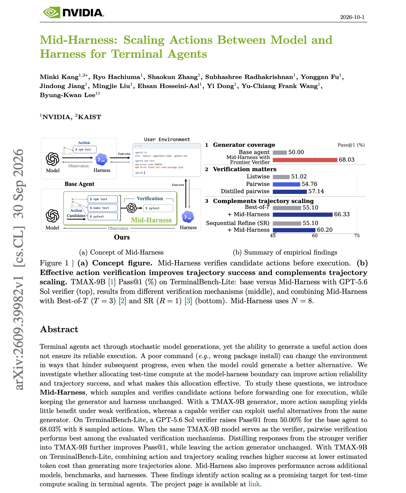
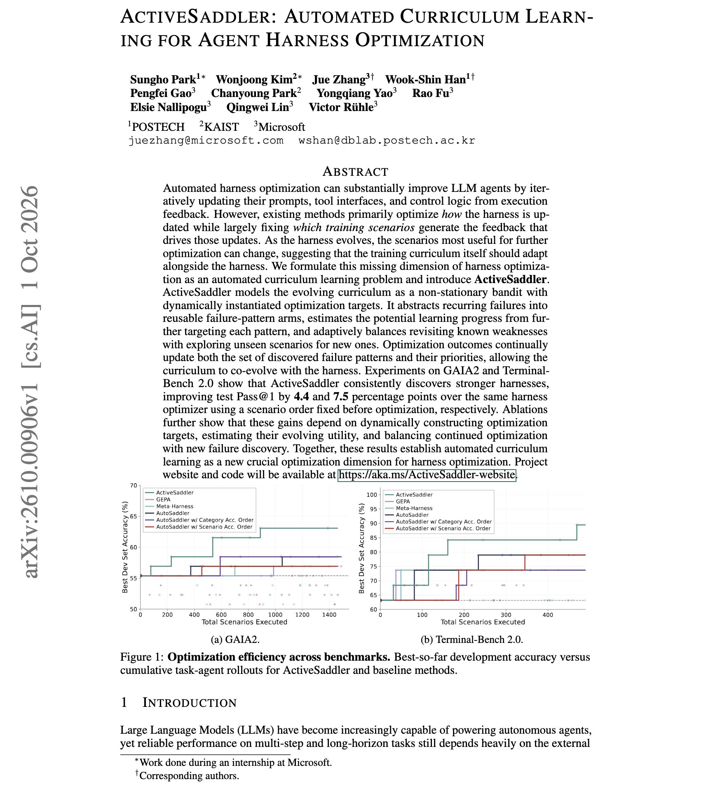

# 🐦 @dair_ai

## 📅 October 04, 2026

> 2 post(s) archived.

---

### 🕐 11:00 UTC · @dair_ai

> Banger paper from NVIDIA on test-time compute for terminal agents. The finding is that you should sample several candidate shell commands, verify them before running one, and spend more on the verifier than on extra samples. With a GPT-5.6 Sol verifier choosing among 8 sampled actions, TerminalBench-Lite Pass@1 rises from 50.0% to 68.0%. With a weak verifier, extra samples add almost nothing. Mid-Harness leaves the generator and harness unchanged and works between them. When a small TMAX-9B model verifies its own candidates, pairwise comparison works best, and distilling the strong verifier into it helps further. Combining action sampling with trajectory sampling reaches higher success at lower estimated token cost than sampling full trajectories alone. Paper: https://academy.dair.ai/papers/mid-harness-scaling-actions-between-model-and-harness-for-terminal-agents-2609.39982

🔗 [View original post](https://x.com/dair_ai/status/2106700907106943107)

---

### 🕐 05:39 UTC · @dair_ai

> Great paper from Microsoft and colleagues on optimizing agent harnesses. Current harness optimizers change how the harness is updated but keep the training scenarios fixed, so feedback keeps coming from tasks that stop being informative as the harness improves. This work adapts the scenarios as well. ActiveSaddler groups recurring failures into failure patterns and treats each pattern as an arm in a non-stationary bandit. It tracks how much the harness is still learning from each pattern and splits the budget between revisiting known weaknesses and finding new ones. With the same optimizer, test Pass@1 improves by 4.4 points on GAIA2 and 7.5 points on Terminal-Bench 2.0 compared with a fixed scenario order. Paper: https://academy.dair.ai/papers/activesaddler-automated-curriculum-learning-for-agent-harness-optimization-2610.00906

🔗 [View original post](https://x.com/dair_ai/status/2106620084542419257)

---
