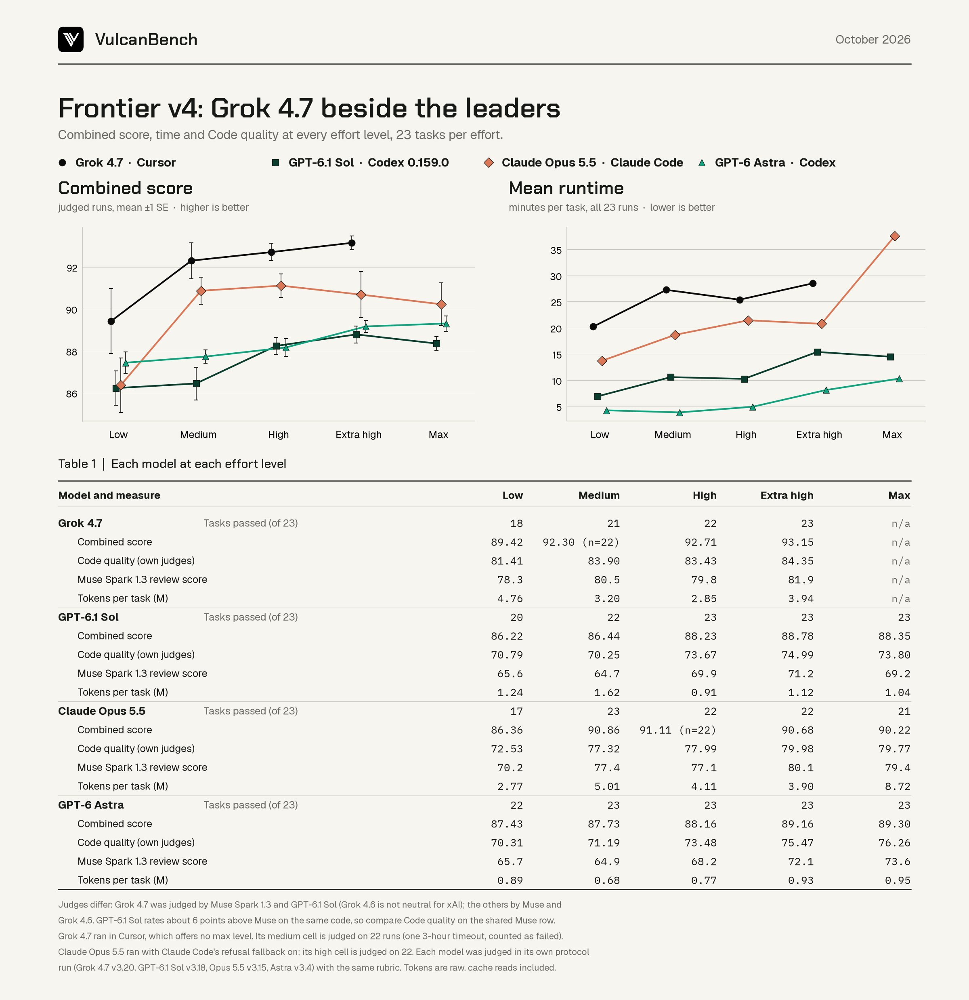
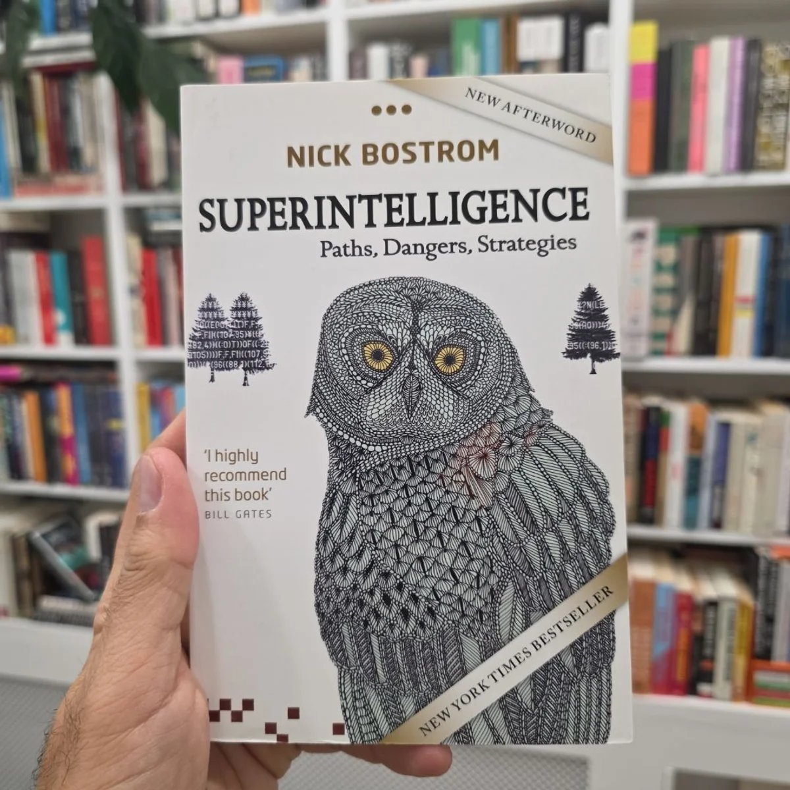

# 🐦 @elonmusk

## 📅 October 04, 2026

> 22 post(s) archived.

---

### 🕐 15:34 UTC · @elonmusk

> Yes Grok 4.7 writes great code.

🔗 [View original post](https://x.com/elonmusk/status/2106769853575000431)

---

### 🕐 15:31 UTC · @elonmusk

> Try Grok @Bot this is unreal… the SpaceXAI engineer who leads Grok Bot, Lauren Tan - shipped 2,500 PRs last month - and reviews them after they land, in the morning I took SpaceXAI&apos;s Grok Bot docs + her 1-hour livestream and turned them into a 3-page prompting blueprint: the 10-field prompt st…

🔗 [View original post](https://x.com/elonmusk/status/2106769237435982129)

---

### 🕐 15:14 UTC · @elonmusk

> Grok is now making all boring stuff for me. For Argil. For personal stuff. It’s like having a 10-person S-tier team working for me. Grok

🔗 [View original post](https://x.com/brivael/status/2106764802643161266)

---

### 🕐 15:01 UTC · @elonmusk

> Grok BREAKING: Farmersville, California, will use Grok to draft council meeting minutes The council voted 4-1 to use Grok. Drafts will be made from meeting recordings and proofread by the city clerk. The city manager praised Grok as more affordable, thorough and objective.

🔗 [View original post](https://x.com/elonmusk/status/2106761668256759878)

---

### 🕐 14:47 UTC · @elonmusk

> Always has been Turns out the joule was the ultimate SI unit all along

🔗 [View original post](https://x.com/elonmusk/status/2106758102674534734)

---

### 🕐 14:44 UTC · @elonmusk

> The upside of extremism I just found the most brilliant bit by @JohnCleese He explains Leftism better in 90 seconds, than you could learn from any academic in 20 years.

🔗 [View original post](https://x.com/elonmusk/status/2106757368419958954)

---

### 🕐 14:14 UTC · @elonmusk

> &quot;Just because Ken Paxton made some bad personal decisions doesn&apos;t mean I have to put my face in a wood chipper and vote for people who have gone plumb crazy!&quot; -- @ScottJenningsKY Media

🔗 [View original post](https://x.com/markfinkelstein/status/2106749694630314017)

---

### 🕐 14:00 UTC · @elonmusk

> SpaceXAI engineer, Lauren Tan: &quot;I was a meat proxy between my agent and my browser. So I fired myself Now 10+ Chiefs of Staff run my agents 24/7 and I just check the work in the morning&quot; In 1 hour, she shows exactly how she built that dark factory with GrokBot Skills → Verification → Loops → GrokBot → Dark Factory Most engineers still babysit one agent. She fired herself from that job This talk is worth more than most $1,500 agentic engineering courses Bookmark and watch it today Then read how to hire your first team of Grok Bots in the article below ↓ Media Grok Bot could be the first thing you hire instead of prompt It can own a job, work inside your tools for hours and come back with finished work In this article, I show you how https://x.com/i/article/2105262478535847936

🔗 [View original post](https://x.com/distortgeekin/status/2106746198082088970)

---

### 🕐 13:40 UTC · @elonmusk

> Thomas, a longtime Porsche enthusiast, never imagined—“not in a million years,” as he puts it—that he would go from being a Tesla critic to a passionate Model Y owner. Today, he owns three Teslas, completely transforming the lineup in his garage. There’s a good reason Model Y has been the world’s best-selling vehicle of any kind, ICE or EV, for several years running. Watch this sports car guru explain what changed his mind and why he became such a big Model Y proponent: https://youtu.be/khBaMSoSYAk?is=la_x0ifmunex8d3h Media

🔗 [View original post](https://x.com/ray4tesla/status/2106741267048669662)

---

### 🕐 13:24 UTC · @elonmusk

> It looks like I might have underestimated Grok 4.7, this is a very good model. It just scored the highest on Frontier v4 beating GPT-6.1 Sol, Opus 5.5, and GPT-6 Astra at every effort level.

🔗 [View original post](https://x.com/morganlinton/status/2106737322255622550)

---

### 🕐 10:19 UTC · @elonmusk

> Elon was thinking about superintelligence long before anyone in the mainstream even understood where superintelligence was heading He was deeply involved in the conversation around Nick Bostrom’s Superintelligence and even contributed to the book. Bostrom thanked him by name in the foreword Elon was already warning about the safety risks of Super Intelligence years before 2014 Then he started OpenAI in 2015 because he wanted a counterweight in advanced intelligence that would focus on benefiting humanity And now we’re entering the SI era....Elon was already thinking about this more than a decade ago, with a clear understanding of what it could eventually become He saw where this was going early, helped push the modern SI race forward, and spent years warning that intelligence beyond humans has to remain aligned with humanity Elon didn’t suddenly start thinking about SI because it became the biggest thing in technology He was thinking about it before everyone else knew what was coming And now we’re living through the future he was preparing for People keep misunderstanding this. I CONTRIBUTED to Bostrom’s Superintelligence book and he thanks me by name in the foreword. I was thinking about AI safety long before 2014.

🔗 [View original post](https://x.com/XFreeze/status/2106690605254672700)

---

### 🕐 09:57 UTC · @elonmusk

> I love SI slopcore Gave Claude another 12 hours to one up this.. Woke up to.. The Clodyssey

🔗 [View original post](https://x.com/elonmusk/status/2106685209085202535)

---

### 🕐 09:10 UTC · @elonmusk

> SpaceX is a super intelligence company

🔗 [View original post](https://x.com/elonmusk/status/2106673377658413414)

---

### 🕐 09:07 UTC · @elonmusk

> It always was

🔗 [View original post](https://x.com/elonmusk/status/2106672522771272121)

---

### 🕐 09:06 UTC · @elonmusk

> The most important people on Earth are on 𝕏 Launch ads in minutes. Find customers for a lifetime.

🔗 [View original post](https://x.com/elonmusk/status/2106672211797168438)

---

### 🕐 08:40 UTC · @elonmusk

> No more AI SI It’s better

🔗 [View original post](https://x.com/elonmusk/status/2106665679361618173)

---

### 🕐 08:38 UTC · @elonmusk

> https://Dot.com Don&apos;t own the .com? The good news is, there&apos;s no such thing. &quot;The .com&quot; is just the only .com you&apos;ve been able to think of so far.

🔗 [View original post](https://x.com/elonmusk/status/2106665276758491194)

---

### 🕐 08:28 UTC · @elonmusk

> It’s so OVER … We’re so BACK!! Grok Bot is operating so insanely fast these days, it feels like SpaceX already launched AI data centers into orbit. Seriously… what is going on?! It’s gotten ridiculously good…

🔗 [View original post](https://x.com/elonmusk/status/2106662762894307405)

---

### 🕐 02:18 UTC · @elonmusk

> Elon Musk giving a tour of Dragon V2 in 2014 Back then it was a vision for returning human spaceflight from American soil Today, Dragon routinely carries astronauts to orbit Media

🔗 [View original post](https://x.com/XFreeze/status/2106569658606444943)

---

### 🕐 01:42 UTC · @elonmusk

> Exactly A humanoid is a capital good on a scale that changes the constraint. It lengthens production and raises what labor and land can turn out, which is the abundance Elon is pointing at. A person supplies about 2,000 hours a year. A robot on a 168 hour week supplies about 8,700. His f…

🔗 [View original post](https://x.com/elonmusk/status/2106560585358082229)

---

### 🕐 01:27 UTC · @elonmusk

> Tesla FSD feels like magic Jason Oppenheim, founder of Oppenheim Group ($5B+ in real estate sales), just sold his Bentley for a @Tesla Model Y and is so blown away by FSD that he’s buying Teslas for 10 employees: &quot;This is the most important video I&apos;ve ever posted. Tesla&apos;s self-driving is life-changing. It&apos;…

🔗 [View original post](https://x.com/elonmusk/status/2106556694683677059)

---

### 🕐 01:00 UTC · @elonmusk

> A public service announcement. Media

🔗 [View original post](https://x.com/OppenheimJason/status/2106550089271668780)

---
