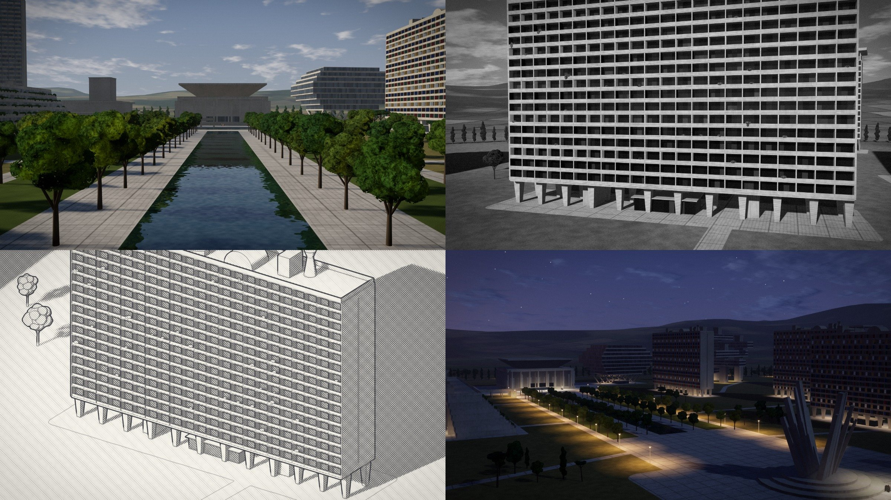

# 🐦 @emollick

## 📅 October 04, 2026

> 3 post(s) archived.

---

### 🕐 19:53 UTC · @emollick

> I am quite impressed with how pretty the results are. Here it is on github: https://github.com/emollick/brut

🔗 [View original post](https://x.com/emollick/status/2106835114626027726)

---

### 🕐 15:32 UTC · @emollick

> Full prompt: &quot;create the ultimate brutalist city builder. you should have lots of controls over buildings in ways that are delightful and inuitive to people who just want to play, but are sophisticated and deep for people who know something about architecture. you should be able to play a lot with design and approach. there should be simulation modes and different ways to view or experience the city. make it stunning.&quot;

🔗 [View original post](https://x.com/emollick/status/2106769324237058221)

---

### 🕐 15:28 UTC · @emollick

> &quot;create the ultimate brutalist city builder. you should have lots of controls over buildings in ways that are delightful and intuitive to people...&quot; Here is Fable 5.1, a little over a year since GPT-5 below, in a single shot from a prompt. It quite good: https://brut-city.netlify.app/ Media I had access to GPT-5. I think it is a very big deal as it is very smart &amp; just does stuff for you Full write up in comments, but this is “make a procedural brutalist building creator where i can drag and edit buildings in cool ways&quot; &amp; &quot;make it better&quot; a bunch. I touched no code

🔗 [View original post](https://x.com/emollick/status/2106768373736493399)

---
