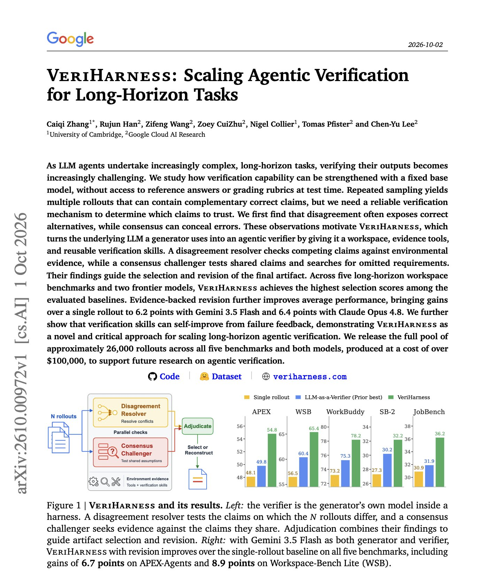
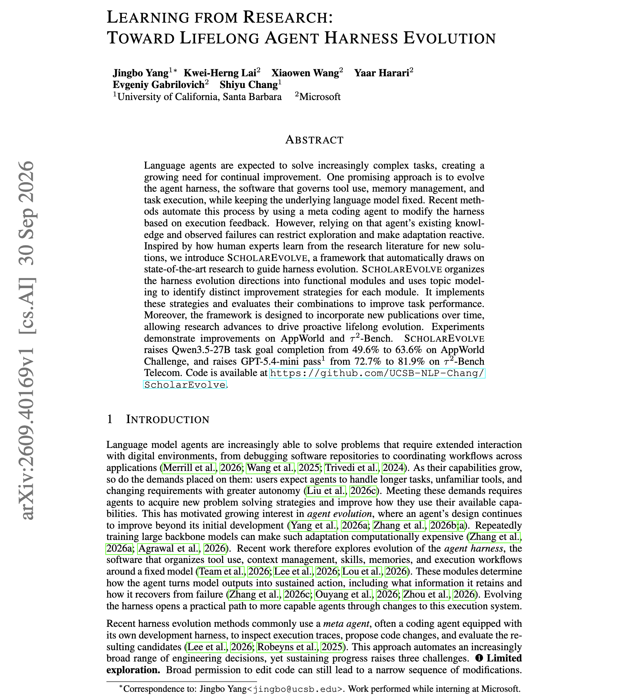

# 🐦 @omarsar0

## 📅 October 04, 2026

> 6 post(s) archived.

---

### 🕐 15:38 UTC · @omarsar0

> The Top AI Papers of the Week (Sep 28 - Oct 4): - JAZ - CASD - Agensh - Jev-Mem - AutoGym - Taste-Bench - Context Language Models Read on for more: https://x.com/i/article/2106769688780775424

🔗 [View original post](https://x.com/dair_ai/status/2106770888054182374)

---

### 🕐 14:23 UTC · @omarsar0

> Same here. I used the terminal for a long time, and I loved it. Agents have changed all of that. I didn&apos;t imagine that that day would arrive, but I have completely moved away from the terminal. You can delegate so much more of this stuff to agents now. And today there are undeniably better interfaces for working with agents. But that experience with terminals has made me a better systems thinker, which I have used in areas like designing useful sandboxes and interesting abstractions on top of them. I was a terminal person for 15+ years. I loved Vim, knew all the shortcuts, and a black terminal made me feel like I was a cool hacker in The Matrix. But terminals assume humans operate computers directly via files, commands, processes. Agents changed all that. You just say your …

🔗 [View original post](https://x.com/omarsar0/status/2106752111874593186)

---

### 🕐 14:12 UTC · @omarsar0

> Tbc, given how much confusion in replies, coding agents still operate via CLI. For me, that&apos;s happening in the background now, rather than being the main way I directly interact with agents. I agree with Yuchen in that the terminal era is over. So many constraints with it. Codex Desktop is as good as it gets today, but even that seems not optimal in some cases. So what I have built and use is an interface that&apos;s more flexible and lets me combine focused agent sessions with high-level persistent agents that can manage all my agent sessions when the number of them gets out of control.

🔗 [View original post](https://x.com/omarsar0/status/2106749383505048054)

---

### 🕐 11:00 UTC · @omarsar0

> Banger paper from Google. It&apos;s standard practice to sample several agent rollouts and trust the answers they agree on. This Google paper shows that agreement can hide shared errors, while disagreement often points to the correct alternative. VeriHarness turns the same base model into an agentic verifier with two jobs. One resolves claims where rollouts disagree by checking workspace evidence. The other challenges claims that every rollout agrees on and looks for requirements they all missed. Across five long-horizon benchmarks, it gives the best selection scores among the baselines tested. With evidence-backed revision, it adds 6.2 points over a single rollout with Gemini 3.5 Flash and 6.4 points with Claude Opus 4.8. The authors also release about 26,000 rollouts. Paper: https://arxiv.org/abs/2610.00972 Chat with Paper: https://academy.dair.ai/papers/veriharness-scaling-agentic-verification-for-long-horizon-tasks-2610.00972

🔗 [View original post](https://x.com/omarsar0/status/2106700905051746803)

---

### 🕐 05:37 UTC · @omarsar0

> New paper from Microsoft and colleagues on evolving agent harnesses. It&apos;s a really cool idea to evolve a harness from published research. Something I have also been testing for the past couple of months. ScholarEvolve proposes harness changes based on published agent research rather than the agent&apos;s own failure logs. It splits the harness into modules for tool use, memory management, and task execution. It runs topic modeling over recent papers to identify distinct improvement strategies for each module, then implements and tests combinations. New papers can be added over time. With the model held fixed, Qwen3.5-27B goal completion on AppWorld Challenge rises from 49.6% to 63.6%, and GPT-5.4-mini on Tau2-Bench Telecom rises from 72.7% to 81.9%. Paper: https://arxiv.org/abs/2609.40169 Chat with Paper: https://academy.dair.ai/papers/learning-from-research-toward-lifelong-agent-harness-evolution-2609.40169

🔗 [View original post](https://x.com/omarsar0/status/2106619582463312315)

---

### 🕐 03:58 UTC · @omarsar0

> Use of coding agents via CLI has been dead for a while now. We are early on discovering better interfaces but interactions now happen directly with agents and will continue that way going forward. What is working for me is a mixture of high-level persistent agents (like dots) and specialised agents (like codex desktop sessions) that are themselves managed by the persistent agents or accessible at anytime when I need to do focused work. This provides me lots of flexibility and I can leverage a variety of experiences and interactions with agents that range from the simpleness of grok bot to the more involved sessions offered by codex desktop. These again are some of the advantages I enjoy because I have built my own agent orchestrator and harness. I haven’t touched Claude Code or Codex CLI in a while. The terminal era is over imo. It&apos;s the wrong interface for coding agents. Tabs are ephemeral, but context is persistent, and managing 30 tabs is pure cognitive overhead. I don’t really need an IDE like Cursor either. I rarely…

🔗 [View original post](https://x.com/omarsar0/status/2106594883590910345)

---
