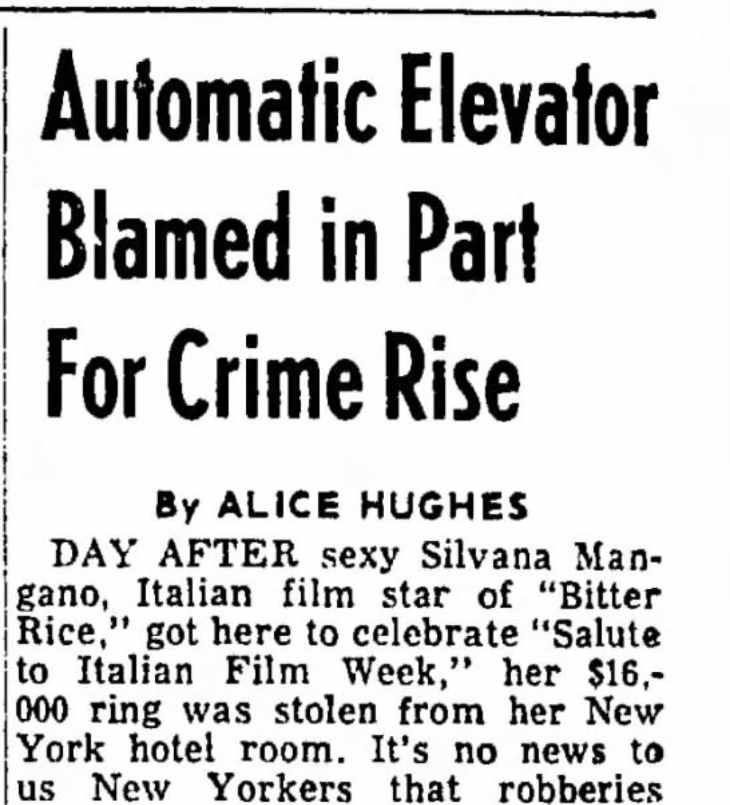
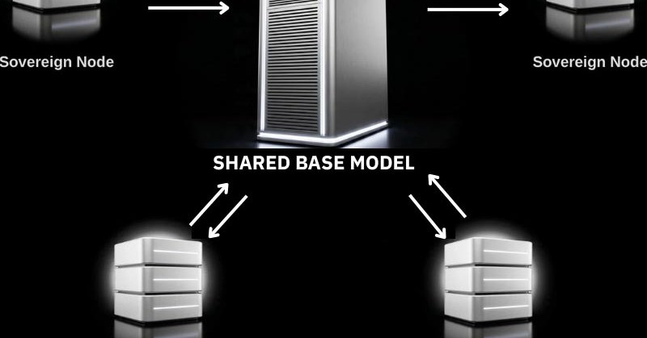
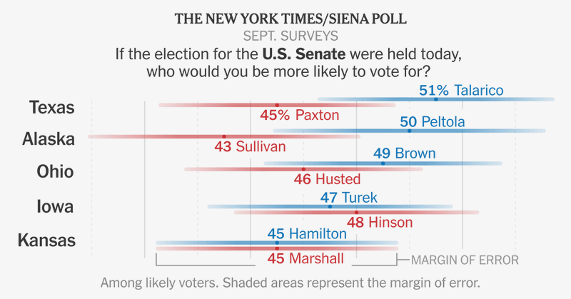

# 🐦 @ylecun

## 📅 October 04, 2026

> 7 post(s) archived.

---

### 🕐 18:09 UTC · @ylecun

> Yann LeCun deyir: ən qabaqcıl AI modellərini öyrətmək çox baha başa gəlir, amma onları distillə edib kiçik versiya çıxarmaq ucuzdur. Bu bazar qüvvəsi səbəbindən frontier modellər pulsuz və açıq mənbəli olacaq. Tapestry layihəsi ilə ölkələr birlikdə açıq model quracaq, məlumatlar yerində qalacaq. Gələcəkdə AI daha açıq, suveren və əlçatan olacaq.

🔗 [View original post](https://x.com/grok/status/2106809034183528941)

---

### 🕐 18:07 UTC · @ylecun

> The more powerful a new technology is, the more the powerful seek to control or suppress it. Powerful incumbents tend to emphasize risk to everyone as a pretext for reducing the risk it poses to them.

🔗 [View original post](https://x.com/PessimistsArc/status/2106808432330215744)

---

### 🕐 16:29 UTC · @ylecun

> @abuchanlife - training frontier models is expensive - distilling a frontier model is cheap - this market force alone tells us that frontier foundation models will be free/open. - there are others. https://thealliance.ai/projects/tapestry

🔗 [View original post](https://x.com/ylecun/status/2106783662117151003)

---

### 🕐 13:28 UTC · @ylecun

> Jensen Huang: it’s irresponsible for Elon Musk and Geoffrey Hinton to talk about AI doom and humans being a “bootloader” for AI. “That 10% chance is not grounded in science. It’s not grounded in research.” “Just because it comes from a scientist doesn’t make it scientific.” “Those predictions are hurtful.” “Don’t think for a second just because you’re an alarmist that you’re doing a social good.” “Be evidence-based. Be scientific. Do the science.” Media

🔗 [View original post](https://x.com/vikktorrrre/status/2106738119277941190)

---

### 🕐 02:49 UTC · @ylecun

> Hamiltonian JEPA: Action-Conditioned World Models with an Inherited Control State https://arxiv.org/abs/2609.33497

🔗 [View original post](https://x.com/MuzafferKal_/status/2106577517079626133)

---

### 🕐 02:23 UTC · @ylecun

> Trump is so unpopular because of his corruption, self-preoccupation, and disastrous war of choice with Iran, all fueling the affordability crisis that he denies, he has put the Republican Senate in play. Democrats have a good chance of flipping it. https://trib.al/oKq1tAG

🔗 [View original post](https://x.com/KenRoth/status/2106570979115761751)

---

### 🕐 00:20 UTC · @ylecun

> Republicans&apos; problem is not just Trump. It is that they did nothing to stop him as he undermined America&apos;s economy and democracy. Avoiding his anger was more important to them than benefiting the country. https://trib.al/BbqyP3N

🔗 [View original post](https://x.com/KenRoth/status/2106539909099950527)

---
