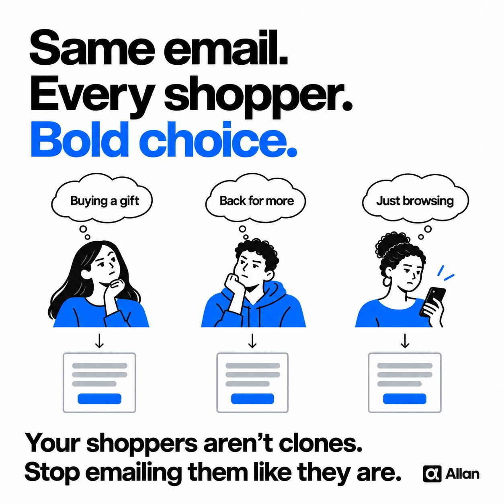

# 🐦 @AiEvolutio58513

## 📅 October 05, 2026

> 4 post(s) archived.

---

### 🕐 16:05 UTC · @AiEvolutio58513

> Most brands send the exact same email to their entire list. When they say they&apos;re split testing, what they&apos;ve actually done is cut the list in half and given each half a different subject line. The hero, the copy, and the offer inside stay identical for everyone. So the test tells you which subject line got more opens, and then everyone on the list lands on the same email anyway. @getallanai changes what gets tested. It sits on top of Omnisend or Klaviyo, and your designer uploads heroes, copy, CTAs, and product blocks instead of finished emails. Allan builds a different email for each subscriber at send time, subject line included, and keeps serving more of whatever lands with each person. Now the whole email gets tested on every send, one subscriber at a time. You&apos;ll wish you started sooner, trust me: https://getallan.com/?utm_source=chase&amp;utm_medium=social

🔗 [View original post](https://x.com/ecomchasedimond/status/2107140138547781911)

---

### 🕐 14:02 UTC · @AiEvolutio58513

> Mark Cuban on where the next wave of jobs will come from. AI integration tailored to small and mid-sized businesses. &quot;Software is dead because everything&apos;s gonna be customized to your unique utilization. Who&apos;s gonna do it for them... And there are 33 mn companies in the US.&quot; The role is called Forward Deployed Engineer. Right now it&apos;s the hottest role in tech, and few people have even heard of it. Interested in AI? Follow @AiEvolutio58513 and never fall behind. I track ChatGPT, Claude, and every tool quietly changing how we work and create, then hand you the tested signals. Media

🔗 [View original post](https://x.com/AiEvolutio58513/status/2107109142221754800)

---

### 🕐 13:04 UTC · @AiEvolutio58513

> Grok 4.7 took one simple prompt and built an interactive 3D jet engine visualizer. Start to finish, it took minutes. Interested in AI? Follow @AiEvolutio58513 and never fall behind. I track ChatGPT, Claude, and every tool quietly changing how we work and create, then hand you the tested signals. Media

🔗 [View original post](https://x.com/AiEvolutio58513/status/2107094529409188067)

---

### 🕐 10:57 UTC · @AiEvolutio58513

> Dario answers his critics directly: “I would rather they make fun of me than to wake up one day and discover that someone used Claude to k*ll a bunch of people.” “Almost every day I&apos;m made fun of on social media because our model&apos;s biology safeguards are too strong. And biology students complain, they make jokes that we can&apos;t use the model.” “But the reason for that is that we have strong safeguards. And I would rather they make fun of me than to wake up one day and discover that someone used our model, Claude, to kill a bunch of people. I don&apos;t want that.” “I would repeat the same point, which is that it shouldn&apos;t be my responsibility alone or Anthropic&apos;s responsibility alone or all of the AI company&apos;s responsibility alone or even one government&apos;s responsibility alone. This is bigger than all of us.” Interested in AI? Follow @AiEvolutio58513 and never fall behind. I track ChatGPT, Claude, and every tool quietly changing how we work and create, then hand you the tested signals. Media

🔗 [View original post](https://x.com/AiEvolutio58513/status/2107062527087800824)

---
