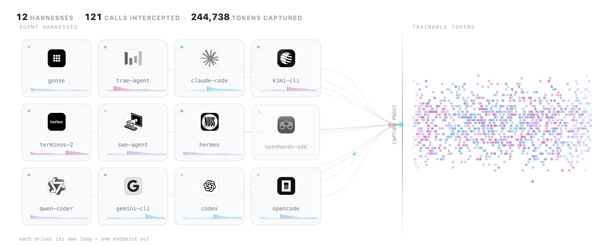
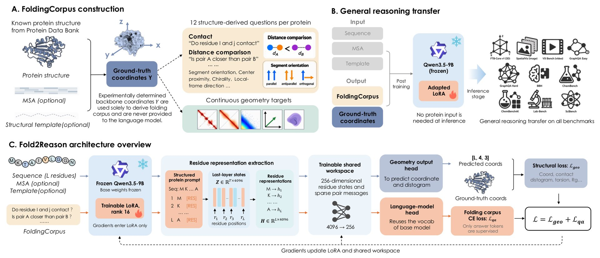

# 🐦 @_akhaliq

## 📅 October 05, 2026

> 7 post(s) archived.

---

### 🕐 14:48 UTC · @_akhaliq

> We turned Claude Code, Codex, Hermes, Pi, @opencode and other coding harnesses into RL environments. No changes to the harnesses, no changes to the training code. Any open model, any task set, fully open source my friends! Same model, same weights: 62% under Mini-SWE-Agent, 33% under Claude Code. But training inside a real harness normally means reimplementing it as an environment, so most models get trained in a scaffold nobody actually ships. The fix is a proxy, not a rewrite. The harness thinks it&apos;s talking to a model API. It&apos;s actually talking to a capture proxy that speaks the 4 formats coding agents use (OpenAI Chat Completions, OpenAI Responses, Anthropic Messages, Gemini), forwards to @vllm_project, records the exact token IDs and logprobs vLLM sampled, and hands TRL sequences it can train on. The harness becomes the environment. 10 harnesses run through it today, none modified. And because you control the reward, you can shape behavior the harness never asked for. We added a small bonus for solving a task in fewer tool calls: on tasks it already solved, the model now uses 31% fewer calls, in every harness, and about half under Codex. Tested on LFM2.5-2.6B from @liquidai: → Train in one harness: better mostly in that harness (OpenCode 34% → 58%). → Train in 4 at once: better in all 4 (42% → 54%). → SFT on 3,189 rollouts from Qwen3.8-27B instead: plateaus at 47.5%, below both RL runs. Everything is open and reproducible: the capture proxy in OpenEnv, the trainer in TRL, the tasks, the SFT data, the training code and all 7 trained models. Bigger models and bigger runs next. Full guide: https://huggingface.co/spaces/FineEnvs/multi-harness-rl

🔗 [View original post](https://x.com/ClementDelangue/status/2107120717980471638)

---

### 🕐 14:44 UTC · @_akhaliq

> Rollout-Marginal Distillation for Long-Horizon Autoregressive Video Generation paper: https://huggingface.co/papers/2609.37925 Media

🔗 [View original post](https://x.com/_akhaliq/status/2107119868218916980)

---

### 🕐 13:09 UTC · @_akhaliq

> Everyone got a coding agent. Nobody got a QA engineer. Until today. Meet Ship, your Autonomous Quality Engineer. It tests deployed PRs, reproduces bugs from Slack and Linear, and hands Claude or Codex the context to fix them. Try it free: https://ship.contextqa.com Media

🔗 [View original post](https://x.com/deepcabinwala/status/2107095904474075536)

---

### 🕐 12:17 UTC · @_akhaliq

> Fold2Reason: training on protein folding improves broad reasoning Post-training on FoldingCorpus raises macro-average accuracy from 45.09% to 48.33% across 10 reasoning benchmarks, with 2.7–3.5× better structure prediction.

🔗 [View original post](https://x.com/HuggingPapers/status/2107082695016870376)

---

### 🕐 04:12 UTC · @_akhaliq

> Scaling Trajectories for Complex Tasks through Recursive Self-Rewrite paper: https://huggingface.co/papers/2610.02826

🔗 [View original post](https://x.com/_akhaliq/status/2106960577071296651)

---

### 🕐 04:09 UTC · @_akhaliq

> Octrees as an Explicit 3D Language paper: https://huggingface.co/papers/2610.02388 Media

🔗 [View original post](https://x.com/_akhaliq/status/2106959958973759807)

---

### 🕐 04:07 UTC · @_akhaliq

> EditHero A Benchmark for Long-Horizon Part-Level 3D Editing and Vibe Modeling paper: https://huggingface.co/papers/2610.02298 Media

🔗 [View original post](https://x.com/_akhaliq/status/2106959328385077426)

---
