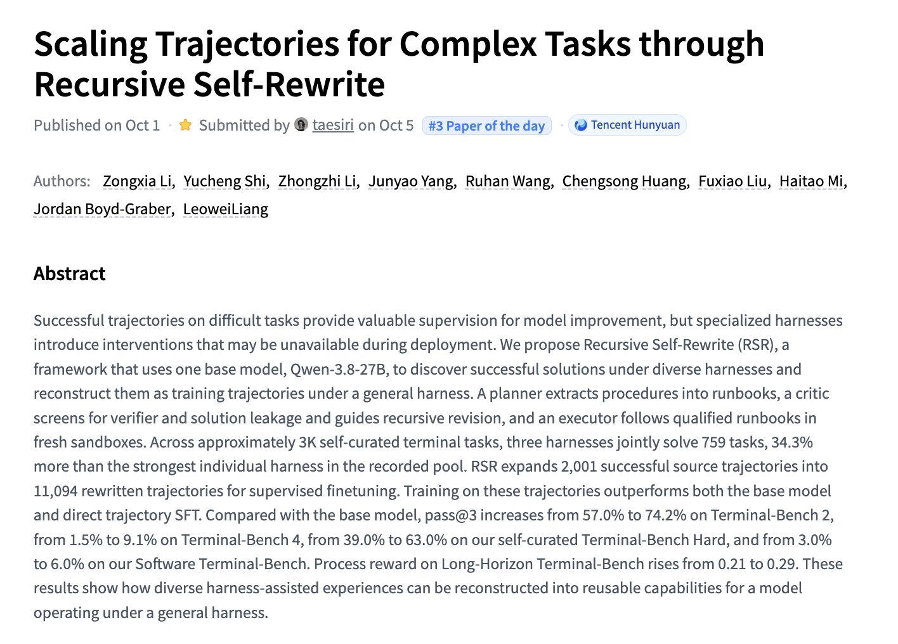

# 🐦 @_akhaliq

## 📅 October 05, 2026

> 3 post(s) archived.

---

### 🕐 04:12 UTC · @_akhaliq

> Scaling Trajectories for Complex Tasks through Recursive Self-Rewrite paper: https://huggingface.co/papers/2610.02826

🔗 [View original post](https://x.com/_akhaliq/status/2106960577071296651)

---

### 🕐 04:09 UTC · @_akhaliq

> Octrees as an Explicit 3D Language paper: https://huggingface.co/papers/2610.02388 Media

🔗 [View original post](https://x.com/_akhaliq/status/2106959958973759807)

---

### 🕐 04:07 UTC · @_akhaliq

> EditHero A Benchmark for Long-Horizon Part-Level 3D Editing and Vibe Modeling paper: https://huggingface.co/papers/2610.02298 Media

🔗 [View original post](https://x.com/_akhaliq/status/2106959328385077426)

---
