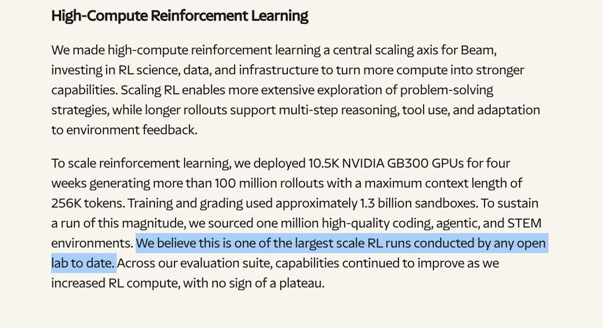
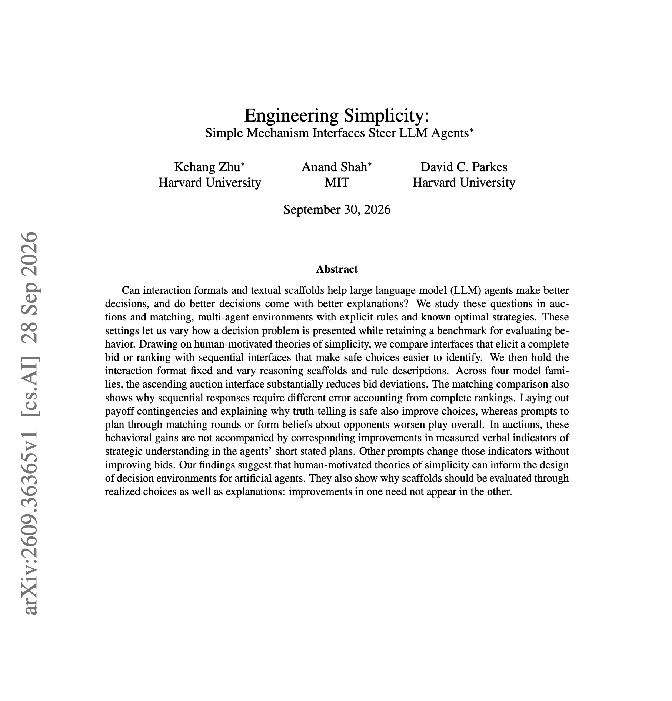
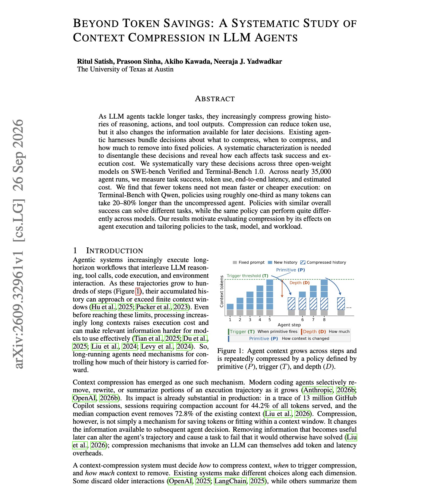
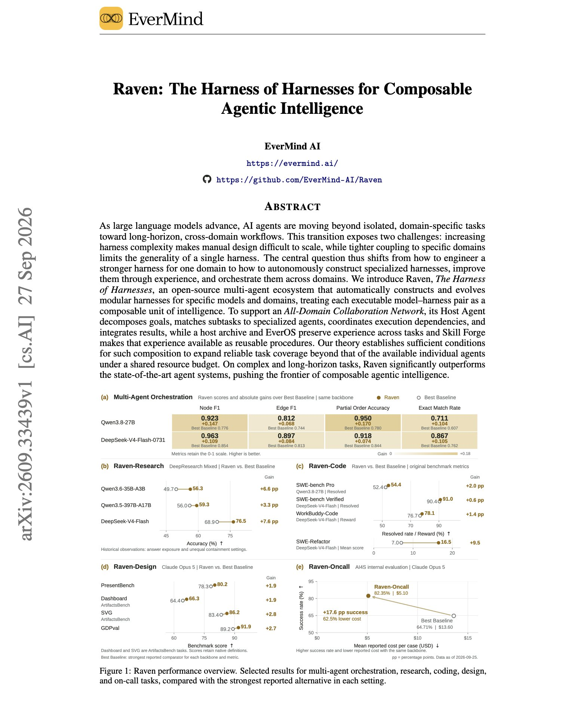

# 🐦 @dair_ai

## 📅 October 05, 2026

> 4 post(s) archived.

---

### 🕐 20:35 UTC · @dair_ai

> Very good to see more competent labs training open-weight models. This Reflection&apos;s new Beam model seems to have strong reasoning efficiency, which I think is a big deal for long-running agents. 3-4x better inference efficiency than rivals like GLM 5.2, positioning it as a strong Western open-weight option. Introducing Beam: a highly efficient agentic open model with 501B total parameters and 23B active. - Frontier reasoning efficiency - Advances the Western open frontier on coding &amp; agentic tasks - Trained end-to-end from scratch Full weights release this month. Learn more about Be…

🔗 [View original post](https://x.com/omarsar0/status/2107208149497172474)

---

### 🕐 16:07 UTC · @dair_ai

> Does telling your agent to plan ahead actually help? It&apos;s standard practice to add a &quot;plan ahead&quot; or &quot;think about the other players&quot; instruction to an agent&apos;s prompt. In auctions and matching markets, this Harvard-MIT paper finds that those prompts make play worse overall. The authors use settings with known optimal strategies, so they can score every choice. What helped was changing the interface. An ascending auction, which presents one safe choice at a time, reduced bid errors across four model families. Plain descriptions of the payoffs and of why truthful bidding is safe also helped. The agents&apos; stated plans did not track their choices. Interventions that improved bids left the measured reasoning quality in the plans unchanged, and some prompts improved the plans without improving bids. The takeaway here is to evaluate a scaffold on the decisions it produces. Paper: https://arxiv.org/abs/2609.36365 Chat with Paper: https://academy.dair.ai/papers/engineering-simplicity-simple-mechanism-interfaces-steer-llm-agents-2609.36365

🔗 [View original post](https://x.com/dair_ai/status/2107140669194064288)

---

### 🕐 02:00 UTC · @dair_ai

> Great overview of context compression in LLM Agents And one interesting, unexpected finding. If your compaction policy is tuned to cut tokens, it may be making your agent run slower. Great study from UT Austin on context compression in coding agents. They ran nearly 35,000 agent runs on SWE-bench Verified and Terminal-Bench and varied three decisions separately. These are how context is compressed, when compression triggers, and how much is removed. On Terminal-Bench with Qwen, policies that use about a third of the tokens can take 20% to 80% longer than keeping full context. Step-triggered policies cut the most tokens per step but need 10% to 27% more model calls. Threshold-triggered policies cut tokens by 22% to 55% with call counts close to full context. Results also differ by model. A policy that works well for Qwen drops Devstral to 38.7% and makes it slower, so measure latency and cost per model before choosing one. Paper: https://arxiv.org/abs/2609.32961 Chat with Paper: https://academy.dair.ai/papers/beyond-token-savings-a-systematic-study-of-context-compression-in-llm-agents-2609.32961

🔗 [View original post](https://x.com/omarsar0/status/2106927371366596692)

---

### 🕐 00:23 UTC · @dair_ai

> Huge release from EverMind AI. Raven is an open-source multi-agent system that builds a separate harness for each model and domain, evolves those harnesses from their failures, and coordinates them through a host agent. The host agent splits a goal into a task graph and sends each part to a model-harness pair for research, code, design, or on-call work. Harness components are diagnosed, mutated, and recombined, and a candidate replaces the current harness only after passing a statistical check. With DeepSeek-V4-Flash, the research harness scores 69.3% on BrowseComp and 60.0% on Humanity&apos;s Last Exam, against at most 62.4% and 43.3% for two other harnesses on the same model. Its curated skill library raises SkillsBench Pass@1 from 9.2% with no skills to 22.6%. Paper: https://arxiv.org/abs/2609.33439 Chat with Paper: https://academy.dair.ai/papers/raven-the-harness-of-harnesses-for-composable-agentic-intelligence-2609.33439

🔗 [View original post](https://x.com/dair_ai/status/2106902948173529447)

---
