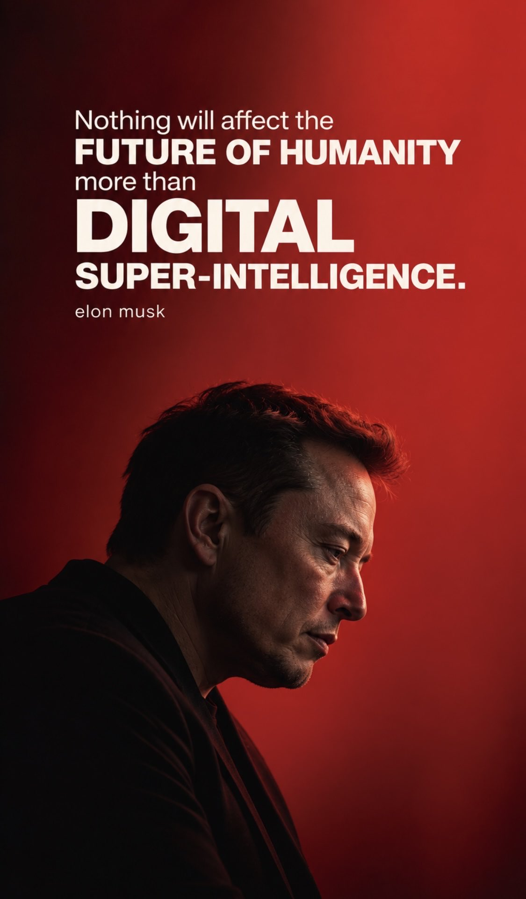
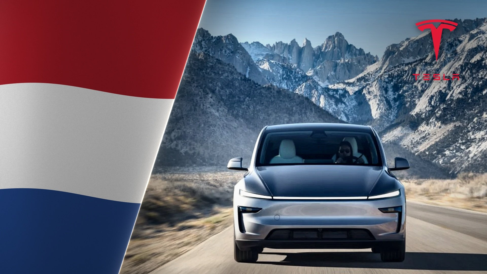

# 🐦 @elonmusk

## 📅 October 05, 2026

> 14 post(s) archived.

---

### 🕐 10:49 UTC · @elonmusk

> BREAKING: SpaceX now holds all 5 fastest U.S. launch-to-docking times at the International Space Station. 🇺🇸 • Crew-13: 7h 55m (Oct 1, 2026) • CRS-31: 12h 23m • Crew-11: 14h 43m • Ax-2: 15h 35m • Crew-4: 15h 44m All five of these missions flew aboard Dragon spacecraft. Media

🔗 [View original post](https://x.com/cb_doge/status/2107060638505996601)

---

### 🕐 08:47 UTC · @elonmusk

> USAID engaged in election interference and regime change around the world, causing massive strife Here’s a shocking statistic you may not know. USAID more than doubled its spending on Brazil as soon Bolsonaro won their 2018 election. This was not because Brazil suddenly needed twice the aid. The money was spent on projects in Brazil to undermine Bolsonaro.

🔗 [View original post](https://x.com/elonmusk/status/2107029927589470636)

---

### 🕐 08:33 UTC · @elonmusk

> Jack Ma told Elon Musk humans will always be smarter than machines. Musk’s reaction says everything. “Computers may be very clever, but human beings are much smarter. We invented the computer. I&apos;ve never seen a computer invent a human being.” Ma&apos;s argument was simple. Computers are tools. They calculate faster, remember more, but humans still hold something machines don&apos;t: experience, judgment, wisdom. Musk clearly didn&apos;t buy it. “What would be an example of something that humans are better than a computer at?” Watching this exchange now feels completely different than it did then. AI agents aren&apos;t just calculating anymore. They&apos;re writing code, analyzing documents, planning tasks, deciding what to do next on their own. METR found that the length of software tasks frontier agents can complete autonomously has historically doubled roughly every seven months, with signs of even faster progress through parts of 2024. That&apos;s where Ma&apos;s argument starts to buckle. For decades, technology automated what humans did. AI is starting to automate what we assumed required a human to think. And companies were already learning to create enormous value with almost no people before this wave even arrived. Instagram sold for $1 billion with 13 employees. WhatsApp sold for $19 billion with 55. Now picture what happens when a small team can direct hundreds of machines that never sleep, never take a salary, never need an office. The question was never just which jobs disappear. It&apos;s what happens to the money once fewer humans are needed to create it in the first place. That&apos;s the question behind 2028: The Economy Without Humans. Who gets the money when machines do the work? Media

🔗 [View original post](https://x.com/kobaHUB/status/2107026299776532653)

---

### 🕐 05:40 UTC · @elonmusk

> Grok Imagine SAY. SI. Made by 🅶🆁🅾🅺 @grok @imagine 💫

🔗 [View original post](https://x.com/elonmusk/status/2106982949832774039)

---

### 🕐 05:25 UTC · @elonmusk

> Do the math. https://x.com/i/article/2106976026194825216

🔗 [View original post](https://x.com/stevenmarkryan/status/2106979185919176985)

---

### 🕐 05:22 UTC · @elonmusk

> Grok Cooked with Grok Imagine.

🔗 [View original post](https://x.com/elonmusk/status/2106978370999537965)

---

### 🕐 05:20 UTC · @elonmusk

> 💯😂 In order to stop Elon Musk from rigging our elections we must: -Switch to paper ballots -Enact Voter ID -Mandate citizenship verification

🔗 [View original post](https://x.com/elonmusk/status/2106977888008642611)

---

### 🕐 05:16 UTC · @elonmusk

> Elon Musk 8 years ago: “Nothing will affect the future of humanity more than digital super-intelligence.”

🔗 [View original post](https://x.com/cb_doge/status/2106976768892768356)

---

### 🕐 04:28 UTC · @elonmusk

> Tesla just took the top two spots in the entire Netherlands new-car market 🇳🇱 Not just EVs...every car September registrations: • Model Y — 2,078 — #1 overall • Model 3 — 1,087 — #2 overall Tesla registered 3,165 cars in September, capturing 8.7% of the entire Dutch new-car market Model Y + Model 3 literally owned the top of the market

🔗 [View original post](https://x.com/XFreeze/status/2106964603582161364)

---

### 🕐 04:15 UTC · @elonmusk

> Watch This Stunning Tesla Awakening Media

🔗 [View original post](https://x.com/stevenmarkryan/status/2106961326069170596)

---

### 🕐 00:37 UTC · @elonmusk

> Propagating super intelligence to the stars is a great success condition for a biological bootloader Elon was calling it SI in 2014

🔗 [View original post](https://x.com/elonmusk/status/2106906678293606496)

---

### 🕐 00:31 UTC · @elonmusk

> Grok @Bot It Is Time To Hire Your First Grok Bot Employee! My insights come from building the first Zero Human Company with @Grok as CEO. I made the mistakes so you don’t have to. Read more:

🔗 [View original post](https://x.com/elonmusk/status/2106905035065991214)

---

### 🕐 00:14 UTC · @elonmusk

> BREAKING: United Airlines just announced that 880+ aircraft will have @Starlink by the end of 2026, with its entire fleet expected to be connected by end of 2027. Starlink has connected 14.2 million devices on 464,000+ flights and is active on over 560 United aircraft today.

🔗 [View original post](https://x.com/cb_doge/status/2106900700206944349)

---

### 🕐 00:07 UTC · @elonmusk

> 英伟达上周又历史新高了 我看B站除了好多恶搞视频 不得不说，现在Ai做视频，基本看不出来痕迹 太夸张了 Media

🔗 [View original post](https://x.com/Bqlsj2023/status/2106899009105526922)

---
