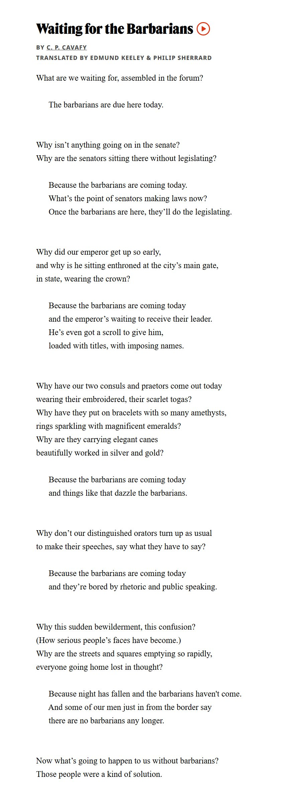

# 🐦 @emollick

## 📅 October 05, 2026

> 11 post(s) archived.

---

### 🕐 20:25 UTC · @emollick

> I will block replybots whose prompts make them generate inane comments connecting the poem to business process re-engineering or whatever, or those that quote a random line from the poem as &quot;the part that people miss&quot; etc. You can do better.

🔗 [View original post](https://x.com/emollick/status/2107205537536561274)

---

### 🕐 20:17 UTC · @emollick

> AI policy right now, especially from the Labs, makes me think of this poem. If you believe superintelligence is near, you don&apos;t need to make hard decisions about how to build AI to make the world better. Just wait for ASI &amp; it will decide for us. But if that doesn&apos;t happen...

🔗 [View original post](https://x.com/emollick/status/2107203549059014739)

---

### 🕐 06:56 UTC · @emollick

> And for everyone saying it, no this is not Slack. Actual email inbox with material being moved between folders or annotated, rather than a team messaging chat. Think Superhuman, but looping in Ais.

🔗 [View original post](https://x.com/emollick/status/2107001975703478329)

---

### 🕐 06:31 UTC · @emollick

> Another much-needed product: an email system built for teams so that a human and autonomous agents can both access it. We need a system, with appropriate permissions, where your AIs (&amp; invited others) can work, comment to each other and bring things to your attention if needed.

🔗 [View original post](https://x.com/emollick/status/2106995773682458784)

---

### 🕐 06:22 UTC · @emollick

> I&apos;ve been complaining about some OpenAI choices tonight, so, on the plus side, I will say there is still no equivalent to GPT-6 Pro (just as there wasn&apos;t with previous Pro models). It both does really hard tasks in one shot &amp; does a surprisingly good job communicating the results

🔗 [View original post](https://x.com/emollick/status/2106993497697919431)

---

### 🕐 04:21 UTC · @emollick

> The whole reset thing is really weird and only makes sense to a narrow slice of even people on Twitter. Everyone else expects to plan their usage in some sort of rational way and getting random prizes of tokens is kind of strange. Like what percent of the user base gets this? Do you ever think of all the ChatGPT pro users who aren’t on Twitter and are just completely confused at why their usage randomly resets and why they receive banked resets

🔗 [View original post](https://x.com/emollick/status/2106962963362111666)

---

### 🕐 04:14 UTC · @emollick

> I have spoken with company leaders in just the last couple of months that talk about their efforts to train people to make GPTs! I think OpenAI needs to figure out ways to bring people along where it is going, since most people are not following this stuff closely.

🔗 [View original post](https://x.com/emollick/status/2106961322902745511)

---

### 🕐 04:03 UTC · @emollick

> I can migrate my most-used GPT (going away in December) to a private &quot;plugin.&quot; But the reason I created a GPT was for other people to use it. GPTs are obviously obsolete, but I know they were a focus within companies &amp; among educators for years. This isn&apos;t a great path for them.

🔗 [View original post](https://x.com/emollick/status/2106958444196413670)

---

### 🕐 02:34 UTC · @emollick

> I actually want personal operating systems optimized for co-working with AIs, including fine-grained ideas of security, easier ways to dynamically see &amp; understand what AIs are doing, and independent secondary &quot;audit&quot; agents that check the results of the AIs on your system whenever I see - &quot;claude/chatgpt has started debugging your browser&quot; - have to give an agent full disk and/or accessibility access I&apos;m convinced we need fundamentally better security primitives for agents to do work as us - and we are living in an awkward intermediate era.

🔗 [View original post](https://x.com/emollick/status/2106936117421601110)

---

### 🕐 01:12 UTC · @emollick

> It doesn’t mean that using AI cannot result in tremendous individual advantage on the job, but it does suggest we need to think about how to build our systems at work to aim for human augmentation, instead of automation. Individual performance is not the only factor.

🔗 [View original post](https://x.com/emollick/status/2106915444162535803)

---

### 🕐 01:10 UTC · @emollick

> I think this advice is not as true anymore: 1) the durable skill behind “using AI better” Is unclear as AI gets easier to use 2) Increasingly, organizational systems bottleneck AI gains not individual workers 3) The effect on jobs is uncertain but may impact entire job categories AI won’t take your job. Someone who knows how to use AI better than you, will take your job.

🔗 [View original post](https://x.com/emollick/status/2106914993526747224)

---
