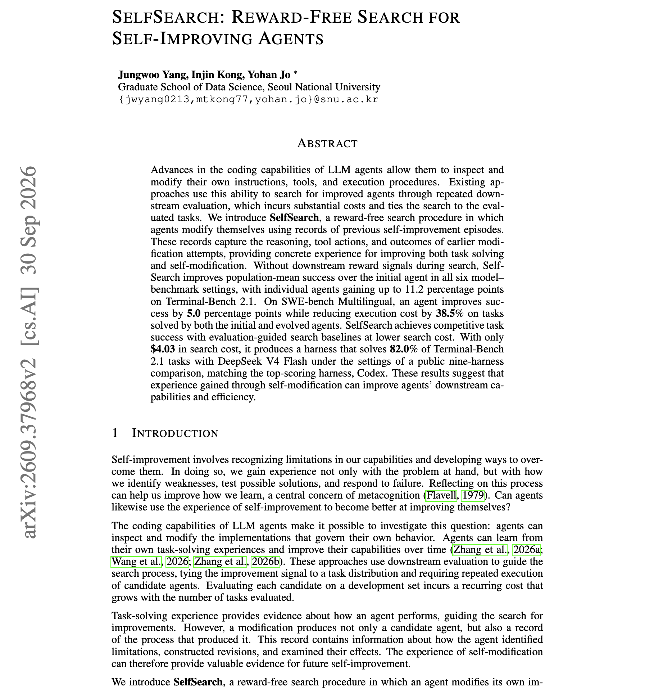

# 🐦 @omarsar0

## 📅 October 05, 2026

> 4 post(s) archived.

---

### 🕐 15:24 UTC · @omarsar0

> A big milestone for AI in healthcare. @nollahealth can now use AI to prescribe acne treatment in Utah. The AI handles intake, a skin scan, assessment, prescription, and follow-up, and a clinician steps in when needed. Starting with acne makes sense to me because it is common and relatively low risk. Very excited about AI-powered personalized healthcare. I have personally benefited from AI for health, so it&apos;s awesome to see this progress. Today, Nolla Health became the first organization in the U.S. (and possibly the world) to receive regulatory approval for an AI to issue initial prescriptions. This makes Nolla the first ever actual end-to-end AI doctor.

🔗 [View original post](https://x.com/omarsar0/status/2107129885000884328)

---

### 🕐 15:08 UTC · @omarsar0

> Or just build your own. That&apos;s how you make personal agents fully yours. You can sit and wait for the next bug fix or for one of these providers to address your safety concerns, or you can start co-evolving a personal agent as needs arise. I have chosen the latter. A personal agent is something you should fully own, from the traces to memory to all outputs. So much resistance to building your own harness and agents. I understand the fear of maintaining yet another thing. But AI makes it easy to build and maintain this stuff. It&apos;s not that hard to build agents today, folks. You seriously should consider building your own solution. This is a great time to start. Start from scratch, keep it minimal, and evolve it as you go. Or you can start with an open-source solution like Pi Durable and build from there (btw, Pi Durable is crazy good for this stuff). there’s something quite awkward about all the personal agents in the current hype cycle muse, grok bot, instinct, dots, and whatever google, anthropic will come up with none of them is “mine” i’d be trusting a vendor for some of the most sensitive data about me and bet on them ha…

🔗 [View original post](https://x.com/omarsar0/status/2107125751937913165)

---

### 🕐 15:01 UTC · @omarsar0

> Learn to optimize your own harness, folks. You can squeeze much more performance and value from a harness. This work claims that a self-modified harness matched Codex for $4.03. Specifically, a coding agent rewrote its own harness until it solved 82.0% of Terminal-Bench 2.1 with DeepSeek V4 Flash, without any task reward during the search. The search cost was $4.03. That matches Codex, the top harness in a public nine-harness comparison run under the same settings. SelfSearch has agents modify their own instructions, tools, and procedures using records of earlier self-modification attempts. Each record holds the reasoning, tool actions, and outcomes. The modified agent then becomes the next improver. Population-mean success rises in all six model-benchmark settings, with single agents gaining up to 11.2 points. On SWE-bench Multilingual, one evolved agent gains 5.0 points and spends 38.5% less on tasks both versions solve. Paper: https://arxiv.org/abs/2609.37968 Chat with Paper: https://academy.dair.ai/papers/selfsearch-reward-free-search-for-self-improving-agents-2609.37968

🔗 [View original post](https://x.com/omarsar0/status/2107123966792052859)

---

### 🕐 14:02 UTC · @omarsar0

> These days, I spend more time verifying agent-written code than writing it. This is a big bottleneck in so-called software factories. Ship from @ContextQa takes a bug reported in Slack or Linear, reproduces it, and hands Claude Code or Codex the context to fix it. Coding agents need this kind of feedback loop to get better at fixing their own bugs. Everyone got a coding agent. Nobody got a QA engineer. Until today. Meet Ship, your Autonomous Quality Engineer. It tests deployed PRs, reproduces bugs from Slack and Linear, and hands Claude or Codex the context to fix them. Try it free: https://ship.contextqa.com

🔗 [View original post](https://x.com/omarsar0/status/2107109255421563227)

---
