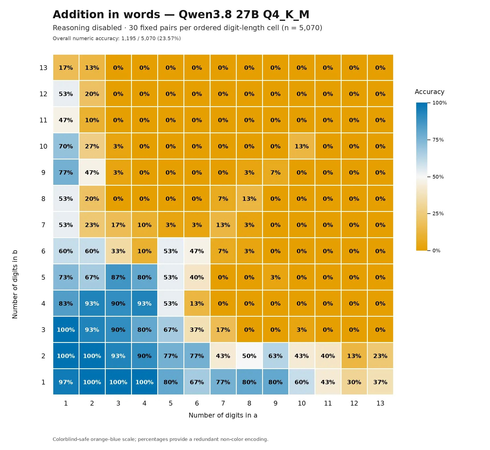

# 🐦 @simonw

## 📅 October 05, 2026

> 1 post(s) archived.

---

### 🕐 17:19 UTC · @simonw

> I re-ran an experiment @colin_fraser ran against GPT-4o a while back to see how good it was at adding long numbers, only this time I tried Qwen 3.8 27B running locally in both reasoning and non-reasoning modes https://simonwillison.net/2026/Oct/4/qwen38-addition-in-words/

🔗 [View original post](https://x.com/simonw/status/2107158711798218848)

---
