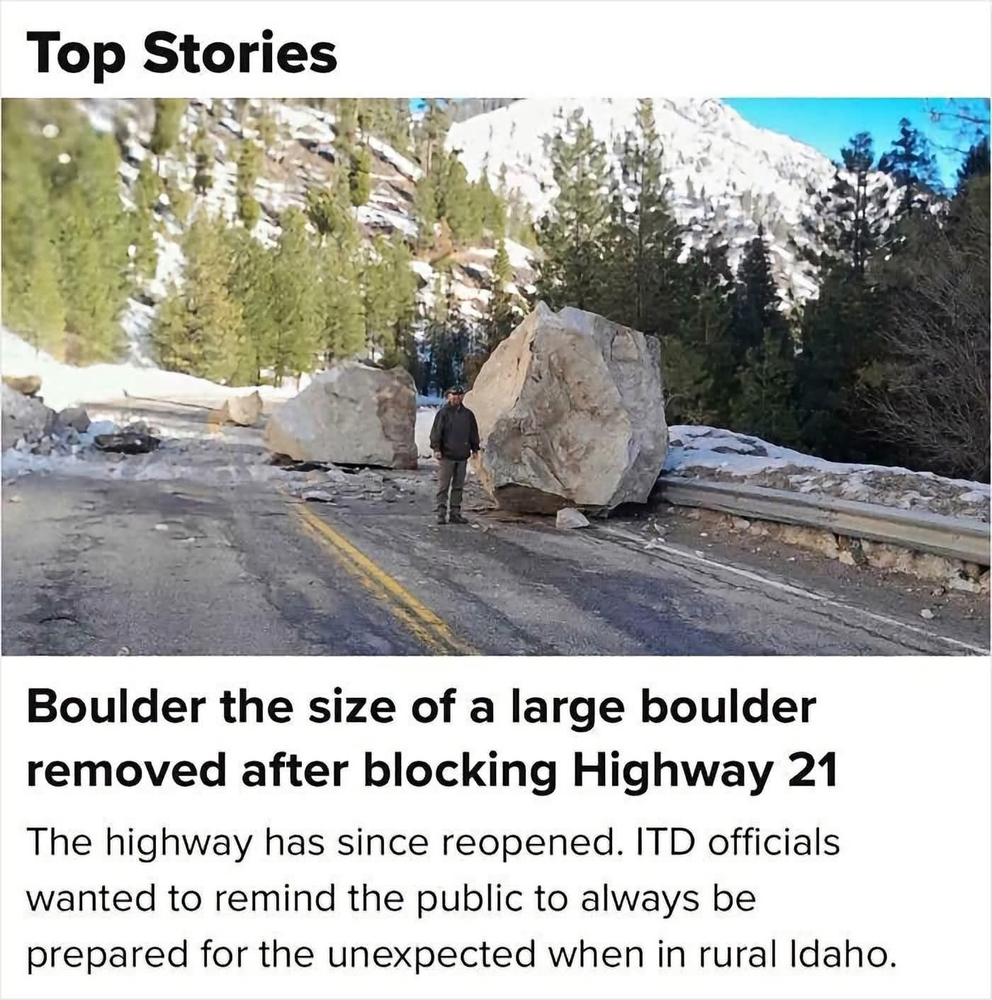

# 🐦 @tunguz

## 📅 October 05, 2026

> 27 post(s) archived.

---

### 🕐 21:34 UTC · @tunguz

> “architecture” LOL ROTFLMAO even San Francisco is expensive. No argument there. But the idea that you get little in return is absurd. Name another city this compact that combines stunning natural beauty, world-class dining, culture, entertainment, architecture, parks, and outdoor recreation. I’ll wait.

🔗 [View original post](https://x.com/tunguz/status/2107222900038320442)

---

### 🕐 21:07 UTC · @tunguz

> I’m proud of my Catholic European work ethic. the striving conversation is kind of bizarre because one of the things that distinguishes american anglo-protestant culture from european, especially catholic, cultures is the emphasis put on hard work and industry (observed by that lib @charlesmurray)

🔗 [View original post](https://x.com/tunguz/status/2107216222765093276)

---

### 🕐 21:06 UTC · @tunguz

> Another stupid healthscare debunked. I won again! A new study on Tylenol and autism has come out. It leveraged a recall in 1982 to show that the affected cohort—which saw greatly reduced Tylenol usage in utero—saw no deviation from trend in autism diagnoses down the line. Tylenol does not cause autism.

🔗 [View original post](https://x.com/tunguz/status/2107215855935484309)

---

### 🕐 19:12 UTC · @tunguz

> Nvidia could be the biggest company in the world by the end of this year.

🔗 [View original post](https://x.com/tunguz/status/2107187193454465128)

---

### 🕐 17:41 UTC · @tunguz

> Sounds about write. physics gives you read access to the universe, engineering gives you write access

🔗 [View original post](https://x.com/tunguz/status/2107164238565503199)

---

### 🕐 16:21 UTC · @tunguz

> I&apos;ve been to Serbia, this checks out. Also - I really, really, need to visit Iceland. I&apos;ve been hankering for svið for years! Daily protein supply per person: 🇮🇸 Iceland – 151.7 g 🇮🇪 Ireland – 136.9 g 🇷🇸 Serbia – 135.6 g 🇲🇪 Montenegro – 134.4 g 🇲🇳 Mongolia – 132.1 g 🇨🇳 China – 131.6 g 🇮🇱 Israel – 130.7 g 🇹🇴 Tonga – 129.3 g 🇧🇾 Belarus – 128.0 g 🇵🇹 Portugal – 126.4 g 🇩🇰 Denmark – 126…

🔗 [View original post](https://x.com/tunguz/status/2107144107055583312)

---

### 🕐 16:12 UTC · @tunguz

> Tennessee and Idaho are goated. Utah and North Dakota are cursed. The most popular Halloween candy in every state

🔗 [View original post](https://x.com/tunguz/status/2107141843729461582)

---

### 🕐 15:56 UTC · @tunguz

> Americans will use anything to measure things except the metric system.

🔗 [View original post](https://x.com/tunguz/status/2107137790953803872)

---

### 🕐 15:44 UTC · @tunguz

> Narrator: we will become dogs to ASI. In the era of ASI, dogs will be huge.

🔗 [View original post](https://x.com/tunguz/status/2107134726595399875)

---

### 🕐 15:27 UTC · @tunguz

> No. Is there anywhere in the world with a larger gap between the price you pay and the value of the urban amenities you get than in San Francisco?

🔗 [View original post](https://x.com/tunguz/status/2107130474800054725)

---

### 🕐 15:26 UTC · @tunguz

> I feel this ... Living in Europe not on vacation for 6+ months makes you realize why America is amazing.

🔗 [View original post](https://x.com/tunguz/status/2107130332587966960)

---

### 🕐 15:24 UTC · @tunguz

> Options is all you need. Money doesn’t buy happiness, but it buys options. And it’s really cool to have options.

🔗 [View original post](https://x.com/tunguz/status/2107129915116294551)

---

### 🕐 14:38 UTC · @tunguz

> oof

🔗 [View original post](https://x.com/tunguz/status/2107118160197628261)

---

### 🕐 14:14 UTC · @tunguz

> Yes what if in the end, it&apos;s catholics who save us from an AI extinction event

🔗 [View original post](https://x.com/tunguz/status/2107112208308297767)

---

### 🕐 14:04 UTC · @tunguz

> Despite all of its faults, this is why I’m still bullish on America. I’m assembling a team

🔗 [View original post](https://x.com/tunguz/status/2107109616723308574)

---

### 🕐 13:52 UTC · @tunguz

> Oh no! How am I ever going to recover from this! @tunguz Was going to follow you but then you wrote this. Sports teach life fundamentals, you’re a nerd and don’t understand this. Sad.

🔗 [View original post](https://x.com/tunguz/status/2107106678500188169)

---

### 🕐 13:50 UTC · @tunguz

> Reposting since this has again become relevant. Questioning validity of IQ tests is a low IQ cope.

🔗 [View original post](https://x.com/tunguz/status/2107106194469064850)

---

### 🕐 13:46 UTC · @tunguz

> I am screwed, all the papers that I was on that were submitted to Nature publications have been accepted. :/ In 1992 Peter Ratcliffe received this rejection from Nature. Almost 30 years later he won the Nobel Prize for the same discovery. Don&apos;t lose faith in the things you believe in.

🔗 [View original post](https://x.com/tunguz/status/2107105247802085629)

---

### 🕐 13:38 UTC · @tunguz

> Slovenian domain name brokers right now.

🔗 [View original post](https://x.com/tunguz/status/2107103199710900494)

---

### 🕐 13:36 UTC · @tunguz

> You become what you immanentize. Humanity is not a fucking bootloader.

🔗 [View original post](https://x.com/tunguz/status/2107102699150098881)

---

### 🕐 13:35 UTC · @tunguz

> This is one of the biggest problems with online ratings. If you move to a new town where you don’t know anyone, and want to get services done, you turn to online ratings only to discover that they are next to useless. I analyzed the range of ratings on booking sites and it&apos;s pretty crazy Airbnb goes just from 4.5 to 5 with a median of 5! But most others aren&apos;t better, they all range from about 4 to 5, and almost all have a median of 4.25, with not many scores outside of it! The best site in

🔗 [View original post](https://x.com/tunguz/status/2107102306605150596)

---

### 🕐 12:30 UTC · @tunguz

> Not wrong, even though I love Italian food. IMHO Balkan cuisine is way better, but like everything else from the Balkans it is the victim of poor marketing. I’ve been in Italy for almost two weeks and I still think Italian food is mid.

🔗 [View original post](https://x.com/tunguz/status/2107085974752923688)

---

### 🕐 01:46 UTC · @tunguz

> I actually disagree. I believe that we can get a better underlying theory of what is going on with LLMs on a fairly abstract level. The question is if that theory could help us at all with making LLMs more efficient. Just so no one is confused: Yes you could make a mathematical model of a human brain. In just the same way you make a mathematical model of the weather. You cannot make a mathematical model of an LLM because it&apos;s literally a mathematical model. The map is not the territory - and …

🔗 [View original post](https://x.com/tunguz/status/2106923953671598235)

---

### 🕐 01:44 UTC · @tunguz

> No reason to mourn. All recent grads should just move to Gary, Indiana. Watching a recent college grad navigate the rental market in SF is truly heartbreaking, tears in my eyes rn

🔗 [View original post](https://x.com/tunguz/status/2106923369178489310)

---

### 🕐 01:42 UTC · @tunguz

> Ohhh… Husbant… You spent all of our savings buying .ai domains... Now they relabel it superintelligence and we are homeress….

🔗 [View original post](https://x.com/tunguz/status/2106922932035518893)

---

### 🕐 01:35 UTC · @tunguz

> He&apos;s a ten but he is one of top 50 tech poasters on X.

🔗 [View original post](https://x.com/tunguz/status/2106921063183700208)

---

### 🕐 01:29 UTC · @tunguz

> This was my experience in Paris as well. Super nice people everywhere we went. We just visited New York City. Person after person held the door open for us, stopped to offer assistance, or just smiled and said good morning. I turned to my wife, &quot;So much for New Yorkers being angry and gruff!&quot; My thesis: the more negative things are on the internet, the more…

🔗 [View original post](https://x.com/tunguz/status/2106919647392285020)

---
