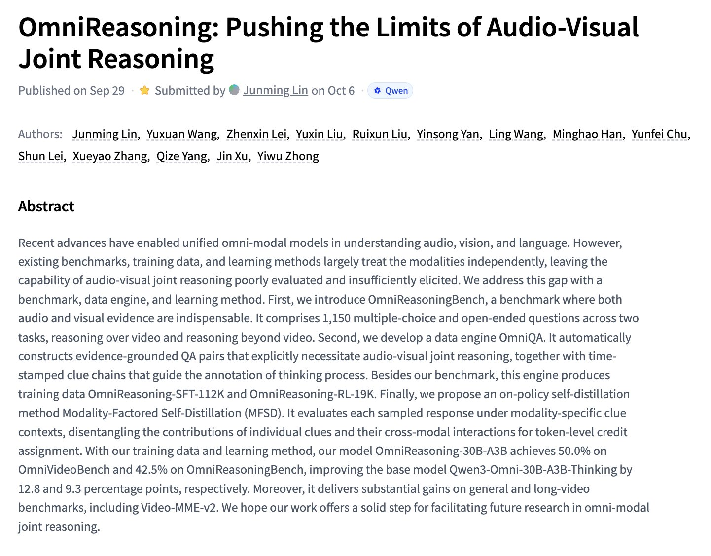
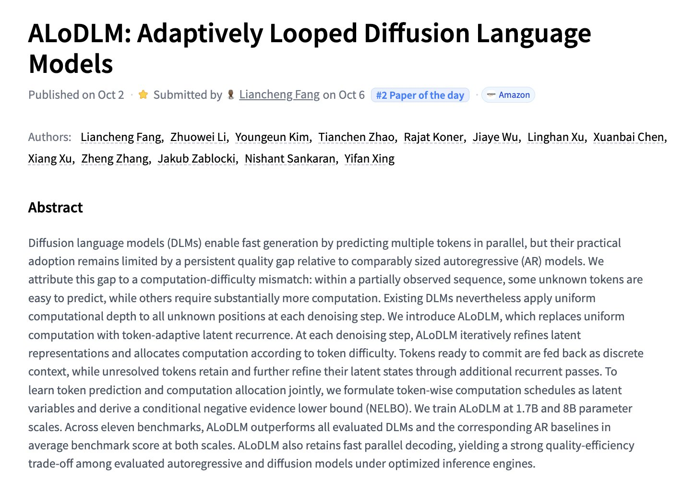
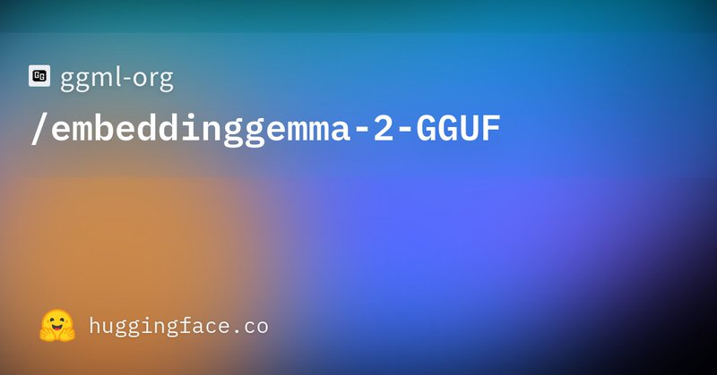
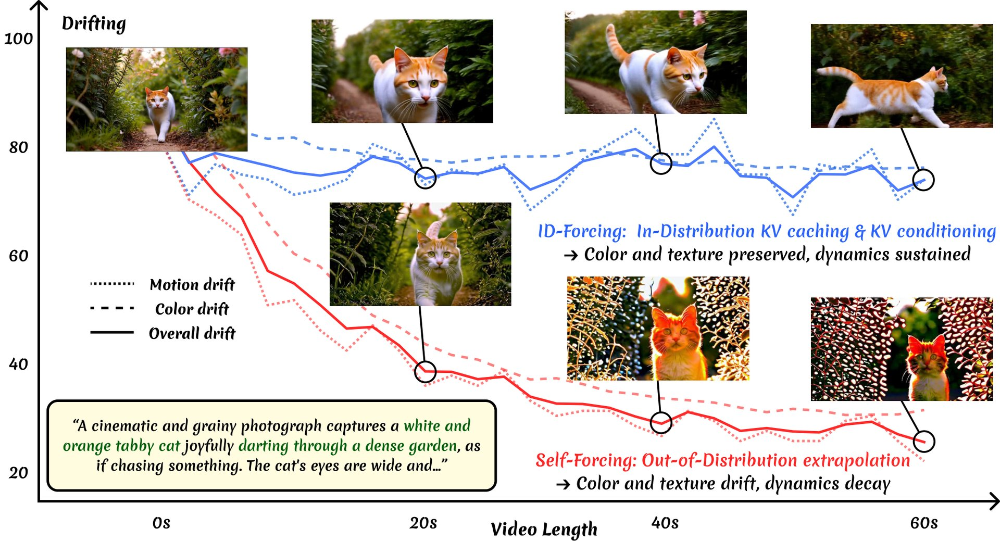

# 🐦 @_akhaliq

## 📅 October 06, 2026

> 5 post(s) archived.

---

### 🕐 18:05 UTC · @_akhaliq

> OmniReasoning Pushing the Limits of Audio-Visual Joint Reasoning paper: https://huggingface.co/papers/2609.39490

🔗 [View original post](https://x.com/_akhaliq/status/2107532766858694847)

---

### 🕐 18:04 UTC · @_akhaliq

> ALoDLM Adaptively Looped Diffusion Language Models paper: https://huggingface.co/papers/2610.04198

🔗 [View original post](https://x.com/_akhaliq/status/2107532442181808351)

---

### 🕐 16:49 UTC · @_akhaliq

> Day-0 support for EmbeddingGemma 2 in llama.cpp https://huggingface.co/ggml-org/embeddinggemma-2-GGUF

🔗 [View original post](https://x.com/ggerganov/status/2107513582925853030)

---

### 🕐 16:13 UTC · @_akhaliq

> ID-Forcing: keeping long video generation in-distribution Autoregressive video models drift beyond their training horizon. ID-Forcing aligns KV caching and conditioning with training, enabling minute-scale videos with no fine-tuning.

🔗 [View original post](https://x.com/HuggingPapers/status/2107504537871200345)

---

### 🕐 16:00 UTC · @_akhaliq

> Your AI is vaporware without deep integrations with your customers’ systems of record. Introducing @WithAmpersand: integration infrastructure for enterprise agents. We power 11x, Orb, and Square&apos;s ability to take agentic action in systems of record like Salesforce, SAP, NetSuite, and Workday. Ask anyone serious about building AI and they’ll tell you: - The SaaSpocalypse didn’t happen. The world depends on CRMs, ERPs, HRISs, and ITSMs. - Your customers customized their deployments beyond recognition. - Systems of record companies are basically monopolies. They never had to make their APIs and MCPs user-friendly. - Docs don&apos;t explain half the weird edge cases you&apos;ll hit. - One bad write can blow up your pilot or renewal. - Once you finally get it working, someone changes a field and it breaks again. The world&apos;s data lives in structured databases. AI needs a translation layer to work with it. So, for your AI to truly transform the way enterprises work, you&apos;ll need deep integrations built for: - scoped permissions - bi-directional actions - real-time speed for agents - custom objects, fields, and workflows for each of your customers We built Ampersand to power the future of software. AI didn&apos;t trivialize writing integrations. It made them the critical path. I believe that deeply, so I didn&apos;t make a launch video about Ampersand. Instead, it&apos;s the best builders I know explaining just how big of a challenge this is. Media

🔗 [View original post](https://x.com/ayanb/status/2107501360031924549)

---
