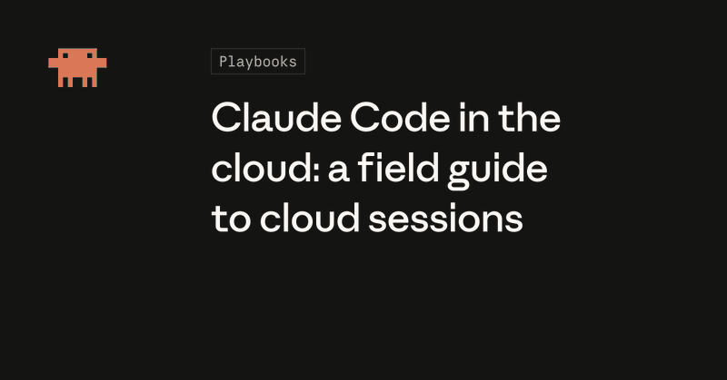
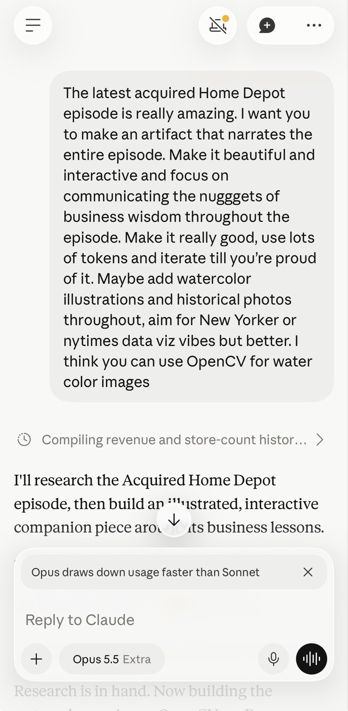
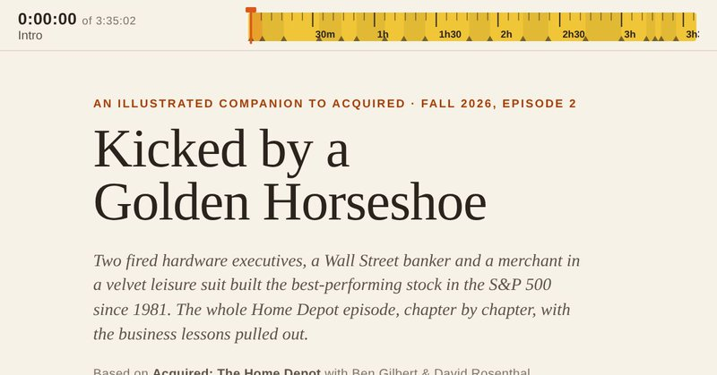

# 🐦 @bcherny

## 📅 October 06, 2026

> 7 post(s) archived.

---

### 🕐 20:15 UTC · @bcherny

> Another example, my actual prompts https://x.com/bcherny/status/2102543349102338309?s=20 I used Opus 5.5 to formally verify the Claude Agent SDK using Lean. A couple short prompts = 16 PRs fixing various bugs and race conditions. Video attached. TLA+ also works well. I sometimes combine Lean and TLA+ to look for issues around data flow, concurrency, and state mgmt. I…

🔗 [View original post](https://x.com/bcherny/status/2107565497680314831)

---

### 🕐 20:15 UTC · @bcherny

> I am surprised that people are surprised this is how I prompt Claude. Talk to Claude the way you would a coworker. There&apos;s no secret to prompting. There&apos;s no need to be overly scaffolded or prescriptive for most tasks -- give Claude a goal, and it will figure it out. Back in the Sonnet 3.5 days, your prompt mattered a lot. Nowadays, it&apos;s much more important to communicate to the model: 1. What you want it to do 2. How much effort you want it to spend 3. How it should verify that it did the right thing Prompt

🔗 [View original post](https://x.com/bcherny/status/2107565388250874193)

---

### 🕐 18:42 UTC · @bcherny

> Cloud sessions run Claude Code on a fresh VM for each task, so you can start several at once and they keep going when you close your laptop. We wrote a field guide with seven workflows that suit them, plus how to connect GitHub on the first try. https://claude.dev/blog/claude-code-in-the-cloud

🔗 [View original post](https://x.com/ClaudeDevs/status/2107542087243907506)

---

### 🕐 18:06 UTC · @bcherny

> Prompt

🔗 [View original post](https://x.com/bcherny/status/2107532985897771152)

---

### 🕐 17:25 UTC · @bcherny

> Claude now works inside Google Docs, Sheets, and Slides, and those files also open inside Claude. In Google Workspace, Claude sits in a sidebar next to your file, reads what you have open, and edits it in place. You can approve each edit before it lands. Media

🔗 [View original post](https://x.com/claudeai/status/2107522596845822135)

---

### 🕐 17:02 UTC · @bcherny

> I asked Opus 5.5 to make an interactive website companion for the latest @AcquiredFM Home Depot episode. It came out pretty nice! Water color illustrations all drawn by Claude, too: https://claude.ai/artifact/RdE6uE7WozcP2MLfx3BDky Episode here: https://www.acquired.fm/episodes/home-depot

🔗 [View original post](https://x.com/bcherny/status/2107516876876362200)

---

### 🕐 16:49 UTC · @bcherny

> The Claude Startups program is expanding to more founders. Members can get a year of Claude Team, API credits, special offers on the tools a startup runs on, and office hours with Anthropic’s Applied AI team. Media

🔗 [View original post](https://x.com/claudeai/status/2107513494493179954)

---
