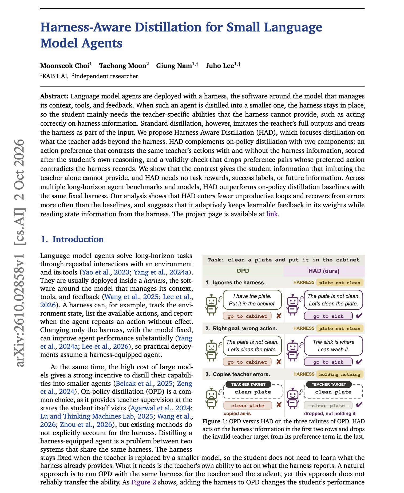
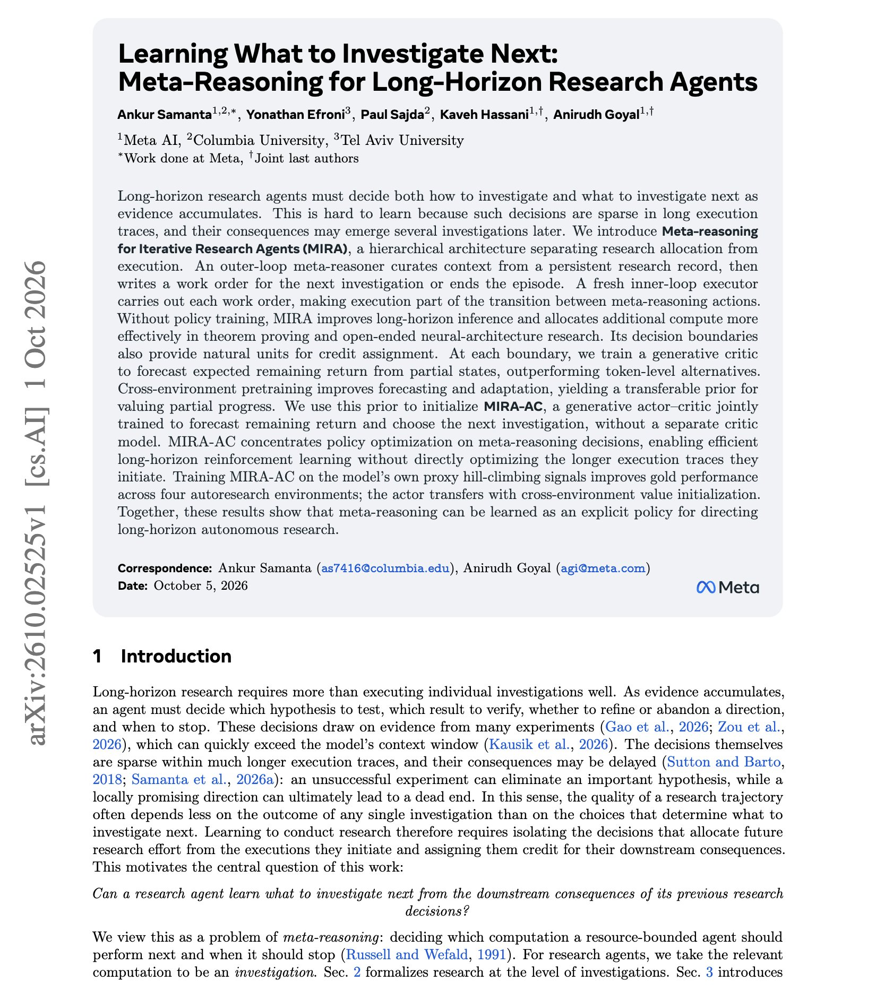
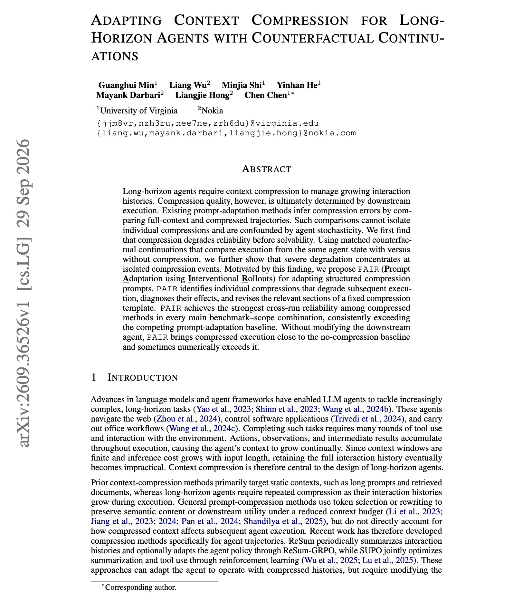

# 🐦 @dair_ai

## 📅 October 06, 2026

> 4 post(s) archived.

---

### 🕐 16:26 UTC · @dair_ai

> Really nice paper on harness-aware distillation for small language model agents. (bookmark it) It&apos;s a super interesting distillation framework for small language model agents that are deployed with a harness. In simple terms, you run the big model with and without harness info, then train the small model on cases where its action changes. Researchers show that adding the harness to on-policy distillation raises how often the student uses harness information on ALFWorld (65.7% to 73.1%) but leaves success flat (43.1% to 43.5%). Their method, Harness-Aware Distillation, queries the same teacher with and without the harness information and trains the student to prefer the action chosen with it. A filter drops pairs whose preferred action contradicts the harness records. The method uses no task rewards or success labels. The student reaches 63.4% on unseen ALFWorld tasks, compared with 47.0% for the best baseline, and exceeds its 8B teacher. It also escapes 59.7% of stalls, while the baselines stay near the untrained student&apos;s 46.8%. Paper: https://arxiv.org/abs/2610.02858 Chat with Paper: https://academy.dair.ai/papers/harness-aware-distillation-for-small-language-model-agents-2610.02858

🔗 [View original post](https://x.com/omarsar0/status/2107507684270600394)

---

### 🕐 14:44 UTC · @dair_ai

> Banger paper from Meta AI on research agents that decide what to investigate next. (bookmark it) If you run long-horizon research agents, choosing the next investigation is hard to learn, because those decisions are rare in long traces and their effects show up several steps later. MIRA splits the agent into two. An outer meta-reasoner reads a persistent research record and writes a work order for the next investigation. A fresh executor carries out each work order. Decisions only happen at work-order boundaries, so the authors train a critic at those points to forecast remaining return, then a single actor-critic (MIRA-AC) that both values partial progress and picks the next investigation. Even without training, the split improves theorem proving and open-ended architecture research. Trained on the model&apos;s own proxy signals, MIRA-AC improves gold scores in all four autoresearch environments. Paper: https://arxiv.org/abs/2610.02525 Chat with Paper: https://academy.dair.ai/papers/learning-what-to-investigate-next-meta-reasoning-for-long-horizon-research-agent-2610.02525

🔗 [View original post](https://x.com/dair_ai/status/2107482016342233309)

---

### 🕐 00:56 UTC · @dair_ai

> Like Jev, I believe RL will unlock several more like this, slashing the cost of critical agent operations. flow-1 is competitive in performance, but a huge cost-saver for finding failures in agent traces. RSI doesn&apos;t only apply to general intelligence. It will equally accelerate specialized intelligence. Introducing flow-1, our new model trained with RL to find errors in agent traces. It matches GPT-6-sol in trace intelligence while being 23x cheaper. It also costs 25% less to run than GPT-6-luna. flow-1 finally makes it possible to monitor and understand every agent run, without…

🔗 [View original post](https://x.com/omarsar0/status/2107273821824622885)

---

### 🕐 00:20 UTC · @dair_ai

> Context compression is a huge bottleneck for long-running agents. This work finds that context compression hurts long-horizon agents at a few specific points. They propose PAIR, which replays the agent from the same state with and without a given compression, instead of comparing whole runs that differ in many random ways. A typical compression adds a few extra steps. The large drops in success come from a small number of compression events. The harmful compressions drop task conditions the agent hasn&apos;t resolved yet. In one Venmo task, the summary dropped the &quot;only from coworkers&quot; filter and reported the total of all 36 payments as the answer. Other compressions reduce API specs the agent already read to vague prose, so the agent reopens the docs and logs in again, which adds about five steps. PAIR then diagnoses what information those compressions dropped and rewrites the matching sections of the compression prompt. The agent, compressor model, and tools stay fixed. On AppWorld, OfficeBench, and tau-Bench Retail, it gives the most consistent task completion of any compressed method and comes close to running with no compression at all. Compression also lowers run-to-run reliability before it makes tasks unsolvable, so check consistency across repeated runs in your own evals. Paper: https://arxiv.org/abs/2609.36526 Chat with Paper: https://academy.dair.ai/papers/adapting-context-compression-for-long-horizon-agents-with-counterfactual-continu-2609.36526

🔗 [View original post](https://x.com/dair_ai/status/2107264582687584567)

---
