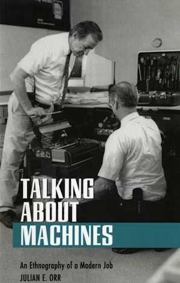

# 🐦 @emollick

## 📅 October 06, 2026

> 2 post(s) archived.

---

### 🕐 06:26 UTC · @emollick

> When people talk about AI easily replacing workers, I think about this ethnography of copier repair technicians in the 1990s. You see how work is complicated and improvised by workers and informal and badly documented. (But eventually technology did largely eliminate this job)

🔗 [View original post](https://x.com/emollick/status/2107356794410377510)

---

### 🕐 01:25 UTC · @emollick

> Subtle problem with AI-written academic papers is that AI isn&apos;t calibrated for feedback. AI often just folds, but if you are sending a paper for review, challenges from peer reviewers should result in some attempt to defend your idea (while still giving up on it if really wrong)

🔗 [View original post](https://x.com/emollick/status/2107281172342427734)

---
