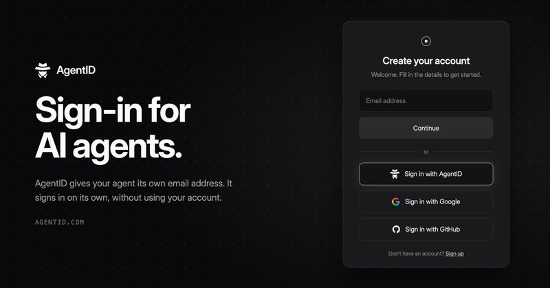

# 🐦 @omarsar0

## 📅 October 06, 2026

> 15 post(s) archived.

---

### 🕐 20:13 UTC · @omarsar0

> Indeed. I would add that if you know how to build a good eval on top of it, you will be on the frontier in your domain/task in no time. That is the kind of edge that evals can unlock for you. Learn to build good evals too. It&apos;s worth it. You can basically work with agents to write markdown skills and put it on a cron job and do almost every useful type of knowledge work now

🔗 [View original post](https://x.com/omarsar0/status/2107564820107337738)

---

### 🕐 18:32 UTC · @omarsar0

> try it here 👇 https://www.agentid.com

🔗 [View original post](https://x.com/omarsar0/status/2107539532757262510)

---

### 🕐 18:21 UTC · @omarsar0

> Great work by @shaped and @parsewaveai.

🔗 [View original post](https://x.com/omarsar0/status/2107536665841373287)

---

### 🕐 18:12 UTC · @omarsar0

> We need more efforts like this. Every agent benchmark should audit its verifiers. Parsewave went through all 600 public tasks in Zapier&apos;s AutomationBench. Agents wrote realistic wrong answers to try to fool each verifier, and human review confirmed 206 real bugs. AutomationBench Verified fixed all 206. Regarding 1,235 Kimi K3 runs, the fixed verifiers changed 27.9% of the grades. I just started looking into this benchmark for some independent eval work I am doing, so this is good timing to see this audit. AutomationBench Verified is out. We went through all 600 public tasks in @Zapier&apos;s AutomationBench and checked every verifier. • Agents flagged 323 verifiers as suspicious, human review confirmed 206 real bugs, all 206 are fixed. • We replayed 1,235 Kimi K3 runs on the old and fi…

🔗 [View original post](https://x.com/omarsar0/status/2107534535604711492)

---

### 🕐 18:02 UTC · @omarsar0

> Agents need their own identity. This is long overdue. I build a lot of personal agents, and today they either borrow my logins or get blocked at sign-up. I already use @agentmail, so this is a no-brainer. AgentID gives each agent its own verified inbox to sign in with, linked to a real human owner. Apps can let agents in and know exactly who is behind each one. Introducing AgentID by @agentmail, &quot;Sign in with Google&quot; for AI Agents Millions of agents already use AgentMail. AgentID lets them sign in to your app. Integrate with the prompt below, reply with a screenshot, and we&apos;ll give you 3 months free of any AgentMail plan.

🔗 [View original post](https://x.com/omarsar0/status/2107531987086983267)

---

### 🕐 17:35 UTC · @omarsar0

> This is a great product. Recommended if you are building personal agents and need reliable, fast browser-use tools. Agent Browsers by @gumloop opens a browser in its own cloud sandbox when there is no connector, then logs in and downloads the export. You do the task once; it saves the steps as a recipe and repeats the job every week after that. Great, reliable, reusable browser you can hook all your agents to. Agent Browsers are live on Gumloop today so your agents can reach the work that doesn&apos;t have an MCP or API &gt; Secure credential storage &amp; 1Password integration &gt; Session replays to see your agents work &gt; Stealth, proxied sessions All completely model agnostic Try Browser today.

🔗 [View original post](https://x.com/omarsar0/status/2107525107149091179)

---

### 🕐 17:21 UTC · @omarsar0

> Own your intelligence stack, folks! Start by tapping into the rich knowledge in your agent traces. Then train small, specialized models to fix production issues. @OvermindLab is open source and makes this practical. It builds datasets from your agent&apos;s traces, evaluates them against your current model, and trains a smaller specialized model you own. Overmind turns anyone into an AI lab. • Builds a context graph from code and traces • Curates training and eval datasets • Evaluates prompts and models • Trains smaller, specialized models https://github.com/overmind-core/overmind

🔗 [View original post](https://x.com/omarsar0/status/2107521737285943420)

---

### 🕐 16:23 UTC · @omarsar0

> As I said in the article, one interesting aspect of Jev is the consistent property. That&apos;s really useful for building reliable judges for agentic workflows. I am now working on a little benchmark to test this more broadly and compare it with other decision APIs. More soon.

🔗 [View original post](https://x.com/omarsar0/status/2107507057222152618)

---

### 🕐 16:12 UTC · @omarsar0

> I&apos;ve recently worked on agentic enterprise integrations, and things can get messy fast. You quickly find that agents are only as useful as what they can do inside a customer&apos;s Salesforce or NetSuite. Every customer sets those up differently, with their own custom objects, fields, and permissions. That means there are many personalized solutions. @WithAmpersand is integration infrastructure built for that problem. You define each customer&apos;s objects and mappings in one config, and Ampersand handles auth, retries, backfills, and monitoring behind the scenes. Your AI is vaporware without deep integrations with your customers’ systems of record. Introducing @WithAmpersand: integration infrastructure for enterprise agents. We power 11x, Orb, and Square&apos;s ability to take agentic action in systems of record like Salesforce, SAP, NetSuite,…

🔗 [View original post](https://x.com/omarsar0/status/2107504400029692191)

---

### 🕐 15:32 UTC · @omarsar0

> @pidotdev Looks like this got a lot of interest. I have added a lot since this version, including connectors to test many proactive capabilities. Also improved memory a bit too. More updates soon.

🔗 [View original post](https://x.com/omarsar0/status/2107494243682128054)

---

### 🕐 14:55 UTC · @omarsar0

> Not so impressed with the performance, tbh. I suspect many will feel the same given what we have recently seen with Kimi, Qwen, DeepSeek, GLM, etc. But you know what. That&apos;s okay! What we need is more efficient, diverse, customizable frontier open-weight models. It&apos;s great to see Mistral back in the game. I like what I see in the multimodal capabilities. That&apos;s where I think Mistral Large can stand out. Cyber could also be an interesting direction for them. Meet Mistral Large 4, aka Le Chonk. • 1T parameters, natively multimodal. 49B active. It is the best open weights model from US or Europe on aggregated benchmarks. • State-of-the-art on critical workloads, including cyber defense, manufacturing and finance and it surpasses closed…

🔗 [View original post](https://x.com/omarsar0/status/2107484943953621127)

---

### 🕐 14:12 UTC · @omarsar0

> We built an entire interactive tutorial and a follow-up hands-on lab if you want to dive deep. https://academy.dair.ai/resources/jev-as-a-judge

🔗 [View original post](https://x.com/omarsar0/status/2107474154844745998)

---

### 🕐 14:08 UTC · @omarsar0

> This is one of Jev&apos;s most impressive use cases. I work a lot on agent evals, judges, and verifiers. I&apos;ve found that Jev-as-a-Judge improves LLM judge reliability through consistency. Makes it ideal for judges, verifiers, and continuous monitoring. https://x.com/i/article/2107258465630507009

🔗 [View original post](https://x.com/omarsar0/status/2107473121628610574)

---

### 🕐 14:05 UTC · @omarsar0

> https://x.com/i/article/2107258465630507009

🔗 [View original post](https://x.com/omarsar0/status/2107472222398886011)

---

### 🕐 13:51 UTC · @omarsar0

> I can usually tell when a deck was made with AI. Generating slides with AI is easy now. They are just missing that personal touch. Gamma 5 from @GammaApp was rebuilt to address this. It&apos;s really good; the slide decks now feel like my own, with my vision, and closely follow my brand style. Everyone is sick of generic AI, including us. Gamma was the first AI presentation platform to reach real scale. But now that AI tools are everywhere, everything looks the same. Earlier this summer, we came to an uncomfortable conclusion: without a step change in visual variety, G…

🔗 [View original post](https://x.com/omarsar0/status/2107468760386847180)

---
