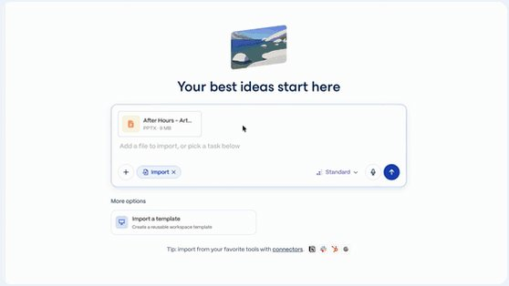

# 🐦 @omarsar0

## 📅 October 06, 2026

> 5 post(s) archived.

---

### 🕐 14:55 UTC · @omarsar0

> Not so impressed with the performance, tbh. I suspect many will feel the same given what we have recently seen with Kimi, Qwen, DeepSeek, GLM, etc. But you know what. That&apos;s okay! What we need is more efficient, diverse, customizable frontier open-weight models. It&apos;s great to see Mistral back in the game. I like what I see in the multimodal capabilities. That&apos;s where I think Mistral Large can stand out. Cyber could also be an interesting direction for them. Meet Mistral Large 4, aka Le Chonk. • 1T parameters, natively multimodal. 49B active. It is the best open weights model from US or Europe on aggregated benchmarks. • State-of-the-art on critical workloads, including cyber defense, manufacturing and finance and it surpasses closed…

🔗 [View original post](https://x.com/omarsar0/status/2107484943953621127)

---

### 🕐 14:12 UTC · @omarsar0

> We built an entire interactive tutorial and a follow-up hands-on lab if you want to dive deep. https://academy.dair.ai/resources/jev-as-a-judge

🔗 [View original post](https://x.com/omarsar0/status/2107474154844745998)

---

### 🕐 14:08 UTC · @omarsar0

> This is one of Jev&apos;s most impressive use cases. I work a lot on agent evals, judges, and verifiers. I&apos;ve found that Jev-as-a-Judge improves LLM judge reliability through consistency. Makes it ideal for judges, verifiers, and continuous monitoring. https://x.com/i/article/2107258465630507009

🔗 [View original post](https://x.com/omarsar0/status/2107473121628610574)

---

### 🕐 14:05 UTC · @omarsar0

> https://x.com/i/article/2107258465630507009

🔗 [View original post](https://x.com/omarsar0/status/2107472222398886011)

---

### 🕐 13:51 UTC · @omarsar0

> I can usually tell when a deck was made with AI. Generating slides with AI is easy now. They are just missing that personal touch. Gamma 5 from @GammaApp was rebuilt to address this. It&apos;s really good; the slide decks now feel like my own, with my vision, and closely follow my brand style. Everyone is sick of generic AI, including us. Gamma was the first AI presentation platform to reach real scale. But now that AI tools are everywhere, everything looks the same. Earlier this summer, we came to an uncomfortable conclusion: without a step change in visual variety, G…

🔗 [View original post](https://x.com/omarsar0/status/2107468760386847180)

---
