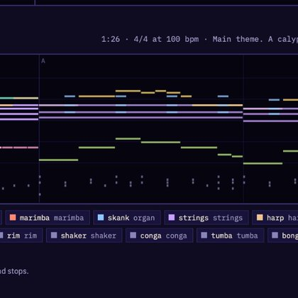

# 🐦 @simonw

## 📅 October 06, 2026

> 3 post(s) archived.

---

### 🕐 17:00 UTC · @simonw

> Here&apos;s a benchmark that uses Lilypond https://x.com/aug5thmusic/status/2096030719156089029 GPT-6 Astra has the best result yet on the Bach Benchmark. Its chorale contains no voice-leading errors, and its harmonic palette is sophisticated enough to include a Neapolitan sixth chord. More importantly, it is the first model to ever write passing tones on this benchmark, a …

🔗 [View original post](https://x.com/simonw/status/2107516463250821166)

---

### 🕐 15:40 UTC · @simonw

> Anyone know when the models started being able to compose competent music? I had Opus 5.5 &quot;write some computer game music for me&quot; and the results were much better than I had expected https://simonwillison.net/2026/Oct/6/scrimshaw-jukebox/

🔗 [View original post](https://x.com/simonw/status/2107496114299822393)

---

### 🕐 14:35 UTC · @simonw

> Mistral can pelican now! https://tools.simonwillison.net/markdown-svg-renderer?url=https%3A%2F%2Fgist.github.com%2Fsimonw%2F0db8b8196e57711b352f6c5857cf5b35#response-1 Meet Mistral Large 4, aka Le Chonk. • 1T parameters, natively multimodal. 49B active. It is the best open weights model from US or Europe on aggregated benchmarks. • State-of-the-art on critical workloads, including cyber defense, manufacturing and finance and it surpasses closed…

🔗 [View original post](https://x.com/simonw/status/2107479817780400577)

---
