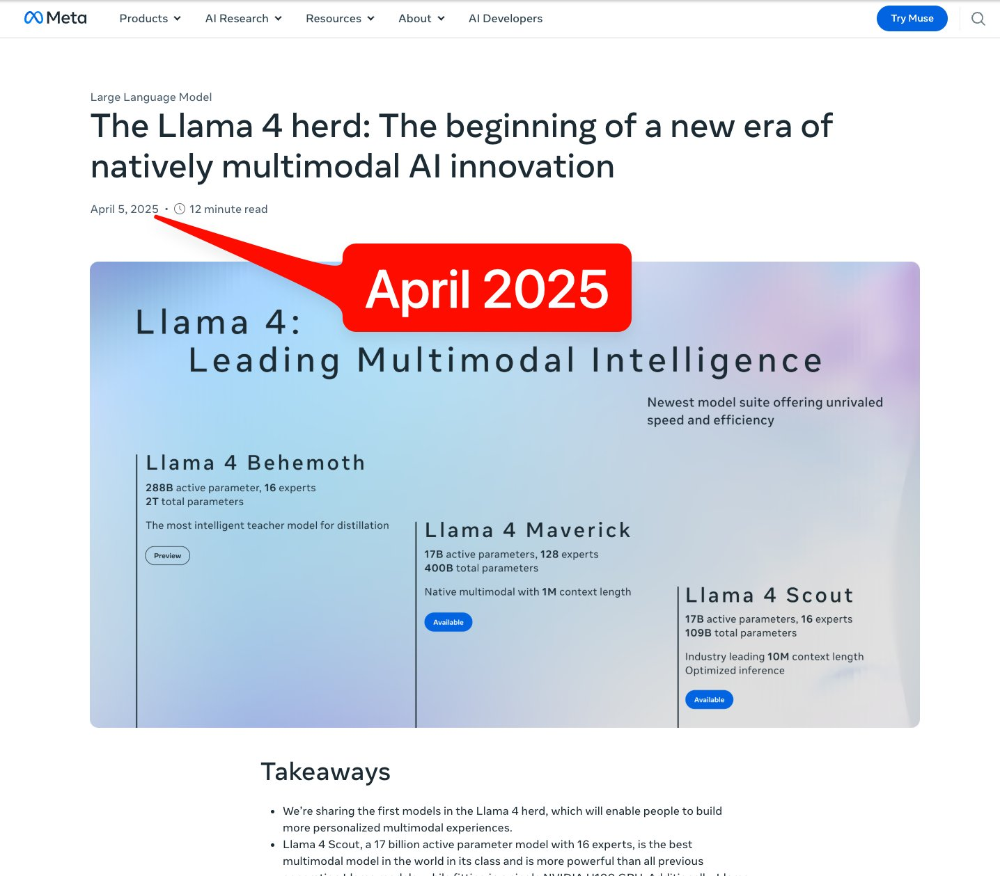

# 🐦 @swyx

## 📅 October 06, 2026

> 2 post(s) archived.

---

### 🕐 17:02 UTC · @swyx

> Today on AI:AM, @swyx is back. Astra is &quot;a fully capable AI Engineer&quot; for $6/hr, so what&apos;s left of the job he named? Plus Cursor → SpaceX, whether agent labs survive, and a preview of @aidotengineer NYC (Oct 12–14). 10:15a PT with @labenz + @8teAPi 📺 https://x.com/i/broadcasts/1XGygweMBVYxM

🔗 [View original post](https://x.com/labenz/status/2107516767408910563)

---

### 🕐 01:02 UTC · @swyx

> the epic 18 month vibe shift of @AIatMeta from the Llama 4 shitshow to now being routinely mentioned in the same breath as other frontier labs needs to be studied @alexandr_wang (and his shockingly deep bench) is both built different and builds different. unreal

🔗 [View original post](https://x.com/swyx/status/2107275361822347406)

---
