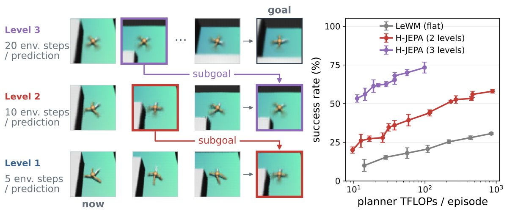
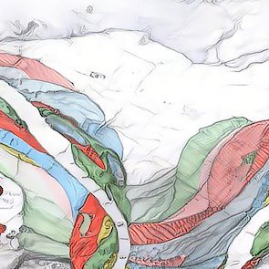

# 🐦 @ylecun

## 📅 October 06, 2026

> 2 post(s) archived.

---

### 🕐 14:34 UTC · @ylecun

> Introducing H-JEPA: the first end-to-end learned hierarchical world model for long-horizon visual planning! Built atop SIGReg/LeWM, H-JEPA provides a stable training recipe where semantic abstractions naturally emerge across levels... Paper+Code: https://arxiv.org/abs/2610.06805 🧵👇

🔗 [View original post](https://x.com/randall_balestr/status/2107479655150436504)

---

### 🕐 11:40 UTC · @ylecun

> An interesting cognitive bias: &quot;GLM 5.3 is around as capable as Claude Mythos at cyber-exploitation while also having much lower safeguards, meaning that every additional day absent some dire cybersecurity incident is further evidence against catastrophic AI cyber-risk.&quot; That&apos;s right. And yet it doesn&apos;t seem to be treated that way by many people in the safety community. It&apos;s like they have a one-way valve for their risk estimates. I was curious if this bias has already been talked about in lesswrong / EA circles and indeed it has, going all the way back to this 2007 Yudkowsky post &quot;Absence of Evidence Is Evidence of Absence&quot; https://www.lesswrong.com/posts/mnS2WYLCGJP2kQkRn/absence-of-evidence-is-evidence-of-absence Does anyone disagree that pretty much every piece of empirical evidence we have about actually existing AI points toward a labor-augmenting technology with a more-or-less ordinary risk profile (no worse than cars, guns, nuclear power, social media, etc.)? On the labor front, the …

🔗 [View original post](https://x.com/random_walker/status/2107435883062325411)

---
