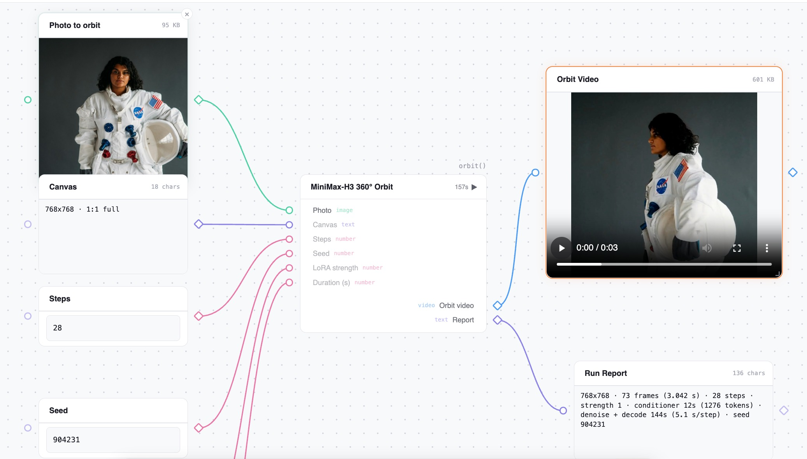
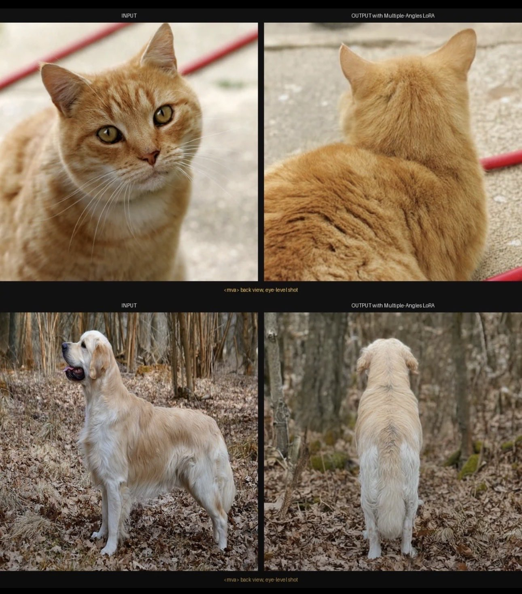

# 🐦 @_akhaliq

## 📅 October 07, 2026

> 2 post(s) archived.

---

### 🕐 12:48 UTC · @_akhaliq

> You can now use the 360 orbit lora as a workflow within @huggingface 🔄 Thanks @_akhaliq for creating the app

🔗 [View original post](https://x.com/pabloadaw/status/2107815211109687551)

---

### 🕐 09:02 UTC · @_akhaliq

> Qwen-Image-2.1-Multiple-Angles-LoRA Model: https://huggingface.co/akhaliq/Qwen-Image-2.1-Multiple-Angles-LoRA

🔗 [View original post](https://x.com/_akhaliq/status/2107758426843648071)

---
