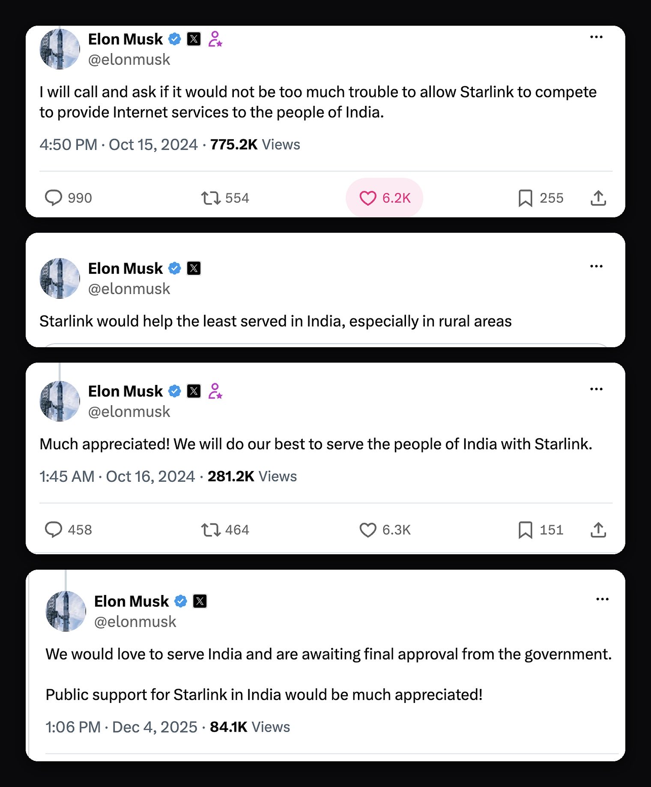
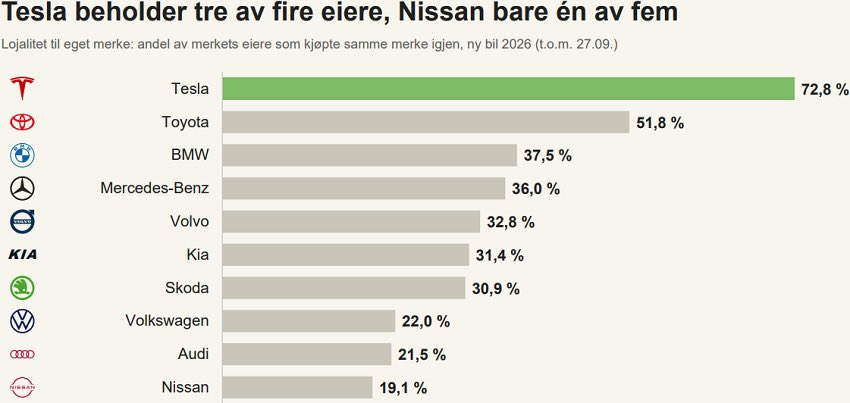
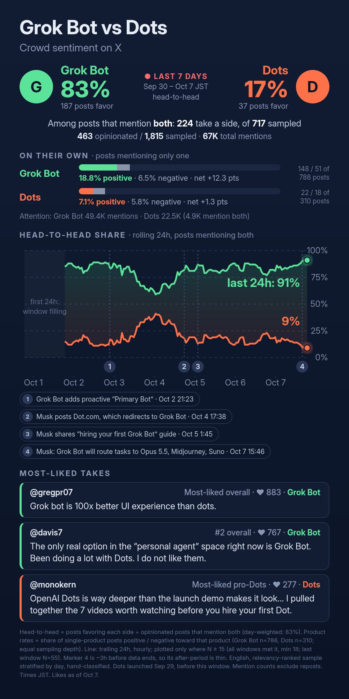

# 🐦 @elonmusk

## 📅 October 07, 2026

> 42 post(s) archived.

---

### 🕐 18:30 UTC · @elonmusk

> For nearly FIVE YEARS, Elon and the Starlink team have been trying to bring high-speed internet to India, especially to rural and remote areas where reliable connectivity is still difficult and expensive to reach Starlink has spent years working through India’s requirements It has secured its telecom licences, received IN-SPACe approval, built 20+ gateway sites and designed its operations specifically around India’s security requirements including keeping Indian user data inside India And yet Starlink still cannot serve a single commercial customer The final clearances and spectrum assignment are still pending India is still about 64% rural…..roughly 941 million people live in rural areas Starlink is ready The ground infrastructure is already built That years-long delay is hard to justify and incredibly frustrating Starlink will give many more people another way to access high-speed internet, especially in places where fibre and mobile networks struggle to reach And that makes the situation even harder to understand when Digital India itself is built around broadband access and closing connectivity gaps If the goal is really to bring more Indians online, Starlink should not still be sitting on the sidelines after nearly five years

🔗 [View original post](https://x.com/XFreeze/status/2107901506586640747)

---

### 🕐 18:02 UTC · @elonmusk

> However, most @Bot requests are pretty simple and will be handled by a lightning-fast version of Grok 4.8 when that comes out. Operating principle is to give Grok Bot users the best possible combination of speed &amp; intelligence. This is wild... Grok Bot will now pick Claude Opus 5.5, Midjourney, Suno + more depending on the task. Best model wins.

🔗 [View original post](https://x.com/elonmusk/status/2107894231922876510)

---

### 🕐 17:47 UTC · @elonmusk

> Elon Musk on why internet access is one of the most powerful tools humanity has for lifting people out of poverty: “The single biggest thing you can do to lift people out of poverty and help them is giving them an internet connection” Because once someone gets connected, their opportunities completely change • they can learn almost anything for free • get access education and information • Find work and build businesses • Sell goods and services to the global market • Participate in an economy far beyond their local community That is the bigger mission behind Starlink Bringing low-cost, high-bandwidth internet to places where traditional connectivity is unavailable, too expensive or simply never reaches For hundreds of millions of people, an internet connection is not just a convenience....it is access to new opportunity they never had before https://x.com/XFreeze/status/2015067284205916553/video/1 Media Starlink in India would enable high-speed, affordable Internet connectivity for those who can’t afford current prices or who don’t have a connection at all!

🔗 [View original post](https://x.com/XFreeze/status/2107890635873345583)

---

### 🕐 17:35 UTC · @elonmusk

> Starlink in India would enable high-speed, affordable Internet connectivity for those who can’t afford current prices or who don’t have a connection at all! ELON MUSK: “We’d love to be operating Starlink in India. That would be great.” It’s been nearly four years since Starlink applied to operate in India, and it is still waiting to launch. The government should grant the remaining approvals as soon as possible so Starlink can bring …

🔗 [View original post](https://x.com/elonmusk/status/2107887475251458094)

---

### 🕐 17:24 UTC · @elonmusk

> Order a Tesla online in under 5 minutes and find out why they have the highest brand loyalty in the world 3 in 4 Norwegian Tesla owners make their next car another Tesla 🇳🇴 We love ya too

🔗 [View original post](https://x.com/wholemars/status/2107884825491423313)

---

### 🕐 16:53 UTC · @elonmusk

> Media

🔗 [View original post](https://x.com/elonmusk/status/2107876928162275329)

---

### 🕐 16:51 UTC · @elonmusk

> Whatever it take for @Bot to deliver the best product experience for users Grok @bot will be insanely powerful if it’s completely model agnostic and the @SpaceXAI simply hyper-focuses on creating the greatest orchestrator AI of all time. That orchestrator AI will know what model is best at what at the best possible cost and fastest speed, and based on y…

🔗 [View original post](https://x.com/elonmusk/status/2107876487454179416)

---

### 🕐 16:49 UTC · @elonmusk

> Manual driving is like riding a horse or hand-coding in Perl and PHP. You can still do it. You just don’t have to. I&apos;m still amazed there are people who use Claude Code and Codex on the daily yet don&apos;t own a Tesla Tesla&apos;s FSD v14.3 is like Opus 5.5. It just works and it is just so good and buttery smooth Imagine Astra-level computer use, but for driving your car &quot;but I love mah car, vroom vro…

🔗 [View original post](https://x.com/pduan/status/2107875970929865183)

---

### 🕐 16:36 UTC · @elonmusk

> 💯 Talarico is very obviously just lying about what he supports in order to try and win an election. We have his voting record and things he has said. He’s hoping people don’t understand these things.

🔗 [View original post](https://x.com/elonmusk/status/2107872672785084550)

---

### 🕐 16:36 UTC · @elonmusk

> True Quebec just handed power to a party that wants out of Canada. The Parti Québécois won Monday&apos;s election, projected at 56 seats. That&apos;s a minority. Paul St-Pierre Plamondon will be premier. He&apos;s promised a referendum on leaving Canada in his first term, but not before January 20, …

🔗 [View original post](https://x.com/elonmusk/status/2107872596465446922)

---

### 🕐 16:35 UTC · @elonmusk

> 🤨 James Talarico: “We have to understand especially for white educators that these violent hierarchies, these systems, white supremacy, heteropatriarchy, economic exploitation, those things have colonized our own minds.”

🔗 [View original post](https://x.com/elonmusk/status/2107872382367281252)

---

### 🕐 16:27 UTC · @elonmusk

> And yet again. I ask my family: Did you see or hear about what is going on in the world? One answer keeps coming: NO. If you aren’t on X, i You oblivious to what is going on in the world. @KanekoaTheGreat And yet again it happens

🔗 [View original post](https://x.com/TheCaptainEli/status/2107870365879795753)

---

### 🕐 16:06 UTC · @elonmusk

> NEW: The DOJ released photos of the Tumbler Ridge school shooter&apos;s guns: a shotgun with a trans flag-colored sticker, posed before a trans flag, and a rifle with a suppressor in trans flag colors. Jesse Van Rootselaar killed eight people, six of them children aged 11 to 13. Van Rootselaar sent the photos on Discord to James Cody Bryant, who also identifies as transgender. Bryant, 30, of Bellingham, Washington, was charged yesterday with conspiracy to murder. Prosecutors say he helped plan the shooting and agreed to livestream it.

🔗 [View original post](https://x.com/KanekoaTheGreat/status/2107865038484918365)

---

### 🕐 15:23 UTC · @elonmusk

> Unfortunately, we are being blocked by certain oligarchs in order to maintain their monopolistic chokehold on the Indian people. You can guess who they are … This is a crime against the people of India! India needs @Starlink 🇮🇳 • 11,256 of India’s listed villages still lacked 4G coverage as of May 2026. • India had 1.093 billion internet subscriptions in March 2026, but only 440.87 million were rural. Rural subscription density was 48.31 per 100 people, compared with 126.80 in…

🔗 [View original post](https://x.com/elonmusk/status/2107854307077034294)

---

### 🕐 15:21 UTC · @elonmusk

> Starlink Mobile (direct-to-cell) V2 satellites are incredible. This @SpaceX constellation will enable more than 100 times the bandwidth of our current V1 system! SpaceX just got a massive FCC green light for Starlink Mobile The FCC has approved SpaceX to launch and operate up to 15,000 next-generation satellites built for direct-to-phone connectivity The new system is designed to: • Target peak speeds of up to 150 Mbps per user • Connect …

🔗 [View original post](https://x.com/elonmusk/status/2107853835528274320)

---

### 🕐 15:18 UTC · @elonmusk

> @KatieMiller Hall of Fame community note

🔗 [View original post](https://x.com/NotTomBrown/status/2107853200913203351)

---

### 🕐 15:11 UTC · @elonmusk

> @xenocosmography TITS could be funded from merch sales alone!

🔗 [View original post](https://x.com/elonmusk/status/2107851234439020966)

---

### 🕐 15:06 UTC · @elonmusk

> After many years in top machine learning organizations, with friends at frontier labs, I still consider Tesla’s ML engineers the best—the only ones I would trust with my life. Unsatisfied with theory, they scrutinize every detail until it is proven in reality. They demand real-world miles, not charts. This culture exists nowhere else. This week marks another anniversary at Tesla. I am honored to work with you all for many years to come.

🔗 [View original post](https://x.com/yunta_tsai/status/2107849961299980503)

---

### 🕐 15:04 UTC · @elonmusk

> Grok @Bot will use whatever achieves the best outcome for users. Simple questions will route to small, fast models. Questions with complex answers will route to large models. Grok goes open. Holy shit.

🔗 [View original post](https://x.com/elonmusk/status/2107849623364895151)

---

### 🕐 15:00 UTC · @elonmusk

> Dragon undocks from the Space Station Dragon separation confirmed!

🔗 [View original post](https://x.com/elonmusk/status/2107848493830463815)

---

### 🕐 14:55 UTC · @elonmusk

> Here’s the full speech of SpaceX’s Vice President of @Starlink Business Operations, Lauren Dreyer, at the 10th India Mobile Congress 2026 today. 0:21 Future at scale 0:45 Launch pad to last mile 1:15 Space AI connectivity 1:45 Starship reaches orbit 2:15 Orbital AI compute 2:45 Global Starlink coverage 3:20 Eleven thousand satellites 3:50 Closing digital divide 4:30 Airtel and Jio MOUs 5:10 Built for India rules 5:42 Twenty gateway sites 6:05 India&apos;s digital progress 6:16 Connect in minutes 6:45 Himalayan classroom 7:10 Northeast telemedicine 7:35 Disaster response 8:00 Farmers and markets 8:25 Tower backhaul 8:50 ISRO GSAT launch 9:06 Shukla and rideshares 9:35 Ready to serve India 10:00 PM Modi connectivity vision Media

🔗 [View original post](https://x.com/cb_doge/status/2107847224046874764)

---

### 🕐 14:41 UTC · @elonmusk

> 3 in 4 Norwegian Tesla owners make their next car another Tesla 🇳🇴 We love ya too

🔗 [View original post](https://x.com/teslaeurope/status/2107843860231815315)

---

### 🕐 12:58 UTC · @elonmusk

> Elon Musk says he was on Twitter almost from the beginning, and his early tweets were already crazy. 😂 He originally deleted his account because everyone was tweeting about what latte they had at Starbucks.https://x.com/Alexs_jame/status/2107650055511429628/video/1 Then someone started impersonating him. So Musk decided to take Twitter back and start saying crazy things himself. “I use Twitter” the same way some people use their hair to express themselves. Honestly, the man has been consistent. Media

🔗 [View original post](https://x.com/joeroganhq/status/2107817719076880818)

---

### 🕐 12:27 UTC · @elonmusk

> BREAKING: SpaceX’s Vice President of @Starlink Business Operations, Lauren Dreyer, spoke at India Mobile Congress today, saying Starlink is ready to serve India. 🇮🇳 Starlink has already built 20 gateway sites in India with hundreds of antennas, security controls tailored to India and Indian user data kept within the country. Final government approvals are pending. She highlighted Starlink’s potential to help connect 100% of India, bringing people online in minutes. “We stand ready to serve India, as soon as India is ready!” https://x.com/ANI/status/2107734328780501192/video/1 Media

🔗 [View original post](https://x.com/cb_doge/status/2107810049418793288)

---

### 🕐 12:13 UTC · @elonmusk

> The spacecraft is executing a series of departure burns to move away from the @Space_Station. Dragon will reenter the Earth&apos;s atmosphere and splash down in ~27.5 hours off the coast of California

🔗 [View original post](https://x.com/SpaceX/status/2107806557807481006)

---

### 🕐 11:25 UTC · @elonmusk

> Can’t unsee it… Elon is a creator. Bernie is a taker. Elon is a doer. Bernie is a talker. Elon is a builder. Bernie is a destroyer. Elon is a contributor. Bernie is a parasite. Elon is a producer. Bernie is a redistributor. Elon is a Capitalist. Bernie is a Communist. Etc

🔗 [View original post](https://x.com/C_3C_3/status/2107794430321369353)

---

### 🕐 11:19 UTC · @elonmusk

> Winter is coming FSD Supervised is ready Media

🔗 [View original post](https://x.com/teslaeurope/status/2107792835126919431)

---

### 🕐 10:35 UTC · @elonmusk

> BREAKING: Intel CEO Lip-Bu Tan confirms the company will continue working with Elon Musk on Terafab. He made the comments in Tokyo today, reaffirming Intel’s role as a development partner. Intel joined in April to help design, manufacture and package chips.

🔗 [View original post](https://x.com/cb_doge/status/2107781749724086318)

---

### 🕐 10:23 UTC · @elonmusk

> People clearly prefer Grok Bot to Dots.

🔗 [View original post](https://x.com/NathanLands/status/2107778953494794733)

---

### 🕐 06:09 UTC · @elonmusk

> 🇩🇪 Danke Schön! 🇩🇪 BREAKING: Germany’s transport minister pushes for Tesla FSD approval across Europe. Speaking today at a Tagesspiegel Background conference in Berlin, Steffen Bilger said: • He will push for Tesla FSD Supervised to reach drivers across the EU soon. • He sees potential for FSD to m…

🔗 [View original post](https://x.com/elonmusk/status/2107714870313676807)

---

### 🕐 06:08 UTC · @elonmusk

> Great to be at India Mobile Congress today. Thank you to the Government of India and @DoT_India for the opportunity to share @Starlink’s vision for India. Starlink can help reach the places where the last mile is still the hardest mile - working alongside India’s operators, government and industry. As India works through the final approvals, our message is simple: We stand ready to serve India, as soon as India is ready! 🇮🇳🛰️

🔗 [View original post](https://x.com/LaurenDreyer/status/2107714585142919226)

---

### 🕐 05:54 UTC · @elonmusk

> Grok Bot is awesome

🔗 [View original post](https://x.com/melvindvivas/status/2107711125341274582)

---

### 🕐 05:28 UTC · @elonmusk

> Finally. https://x.com/NatConTalk/status/2107447587683045633?s=20 “We, the Jews of Israel, have a great problem with progressive Jews in the West who support immigration. It is time for us to call them out.” — @GadiTaub1 at NatCon Jerusalem.

🔗 [View original post](https://x.com/xenocosmography/status/2107704580016582936)

---

### 🕐 05:12 UTC · @elonmusk

> The engineering underneath Super Heavy is absolutely insane It literally looks more like science fiction than rocket hardware

🔗 [View original post](https://x.com/XFreeze/status/2107700687635464494)

---

### 🕐 04:58 UTC · @elonmusk

> It really is Bad news guys: Grok Bot is actually really good 🙃

🔗 [View original post](https://x.com/elonmusk/status/2107697003899846720)

---

### 🕐 04:55 UTC · @elonmusk

> SpaceX talk Grok Bot summary: IAC 2026 presentation by SpaceXAI President Michael Nicolls. 🎯 The main message - SpaceX was founded in 2002 to make life multi-planetary and &quot;extend the light of consciousness to the stars.&quot; - He said the biggest risk as constellations grow is not debris. It&apos;s…

🔗 [View original post](https://x.com/elonmusk/status/2107696351794622954)

---

### 🕐 04:53 UTC · @elonmusk

> Tesla self-driving is magical “I&apos;m in a Model Y L, and using [FSD Supervised]. This is the most unbelievable technology I have ever experienced in a car.”

🔗 [View original post](https://x.com/elonmusk/status/2107695858259292561)

---

### 🕐 04:20 UTC · @elonmusk

> Grok Build just got one of its biggest updates yet.....a massive upgrade touching almost every part of the agent stack Compact mode gets a major upgrade, timestamps are now configurable, shell commands clearly show when they’re running or finished, tables can export directly as TSV, CSV or Markdown, and the dashboard now gives much better visibility and control over worktrees Under the hood, the update is even bigger: stalled model calls now retry, long sessions are more resilient, permission handling is much tighter, failed file writes preserve existing contents, CJK memory search improves, concurrent config edits are safer, MCP tool discovery is more reliable, and worktree creation + deletion gets a huge reliability pass There’s even a breaking safety change: grok worktree rm now refuses to delete active worktrees or ones with unsaved changes unless you explicitly force it Release Notes: v1.0.50 Breaking Changes: • grok worktree rm without -f now refuses to delete worktrees that are in use or contain unsaved changes and exits with an error. Features: • Compact mode now collapses recaps and keeps inner spacing on tall terminals. • Clicking the git branch in the header now copies the full branch name. • Long branch names now abbreviate on narrow terminals while remaining copyable. • Targeted cancels now stop only the specific response when requested by clients. • Compact mode now hides the dock (or tasks pane) the same way Ctrl+G does. • New timestamps setting offers off, minimal, and on modes in Settings and /timestamps. • Shell command output now shows &quot;Running …&quot; while executing and &quot;Ran …&quot; when finished. • Live preview pins now include whether an app was observed behind the URL. • Command palette (Ctrl+P) and model picker now open at the same width as the settings modal. • Tables rendered by grok now show copy buttons underneath that export clean TSV, CSV or Markdown suitable for spreadsheets. • Dashboard now shows which worktree each session belongs to, displays the -m model in the new-agent box, and lets you toggle worktree mode in the folder picker. Bug Fixes: • Shell permission decisions now correctly prompt or approve commands matching the permission manager. • Cancelled turns now correctly mark unanswered tool calls as cancelled instead of succeeded. • Long error messages in the /usage and /session-info modals now wrap instead of being truncated. • Em-dashes no longer appear in status messages and subagent rows. • Stalled model calls during turns now retry before failing the turn. • Queue pane and Ctrl+; now appear and work when the dock is hidden with Ctrl+G. • Long sessions no longer disconnect when the conversation exceeds 4 MiB. • Permission rules now accept native tool names such as run_terminal_command and Shell. • /rewind now places the cursor at the end of the restored prompt. • Failed file writes now leave the previous contents instead of an empty file. • Fixed /loop and scheduler_create so non-ASCII intervals like 5分 no longer crash the session. • Fixed --disallowed-tools when only one scheduler tool is named; the other two no longer cause startup failure. • Fixed closing a busy tab so queued prompts are no longer sent to the model. • Fixed relative --cwd so grok --cwd a no longer ends up running inside a/a. • The terminal title now shows &quot;Action Required&quot; for any background session waiting on approval. • grok now accepts a prompt via piped stdin in headless mode instead of trying to open the UI. • An admin-set [features] title_refresh = false in requirements.toml now correctly disables title refresh even when GROK_TITLE_REFRESH is set. • Custom notification commands defined under [[ui.notifications.hooks]] now execute on matching events. • An admin pin of [cli] use_leader = false now correctly prevents --leader from starting a leader process. • When multiple MCP servers expose a tool with the same name, search_tool now returns all of them. • Concurrent Grok windows editing settings no longer lose or corrupt config.toml entries such as MCP servers or permission rules. • web_fetch no longer downloads huge files into memory before rejecting them. • memory_get no longer returns huge files that exceed the read limit. • Continue to run no longer kills commands running inside background subagents. • memory_search now finds Japanese, Chinese, and Korean words inside longer notes. • Drafts saved by the model now appear under their actual titles in /feedback. • Imagine replies that are not valid images are now rejected instead of being saved as .jpg files. • A workflow file that fails to parse now reports the exact file and parse error instead of &apos;unknown workflow&apos;. • Re-encoded images are now oriented correctly using their EXIF tags instead of appearing sideways. • Image and log paths reported after /fork --worktree now point to real files instead of missing locations. • Tab characters in terminal command output are now preserved when shown to the model. • Transparent images are now kept as PNG when re-encoded instead of turning black. • The bundled ripgrep is now available to terminal commands even on images that do not install it. • Request bodies now stay under a small configured max_request_bytes limit instead of growing past it. • Effort level now stays the same after a bare /model switch instead of jumping to the new model&apos;s default. • Ctrl+\ and other modified digits no longer accidentally select options on permission or cancel cards. • Feedback submissions now show accurate success or failure messages without premature thanks or duplicated prefixes. • grok doctor now reports the exact config file or setting that prevents Grok from starting instead of saying zero issues. • Recap summaries now appear on screen automatically instead of requiring manual scrolling. • grok doctor fix now opens its confirmation card on Cancel to prevent accidental edits to shell or tmux config. • Slash commands now run regardless of case (e.g. /COMPACT or /Compact). • /context no longer shows an invented auto-compact threshold when the agent does not report one. • Agent text no longer keeps the pager redrawing when a tool call interrupts the sentence. • CLI tool calls no longer fail or overflow when the workspace directory is deleted or output is huge. • Logs written to files or when NO_COLOR is set are now plain text instead of containing color codes. • Prompts now fail immediately with a clear message if the session&apos;s working directory no longer exists instead of failing later or recreating it. • grok -w now works correctly with separate-git-dir repositories and shows clear errors when run outside a git repo or on an empty repo. • Shell tool descriptions now correctly state the actual output truncation limit, and grep respects globs relative to the current session directory. • Compaction messages now scroll into view instead of appearing below the bottom of the screen after a turn finishes. • Git-mode worktrees created with -w now preserve uncommitted changes instead of dropping them. • Worktrees created with --worktree-ref no longer contain wrong submodule contents or LFS pointer text. • Worktree creation now shows the same clear error messages on every code path. • Failed worktree creates now show a clear error on the home screen instead of being hidden. • Merge and rebase conflicts now appear in the changes list instead of being hidden. • Fixed a crash when starting a new session with durable rewind checkpoints enabled. • Managed permission files with one bad key no longer lose all their valid rules. • Simultaneous worktree creates with the same label now succeed instead of one failing with &quot;already exists&quot;. • grok worktree rm without -f no longer deletes arbitrary folders that happen to share a name with a removed worktree. • Discard now affects only the exact files you select instead of also deleting or reverting similarly-named files. • Permission rules with one bad entry no longer lose the other rules in the same section. • Chat Completions streams that end without a finish reason are now retried instead of returning partial output. • grok worktree rm by label now refuses when the label exists in multiple repos. • Grep now respects Read deny rules that use a leading ./. Performance: • Command hooks no longer cause large memory spikes when they print a lot of output. • Retry waits now vary between processes instead of being identical. Grok Build just got another bug-fix update, this time focused heavily on permissions and tool safety Hook permission prompts now show up regardless of approval mode, WebSearch/WebFetch and image generation properly respect prompt_policy and rule decisions, and “Allow once” now re…

🔗 [View original post](https://x.com/XFreeze/status/2107687399509913967)

---

### 🕐 04:00 UTC · @elonmusk

> Grok bot proactively helping every day is like having many executive assistants for each area of your life. There hasn’t been a technology that’s this well put together in a long time. I can’t wait to see what else the @SpaceXAI team is cooking 👨‍🍳 🥔

🔗 [View original post](https://x.com/thecsguy/status/2107682560763654325)

---

### 🕐 03:56 UTC · @elonmusk

> Bro… after connecting all my Gmail accounts to Grok Bot, I don’t even need to open Gmail anymore. Today it cleaned up 2,000+ emails, and all I had to tell it was: “Mark these as read,” “Unsubscribe me from these mailing lists,” “Move these to trash,” or respond with whatever. I’m literally managing my inbox by texting my bot… thousands of emails cleaned up with a few simple instructions. And unsubscribing means less junk coming in tomorrow, too. This might be my favorite email hack ever. What a game changer.

🔗 [View original post](https://x.com/Teslaconomics/status/2107681345178923367)

---

### 🕐 03:32 UTC · @elonmusk

> Democrats are for open borders and couldn’t care less when American citizens are murdered by illegal aliens. Listen for yourself 👇 Media

🔗 [View original post](https://x.com/ScottJenningsKY/status/2107675323672248425)

---

### 🕐 00:04 UTC · @elonmusk

> Grok 4.7 is now live on Microsoft Foundry Media

🔗 [View original post](https://x.com/SpaceXAI/status/2107623124909060174)

---
