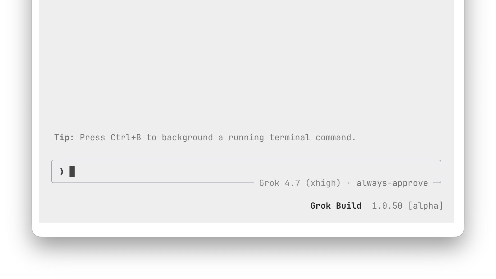

# 🐦 @elonmusk

## 📅 October 07, 2026

> 6 post(s) archived.

---

### 🕐 04:58 UTC · @elonmusk

> It really is Bad news guys: Grok Bot is actually really good 🙃

🔗 [View original post](https://x.com/elonmusk/status/2107697003899846720)

---

### 🕐 04:55 UTC · @elonmusk

> SpaceX talk Grok Bot summary: IAC 2026 presentation by SpaceXAI President Michael Nicolls. 🎯 The main message - SpaceX was founded in 2002 to make life multi-planetary and &quot;extend the light of consciousness to the stars.&quot; - He said the biggest risk as constellations grow is not debris. It&apos;s…

🔗 [View original post](https://x.com/elonmusk/status/2107696351794622954)

---

### 🕐 04:53 UTC · @elonmusk

> Tesla self-driving is magical “I&apos;m in a Model Y L, and using [FSD Supervised]. This is the most unbelievable technology I have ever experienced in a car.”

🔗 [View original post](https://x.com/elonmusk/status/2107695858259292561)

---

### 🕐 04:20 UTC · @elonmusk

> Grok Build just got one of its biggest updates yet.....a massive upgrade touching almost every part of the agent stack Compact mode gets a major upgrade, timestamps are now configurable, shell commands clearly show when they’re running or finished, tables can export directly as TSV, CSV or Markdown, and the dashboard now gives much better visibility and control over worktrees Under the hood, the update is even bigger: stalled model calls now retry, long sessions are more resilient, permission handling is much tighter, failed file writes preserve existing contents, CJK memory search improves, concurrent config edits are safer, MCP tool discovery is more reliable, and worktree creation + deletion gets a huge reliability pass There’s even a breaking safety change: grok worktree rm now refuses to delete active worktrees or ones with unsaved changes unless you explicitly force it Release Notes: v1.0.50 Breaking Changes: • grok worktree rm without -f now refuses to delete worktrees that are in use or contain unsaved changes and exits with an error. Features: • Compact mode now collapses recaps and keeps inner spacing on tall terminals. • Clicking the git branch in the header now copies the full branch name. • Long branch names now abbreviate on narrow terminals while remaining copyable. • Targeted cancels now stop only the specific response when requested by clients. • Compact mode now hides the dock (or tasks pane) the same way Ctrl+G does. • New timestamps setting offers off, minimal, and on modes in Settings and /timestamps. • Shell command output now shows &quot;Running …&quot; while executing and &quot;Ran …&quot; when finished. • Live preview pins now include whether an app was observed behind the URL. • Command palette (Ctrl+P) and model picker now open at the same width as the settings modal. • Tables rendered by grok now show copy buttons underneath that export clean TSV, CSV or Markdown suitable for spreadsheets. • Dashboard now shows which worktree each session belongs to, displays the -m model in the new-agent box, and lets you toggle worktree mode in the folder picker. Bug Fixes: • Shell permission decisions now correctly prompt or approve commands matching the permission manager. • Cancelled turns now correctly mark unanswered tool calls as cancelled instead of succeeded. • Long error messages in the /usage and /session-info modals now wrap instead of being truncated. • Em-dashes no longer appear in status messages and subagent rows. • Stalled model calls during turns now retry before failing the turn. • Queue pane and Ctrl+; now appear and work when the dock is hidden with Ctrl+G. • Long sessions no longer disconnect when the conversation exceeds 4 MiB. • Permission rules now accept native tool names such as run_terminal_command and Shell. • /rewind now places the cursor at the end of the restored prompt. • Failed file writes now leave the previous contents instead of an empty file. • Fixed /loop and scheduler_create so non-ASCII intervals like 5分 no longer crash the session. • Fixed --disallowed-tools when only one scheduler tool is named; the other two no longer cause startup failure. • Fixed closing a busy tab so queued prompts are no longer sent to the model. • Fixed relative --cwd so grok --cwd a no longer ends up running inside a/a. • The terminal title now shows &quot;Action Required&quot; for any background session waiting on approval. • grok now accepts a prompt via piped stdin in headless mode instead of trying to open the UI. • An admin-set [features] title_refresh = false in requirements.toml now correctly disables title refresh even when GROK_TITLE_REFRESH is set. • Custom notification commands defined under [[ui.notifications.hooks]] now execute on matching events. • An admin pin of [cli] use_leader = false now correctly prevents --leader from starting a leader process. • When multiple MCP servers expose a tool with the same name, search_tool now returns all of them. • Concurrent Grok windows editing settings no longer lose or corrupt config.toml entries such as MCP servers or permission rules. • web_fetch no longer downloads huge files into memory before rejecting them. • memory_get no longer returns huge files that exceed the read limit. • Continue to run no longer kills commands running inside background subagents. • memory_search now finds Japanese, Chinese, and Korean words inside longer notes. • Drafts saved by the model now appear under their actual titles in /feedback. • Imagine replies that are not valid images are now rejected instead of being saved as .jpg files. • A workflow file that fails to parse now reports the exact file and parse error instead of &apos;unknown workflow&apos;. • Re-encoded images are now oriented correctly using their EXIF tags instead of appearing sideways. • Image and log paths reported after /fork --worktree now point to real files instead of missing locations. • Tab characters in terminal command output are now preserved when shown to the model. • Transparent images are now kept as PNG when re-encoded instead of turning black. • The bundled ripgrep is now available to terminal commands even on images that do not install it. • Request bodies now stay under a small configured max_request_bytes limit instead of growing past it. • Effort level now stays the same after a bare /model switch instead of jumping to the new model&apos;s default. • Ctrl+\ and other modified digits no longer accidentally select options on permission or cancel cards. • Feedback submissions now show accurate success or failure messages without premature thanks or duplicated prefixes. • grok doctor now reports the exact config file or setting that prevents Grok from starting instead of saying zero issues. • Recap summaries now appear on screen automatically instead of requiring manual scrolling. • grok doctor fix now opens its confirmation card on Cancel to prevent accidental edits to shell or tmux config. • Slash commands now run regardless of case (e.g. /COMPACT or /Compact). • /context no longer shows an invented auto-compact threshold when the agent does not report one. • Agent text no longer keeps the pager redrawing when a tool call interrupts the sentence. • CLI tool calls no longer fail or overflow when the workspace directory is deleted or output is huge. • Logs written to files or when NO_COLOR is set are now plain text instead of containing color codes. • Prompts now fail immediately with a clear message if the session&apos;s working directory no longer exists instead of failing later or recreating it. • grok -w now works correctly with separate-git-dir repositories and shows clear errors when run outside a git repo or on an empty repo. • Shell tool descriptions now correctly state the actual output truncation limit, and grep respects globs relative to the current session directory. • Compaction messages now scroll into view instead of appearing below the bottom of the screen after a turn finishes. • Git-mode worktrees created with -w now preserve uncommitted changes instead of dropping them. • Worktrees created with --worktree-ref no longer contain wrong submodule contents or LFS pointer text. • Worktree creation now shows the same clear error messages on every code path. • Failed worktree creates now show a clear error on the home screen instead of being hidden. • Merge and rebase conflicts now appear in the changes list instead of being hidden. • Fixed a crash when starting a new session with durable rewind checkpoints enabled. • Managed permission files with one bad key no longer lose all their valid rules. • Simultaneous worktree creates with the same label now succeed instead of one failing with &quot;already exists&quot;. • grok worktree rm without -f no longer deletes arbitrary folders that happen to share a name with a removed worktree. • Discard now affects only the exact files you select instead of also deleting or reverting similarly-named files. • Permission rules with one bad entry no longer lose the other rules in the same section. • Chat Completions streams that end without a finish reason are now retried instead of returning partial output. • grok worktree rm by label now refuses when the label exists in multiple repos. • Grep now respects Read deny rules that use a leading ./. Performance: • Command hooks no longer cause large memory spikes when they print a lot of output. • Retry waits now vary between processes instead of being identical. Grok Build just got another bug-fix update, this time focused heavily on permissions and tool safety Hook permission prompts now show up regardless of approval mode, WebSearch/WebFetch and image generation properly respect prompt_policy and rule decisions, and “Allow once” now re…

🔗 [View original post](https://x.com/XFreeze/status/2107687399509913967)

---

### 🕐 03:56 UTC · @elonmusk

> Bro… after connecting all my Gmail accounts to Grok Bot, I don’t even need to open Gmail anymore. Today it cleaned up 2,000+ emails, and all I had to tell it was: “Mark these as read,” “Unsubscribe me from these mailing lists,” “Move these to trash,” or respond with whatever. I’m literally managing my inbox by texting my bot… thousands of emails cleaned up with a few simple instructions. And unsubscribing means less junk coming in tomorrow, too. This might be my favorite email hack ever. What a game changer.

🔗 [View original post](https://x.com/Teslaconomics/status/2107681345178923367)

---

### 🕐 00:04 UTC · @elonmusk

> Grok 4.7 is now live on Microsoft Foundry Media

🔗 [View original post](https://x.com/SpaceXAI/status/2107623124909060174)

---
