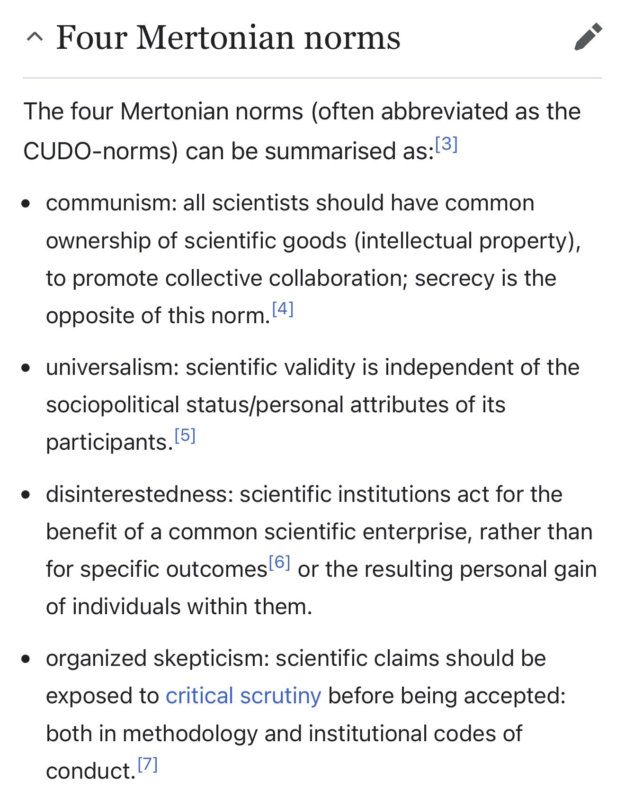
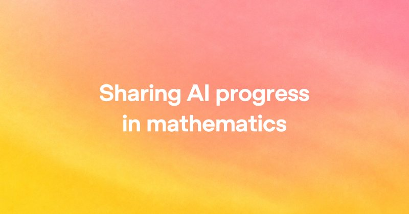

# 🐦 @emollick

## 📅 October 07, 2026

> 4 post(s) archived.

---

### 🕐 18:07 UTC · @emollick

> Much of the world is based on the assumption that the future is like the past and an original meaning of “singularity” was a point where that relationship breaks. I don’t know if there will be one big Singularity, but a million little singularities across fields seems inevitable.

🔗 [View original post](https://x.com/emollick/status/2107895489614250316)

---

### 🕐 17:02 UTC · @emollick

> Even the underlying norms of science are going to change. Some because we can live up to them better (disinterestedness) some because they may no longer apply.

🔗 [View original post](https://x.com/emollick/status/2107879269305385412)

---

### 🕐 01:44 UTC · @emollick

> Context, OpenAI cracked or made important progress in hundreds of big problems today: https://openai.com/index/sharing-ai-progress-in-mathematics/ (And I am seeing rapid increases in the ability of AI to do novel work in my field of economic sociology, with nearly autonomous research getting to top journal level)

🔗 [View original post](https://x.com/emollick/status/2107648160604528897)

---

### 🕐 01:38 UTC · @emollick

> After a brief but institution-eroding slop science era, it increasingly looks like we are going to have two revolutions from AI: 1) Everything ever published will be re-read and re-judged in ways that human scientists never anticipated 2) Novel discoveries will start to come fast

🔗 [View original post](https://x.com/emollick/status/2107646599635910951)

---
