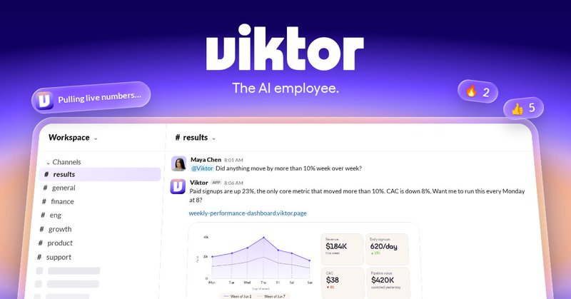

# 🐦 @omarsar0

## 📅 October 07, 2026

> 2 post(s) archived.

---

### 🕐 17:28 UTC · @omarsar0

> Own your intelligence stack, folks! This chart could mean so many different things without raw details. I suspect more companies/devs are starting to realize the business opportunities RL unlocks, given the impressive models we already have today. For many real-world tasks, you don&apos;t need AGI; you need a proper specialized model, harness, and data flywheel. A new, fruitful post-training era is upon us. It&apos;s hard to see, but it&apos;s starting to happen with full-stack AI companies, and it&apos;s only going to keep growing. Post-training / RL and inference is taking over compute

🔗 [View original post](https://x.com/omarsar0/status/2107885815875395612)

---

### 🕐 15:37 UTC · @omarsar0

> Get started here: https://ref.viktor.com/elvis-x-6

🔗 [View original post](https://x.com/omarsar0/status/2107857905718538556)

---
