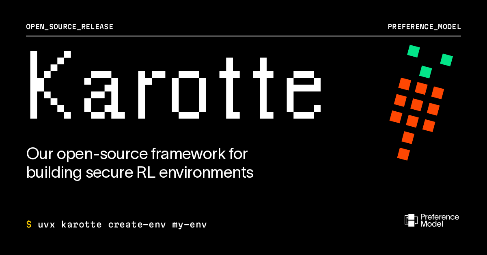

# 🐦 @swyx

## 📅 October 07, 2026

> 2 post(s) archived.

---

### 🕐 17:58 UTC · @swyx

> Today we are open-sourcing 🥕Karotte, our framework for building RL environments. We&apos;ve used it for the past year to build MLE RL environments for frontier labs, and it&apos;s been hardened through 1M+ evaluation runs and red-teaming.

🔗 [View original post](https://x.com/chem_safety/status/2107893216515133719)

---

### 🕐 01:36 UTC · @swyx

> what is your default/workhorse coding agent today, Oct 2026?

🔗 [View original post](https://x.com/swyx/status/2107646238585950540)

---
