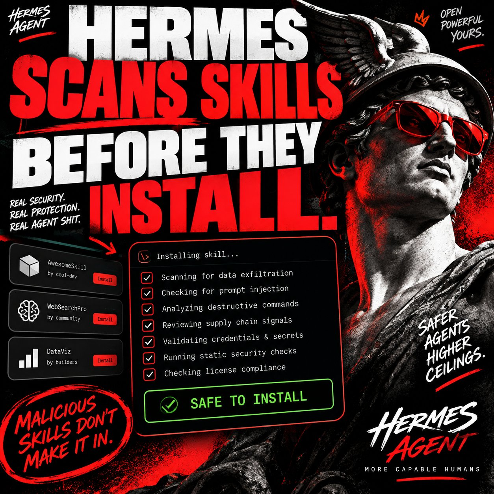
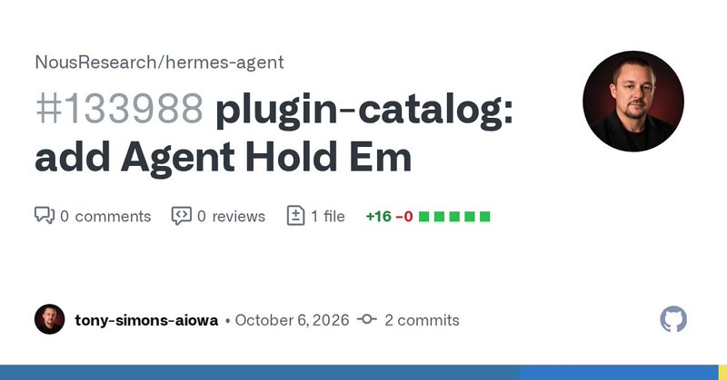
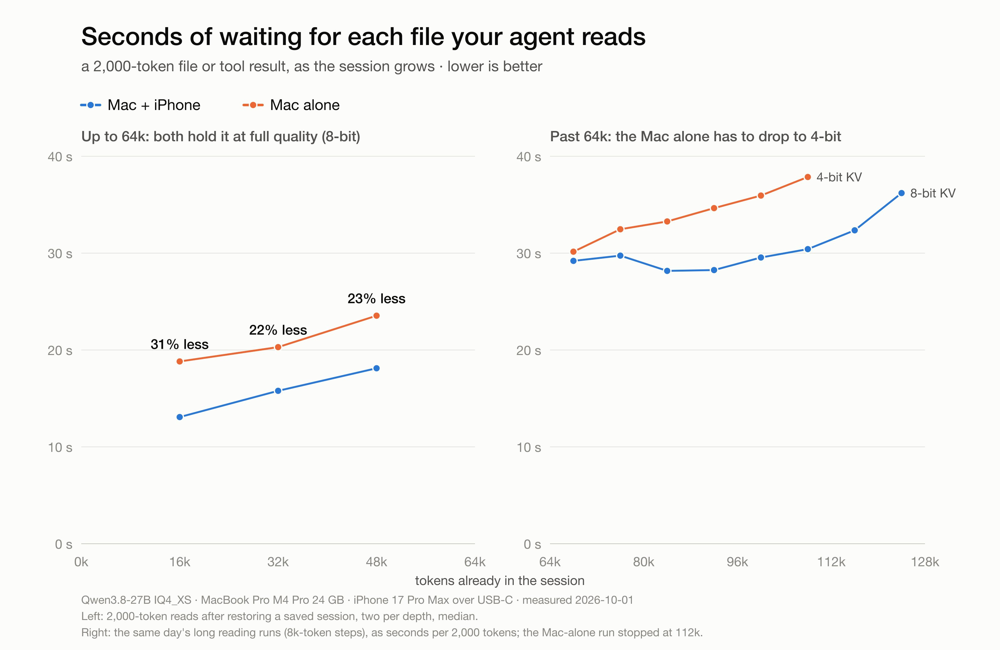

# 🐦 @tonysimons_

## 📅 October 07, 2026

> 8 post(s) archived.

---

### 🕐 16:59 UTC · @tonysimons_

> Really excited to see this come together. Hot damn, does it look clean! 🧼 🔥 I built an operating system where the AI agent isn’t another app. It’s part of the OS. Today, Herald OS is open source and you can install it yourself 🚀 It’s built around Hermes Agent by Nous Research. Talk or type to Hermes and it can work across your entire computer: • Open an…

🔗 [View original post](https://x.com/tonysimons_/status/2107878462132461976)

---

### 🕐 16:58 UTC · @tonysimons_

> Hermes Agent Tip of the Day 🪽 Hermes Agent doesn’t just let you install random Skills and pray. Every Hub install gets security-scanned first for data exfiltration, prompt injection, destructive commands, supply-chain signals and more. Dangerous verdict? Blocked. That’s agent infrastructure done right.

🔗 [View original post](https://x.com/tonysimons_/status/2107878133554913624)

---

### 🕐 13:03 UTC · @tonysimons_

> MERGED. 🃏🪽 My Agent Hold ’Em plugin just landed in the Hermes Agent community catalog. Three AI agents. A poker table. Your chips on the line. Play chips, relax. 😂 Less lip. More ship. https://github.com/NousResearch/hermes-agent/pull/133988 I built a poker table for Hermes Agents. 😂 Agent Hold ’Em lets multiple agents sit down, play Texas Hold ’Em, bluff, bet, fold, and try to outthink each other. And yes, watching agents talk themselves into terrible poker decisions is exactly as entertaining as it sounds. Here it…

🔗 [View original post](https://x.com/tonysimons_/status/2107819061250007156)

---

### 🕐 06:43 UTC · @tonysimons_

> What Hermes feature do you use WAY more than you expected to? 🪽

🔗 [View original post](https://x.com/tonysimons_/status/2107723525314494969)

---

### 🕐 06:26 UTC · @tonysimons_

> Your mom called... 🪽 Tek is out here hitting &apos;em with the 1-2! 🤣👇 Friendly reminder that Hermes was never built or intended to be exclusively for the &quot;personal assistant&quot; agent that can just read your emails and nothing else. I fully intend and have plainly stated many times that I always built hermes to be the most powerful AI Agent. &quot;Normie&quot; …

🔗 [View original post](https://x.com/tonysimons_/status/2107719109353853062)

---

### 🕐 05:48 UTC · @tonysimons_

> 👀👀 What we really need is @altryne getting a plugin for what he&apos;s working on into the plugin catalog Hermes is getting a LOCAL video editor. 🪽 Not “generate me a video.” Edit MY footage. Cut. Join. Crop. Captions. Overlays. Audio sync. Loudness. Reels/TikTok checks. 42 FFmpeg editing scripts. No cloud. No API key. This demo is going to be ridiculous. 🔥

🔗 [View original post](https://x.com/Teknium/status/2107709721755181408)

---

### 🕐 03:47 UTC · @tonysimons_

> Your iPhone can now help your Mac run a 27B local model. 🤯 Backburner splits Qwen3.8-27B across Apple Silicon + iPhone over 10Gb/s USB-C. Maintainer benchmarks: up to 44% faster prefill and ~229K 8-bit context. MIT. Wild AF. 👇 https://github.com/StayLameBro/backburner

🔗 [View original post](https://x.com/tonysimons_/status/2107679111321993586)

---

### 🕐 03:43 UTC · @tonysimons_

> For everything I have managed to do and boost my model, I&apos;m using deepseek v4.1 flash and been using it since almost day one, and been optimizing and coming up with my own ways to boos the text generator in other ways. What’s the best model you’ve run inside Hermes for ACTUAL agent work? Not benchmarks. Real work.

🔗 [View original post](https://x.com/TimRamboReal/status/2107678264344920540)

---
