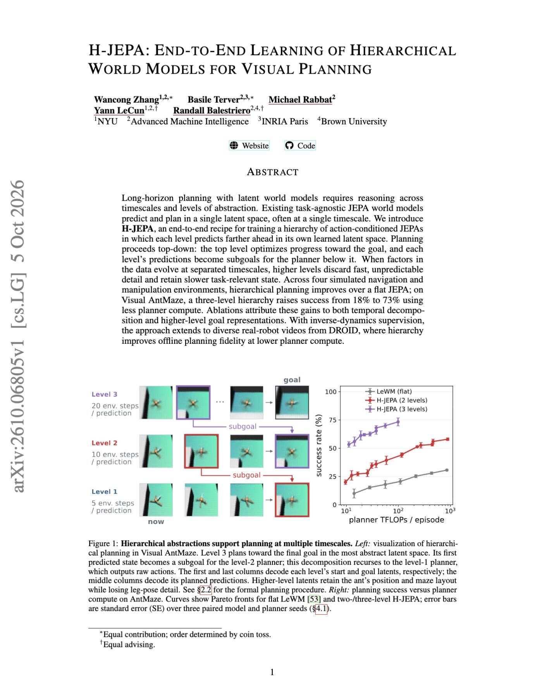

# 🐦 @ylecun

## 📅 October 07, 2026

> 3 post(s) archived.

---

### 🕐 10:49 UTC · @ylecun

> &quot;Even “normal” general-purpose technologies are initially volatile and dangerous, even those we come to think of as unalloyed goods.&quot; https://www.theargumentmag.com/p/the-nightmare-before-progress Completely agree, and appreciate @DKThomp citing us making that very point. Emphasizing AI&apos;s similarity to past general purpose technologies should put more focus on this destabilization, not less. &quot;Practically every major technological revolution has been, at least partly and briefly, an economic, social, or political catastrophe. From this reading of history, it would be odd if AI arrived without significantly destabilizing some part of our world for the worse.&quot;

🔗 [View original post](https://x.com/random_walker/status/2107785375582167519)

---

### 🕐 08:34 UTC · @ylecun

> New paper advised by Yann LeCun! &quot;H-JEPA: End-to-End Learning of Hierarchical World Models for Visual Planning&quot; Most world models plan in a single latent space and at one timescale, which makes long-horizon planning expensive and forces one representation to handle both low-level motion and high-level goals. H-JEPA instead stacks JEPA world models across multiple timescales, with higher levels predicting farther into the future. The highest level first figures out roughly where the agent should go, then each lower level turns that into increasingly concrete subgoals until the bottom level outputs actual actions. On Visual AntMaze, this 3-level setup increases success from 18% to 73% while using less planner compute. https://www.alphaxiv.org/abs/2610.06805

🔗 [View original post](https://x.com/askalphaxiv/status/2107751281553236473)

---

### 🕐 07:18 UTC · @ylecun

> Il est sorti et il est déjà en rupture de stock sur Amazon 🤯 Les pionniers de l’IA, prix du livre d’économie, vient de sortir en format poche et surtout en version updatée avec notamment l’apparition d’@aidangomez de @cohere ou encore de nouvelles explications avec @ylecun et forcément un update @huggingface. Bravo @guillaumgrallet 🔥🔥🔥

🔗 [View original post](https://x.com/fabricepelosi/status/2107732330974446073)

---
