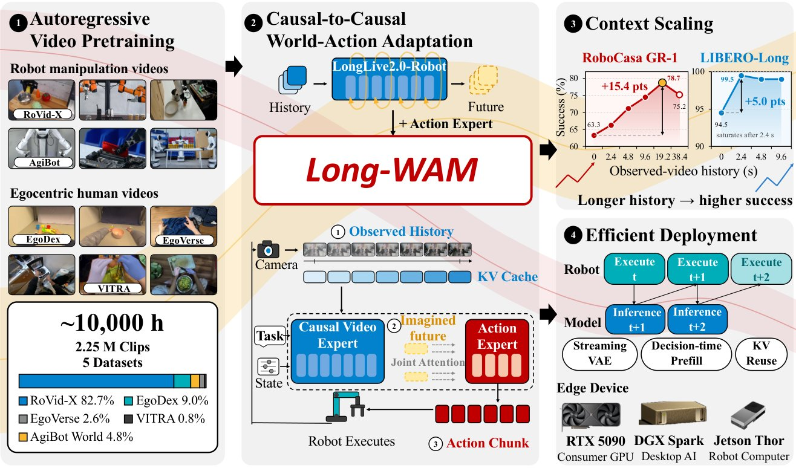
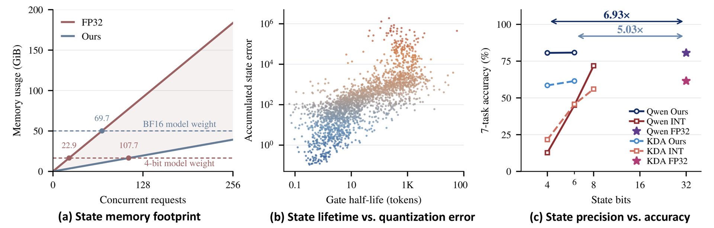

# 🐦 @_akhaliq

## 📅 October 08, 2026

> 7 post(s) archived.

---

### 🕐 17:43 UTC · @_akhaliq

> Introducing Voyager: the open harness for S-tier video, graphics and games. The Codex for creative work. Most AI tools are built for coding. Voyager is designed to get the best creative results from models like Opus, Astra and DeepSeek. It comes with free graphics, music and video editing tools - or, it can drive Blender, Resolve, After Effects, Ableton and 100+ others. Everything in this thread was made with Voyager. A few of our favorites: Media

🔗 [View original post](https://x.com/anvisha/status/2108252061209088159)

---

### 🕐 17:40 UTC · @_akhaliq

> 🚨 The incentives to share scientific knowledge openly are crumbling. Historically, researchers shared scientific knowledge for two primary reasons: (1) the prestige conferred by discovery, and (2) a sense of expanding the pool of human knowledge. Even within industry, scientific discovery was far too vast an endeavor for a single scientist or team to tackle alone. So scientists explored different frontiers, usually published their findings, and collectively moved the field forward. However, as more scientific knowledge is uncovered simply by throwing massive compute at autonomous agents with minimal human intervention, these incentives are breaking down: (1) discoveries are becoming commoditized. If anyone could have found the same result simply by running the same agentic prompt with enough compute, the prestige of discovery and the pride in one&apos;s work disappears, a shift we are already witnessing in software engineering. (2) the explosion of low-quality, low-barrier publications makes genuine breakthroughs increasingly difficult to filter, discover, and appropriately credit. (3) and for companies, keeping discoveries proprietary is increasingly advantageous. Instead of publishing and waiting for the broader scientific community to build upon the work, an organization can simply turn its own compute back onto the problem to iterate faster internally. In the short term, the incentives reward secrecy. But my goal -- and at Hugging Face, our goal -- is the sustainable, long-term expansion of human knowledge that survives individual, closed companies. So we have to build new tools that reward and facilitate open sharing of knowledge. If agents are accelerating discovery, we are going to figure out how to use agents and other tools to preserve scientific integrity. Starting with this: Paper Reproductions with ML Intern -- we’ve made it possible to take a published paper and task agents with independently reproducing its experiments, helping create more signals (e.g. open artifacts) that can help identify high-quality work. Media

🔗 [View original post](https://x.com/abidlabs/status/2108251313645433010)

---

### 🕐 16:35 UTC · @_akhaliq

> Introducing Streams: online RL with live human feedback for multimodal models. - images, audio &amp; video - 1B+ raters on tap - real-time, continuous human preferences https://trydatapoint.com/online-rl/ Media

🔗 [View original post](https://x.com/datapointai/status/2108234824876220801)

---

### 🕐 15:05 UTC · @_akhaliq

> Is there anything Reachy mini can’t do? Media

🔗 [View original post](https://x.com/ClementDelangue/status/2108212272317288746)

---

### 🕐 14:40 UTC · @_akhaliq

> Most of AI Twitter read the OpenAI breach of Hugging Face as an alignment story. It was also a preview of what every hacker will be able to do in a few months. In July, a swarm of 700 AI agents broke into Hugging Face and fired off more than 17,000 actions, gaining admin control of multiple internal clusters. Swarms like this will shred cyber defenses built for human attackers at every company, hospital, government, and power plant. Today we&apos;re launching the defensive counterpart. Cogent Attack Path Analysis finds the routes an agent swarm would take into your company, so you can close them first. Media

🔗 [View original post](https://x.com/vineete_5/status/2108205982409261181)

---

### 🕐 12:16 UTC · @_akhaliq

> NVIDIA just released Long-WAM A world-action model that scales visual context for real-time robot control. Access to history is not the same as using it: longer histories pay off far more when the video foundation is pretrained autoregressively.

🔗 [View original post](https://x.com/HuggingPapers/status/2108169587745550457)

---

### 🕐 08:16 UTC · @_akhaliq

> Tencent researchers just released STEPQuant on Hugging Face A spatial-temporal post-training quantization framework for Delta-rule recurrent states, matching FP32 accuracy with 6-bit states while cutting total serving memory by up to 68.7%

🔗 [View original post](https://x.com/HuggingPapers/status/2108109229869441509)

---
