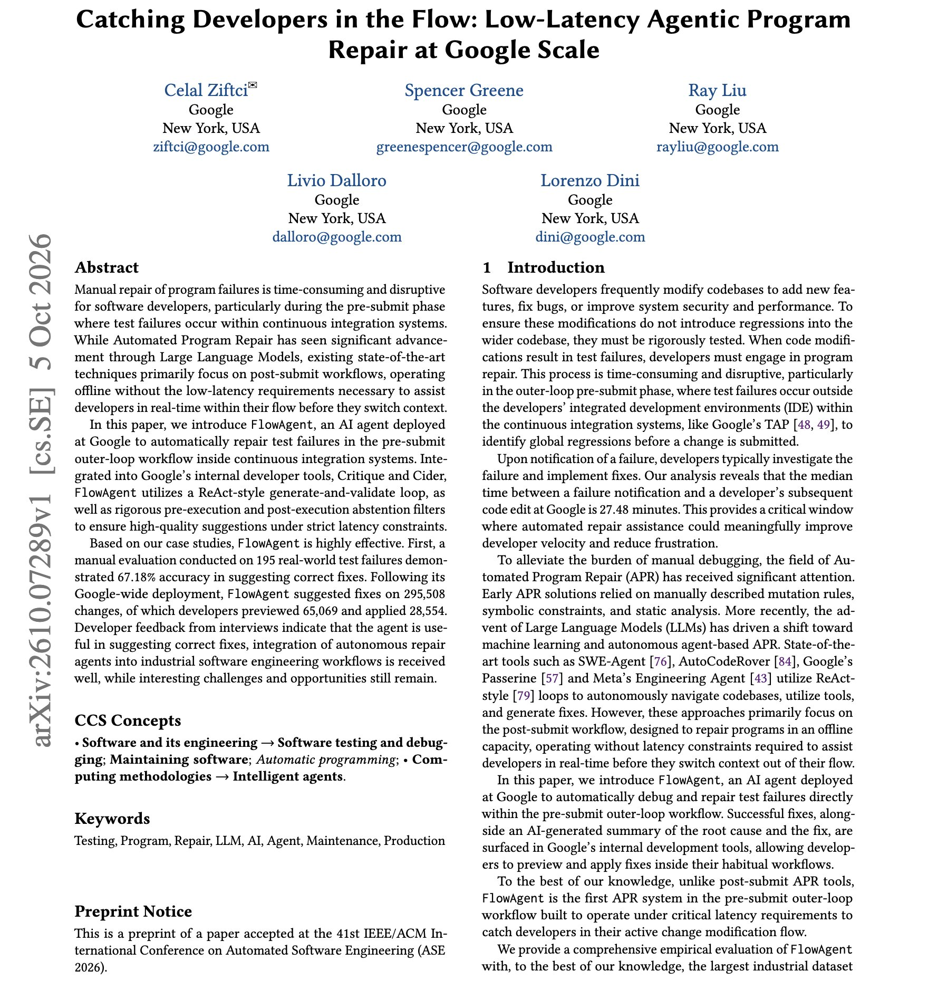
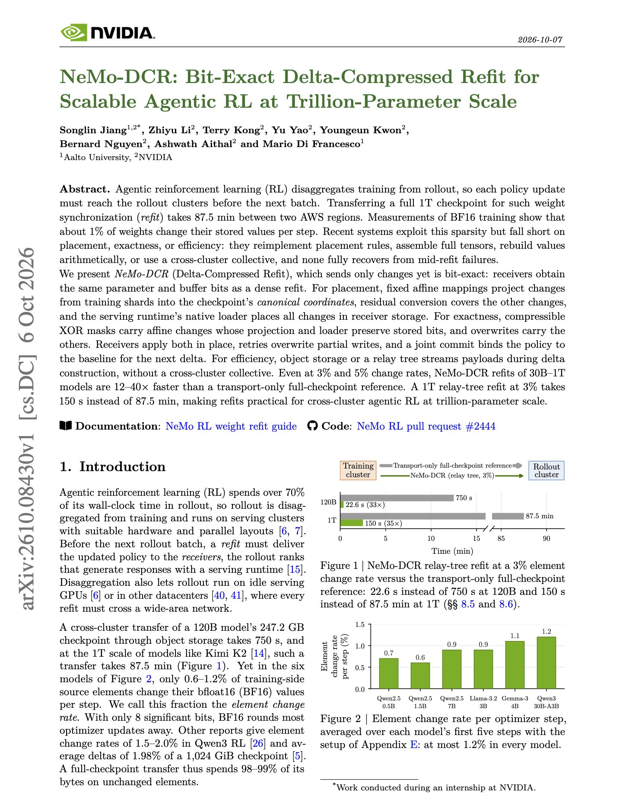

# 🐦 @dair_ai

## 📅 October 08, 2026

> 4 post(s) archived.

---

### 🕐 19:21 UTC · @dair_ai

> Great paper from Google on program repair agents inside CI. (bookmark it) They propose FlowAgent, which runs a ReAct-style generate-and-validate loop on pre-submit test failures and shows the fix inside Google&apos;s code review tools. Two abstention filters decide whether a fix is worth showing. One runs before execution and one after, so weak suggestions never reach the developer. In a manual review of 195 real failures, 67.18% of its fixes were correct. After the Google-wide launch, it suggested fixes on 295,508 changes. Developers previewed 65,069 and applied 28,554. Paper: https://arxiv.org/abs/2610.07289 Chat with Paper: https://academy.dair.ai/papers/catching-developers-in-the-flow-low-latency-agentic-program-repair-at-google-sca-2610.07289

🔗 [View original post](https://x.com/omarsar0/status/2108276499615014936)

---

### 🕐 17:18 UTC · @dair_ai

> Huge release from @odysseyml. Odyssey-3 Pro sets a new top score on Physics-IQ Verified, a benchmark that asks models to continue videos of real physics experiments. The robotics results stood out to me. With tens of hours of demos, the robot arm recovered from a missed grasp, a behavior that never appeared in those demos. Media Today we&apos;re launching Odyssey-3, the most powerful foundation world model yet. It sets a new state of the art on Physics-IQ, and powers robots, trains AIs, and generates interactive experiences. It&apos;s really cool. Experience the model today, all for free!

🔗 [View original post](https://x.com/omarsar0/status/2108245674961588672)

---

### 🕐 16:15 UTC · @dair_ai

> Another great paper from NVIDIA. They find that only 0.6% to 1.2% of model weights change after each RL step in the six models they measured. Yet a standard refit copies the full checkpoint to the rollout cluster after every update. For a 1T model across two AWS regions, that copy takes 87.5 minutes. NVIDIA&apos;s NeMo-DCR sends only the changed values and still gives the rollout cluster the exact same bits as a full copy. It maps changes from training shards straight into the checkpoint layout, encodes them as XOR masks or overwrites, and streams them through a relay tree while the delta is still being built. A joint commit and retries handle failures in the middle of a transfer. A 1T refit at a 3% change rate takes 150 seconds instead of 87.5 minutes. Across 30B to 1T models, it is 12x to 40x faster than full-checkpoint transfer. Paper: https://academy.dair.ai/papers/nemo-dcr-bit-exact-delta-compressed-refit-for-scalable-agentic-rl-at-trillion-pa-2610.08430

🔗 [View original post](https://x.com/dair_ai/status/2108229693061357652)

---

### 🕐 02:00 UTC · @dair_ai

> Another great paper from Salesforce AI Research. The finding is that a 31B open Gemma-4 web agent scores 74.6% on the 9-app WebArena Infinity set, above Gemini 3 Flash with browser use at 70.1%. They got there without calling a frontier judge at every step or at deployment. CLIFT has the agent answer verification questions about its own rollouts. A conformal certifier keeps only the questions whose answers agree with a training-time judge, weights them by how much they can be trusted, and adds the result to per-step rewards. At test time, the same frozen question bank picks between a greedy rollout and a few retries, with no external judge. The trained agent improves 12.8 points over its base model and wins 7 of 9 apps. The question bank also transfers to GPT-5.5 at test time on VisualWebArena, and a translated bank improves a live-web agent on Online Mind2Web without any training on that benchmark. Paper: https://arxiv.org/abs/2610.06829 Chat with Paper: https://academy.dair.ai/papers/clift-conformal-self-verification-for-web-agent-training-and-test-time-scaling-2610.06829

🔗 [View original post](https://x.com/dair_ai/status/2108014562922688647)

---
