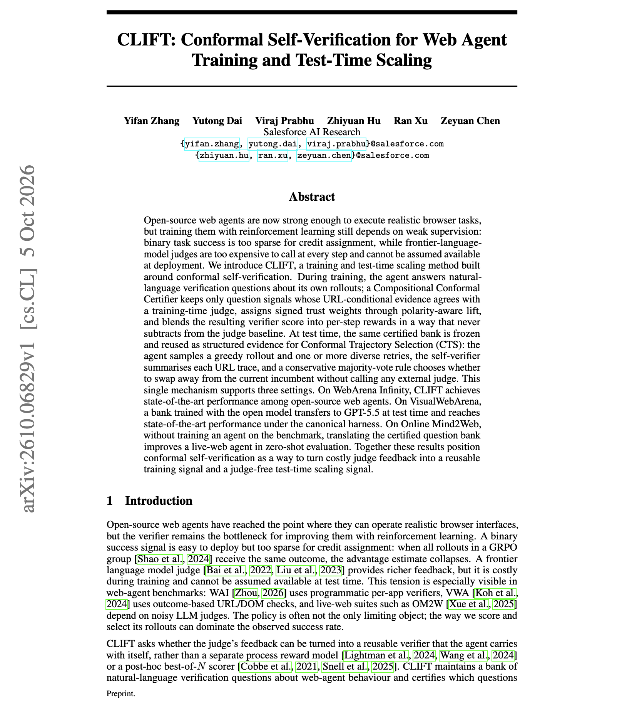

# 🐦 @dair_ai

## 📅 October 08, 2026

> 1 post(s) archived.

---

### 🕐 02:00 UTC · @dair_ai

> Another great paper from Salesforce AI Research. The finding is that a 31B open Gemma-4 web agent scores 74.6% on the 9-app WebArena Infinity set, above Gemini 3 Flash with browser use at 70.1%. They got there without calling a frontier judge at every step or at deployment. CLIFT has the agent answer verification questions about its own rollouts. A conformal certifier keeps only the questions whose answers agree with a training-time judge, weights them by how much they can be trusted, and adds the result to per-step rewards. At test time, the same frozen question bank picks between a greedy rollout and a few retries, with no external judge. The trained agent improves 12.8 points over its base model and wins 7 of 9 apps. The question bank also transfers to GPT-5.5 at test time on VisualWebArena, and a translated bank improves a live-web agent on Online Mind2Web without any training on that benchmark. Paper: https://arxiv.org/abs/2610.06829 Chat with Paper: https://academy.dair.ai/papers/clift-conformal-self-verification-for-web-agent-training-and-test-time-scaling-2610.06829

🔗 [View original post](https://x.com/dair_ai/status/2108014562922688647)

---
