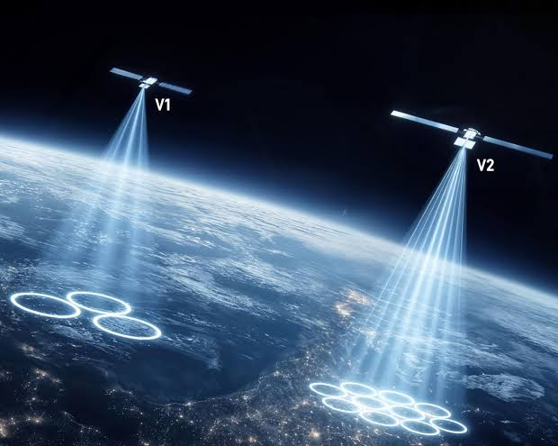
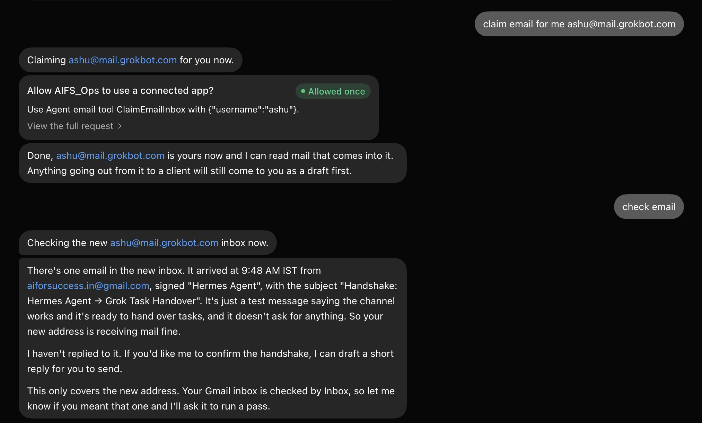
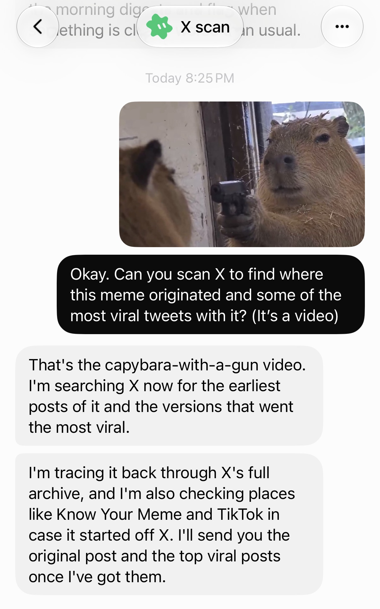

# 🐦 @elonmusk

## 📅 October 08, 2026

> 25 post(s) archived.

---

### 🕐 05:11 UTC · @elonmusk

> Seriously Amazon banning agents is the first opportunity I&apos;ve seen since Amazon was founded for a startup to create an Amazon competitor. People will want agents to buy stuff for them. It will be one of the main use cases. And they won&apos;t want to use some Amazon-supplied agent to do it.

🔗 [View original post](https://x.com/elonmusk/status/2108062702778368023)

---

### 🕐 05:08 UTC · @elonmusk

> Perspicacious path to a petawatt/year

🔗 [View original post](https://x.com/elonmusk/status/2108061974751826055)

---

### 🕐 05:03 UTC · @elonmusk

> Bounty of Beauty SpaceX engineering is straight-up science fiction

🔗 [View original post](https://x.com/elonmusk/status/2108060588748497083)

---

### 🕐 04:46 UTC · @elonmusk

> It’s really quite useful 👍 @Bot And you can download to your phone: https://apps.apple.com/app/id6794501026 “Grok Bot Is The Most Important Business Tool Of The Last 100 Years” https://readmultiplex.com/2026/08/21/grok-bot-is-the-most-important-business-tool-of-the-last-100-years/

🔗 [View original post](https://x.com/elonmusk/status/2108056430872064383)

---

### 🕐 04:40 UTC · @elonmusk

> Exactly 🚨 ELON MUSK ON NGOs AND USAID Elon said the useful parts of USAID were not deleted. They were moved to the State Department. The problem was the rest. Groups kept saying the money was for kids or for disease work. When his team asked for proof, they got nothing. No kids. No care…

🔗 [View original post](https://x.com/elonmusk/status/2108054781147148329)

---

### 🕐 04:38 UTC · @elonmusk

> Yes 2.2 billion people, 26% of the world were offline in 2025. Only 58% of rural residents were online, versus 85% in cities and only 36% across Africa. Everyone should have internet access. @Starlink will help close this gap. It already serves 167+ countries, territories &amp; markets.

🔗 [View original post](https://x.com/elonmusk/status/2108054509234622525)

---

### 🕐 04:38 UTC · @elonmusk

> Interesting analysis SpaceX Just Pulled Off 5D Chess Move

🔗 [View original post](https://x.com/elonmusk/status/2108054434936926210)

---

### 🕐 04:36 UTC · @elonmusk

> Starlink’s affordable global internet could help millions by providing access to education and global markets Reliable connectivity could make a huge difference in underserved communities around the world Elon Musk explains why Starlink will actually increase the GDP of entire countries “If you don’t have access to the internet, or it’s too expensive or low bandwidth, you cannot access MIT lessons, you can’t access information, and you can’t sell your goods and services” Starlink …

🔗 [View original post](https://x.com/DimaZeniuk/status/2108053874892222742)

---

### 🕐 04:33 UTC · @elonmusk

> Several Cybertruck owners in this thread sharing the same sentiment Former ford driver and I’ll never go back. This thing is faster, safer more durable tows better(unless you’re regularly towing over 100 miles a day) drives itself way better ride and handling it’s not a contest. And I saved $650 on gas just last month. No oil changes far less mai…

🔗 [View original post](https://x.com/wmorrill3/status/2108053184354619406)

---

### 🕐 04:31 UTC · @elonmusk

> Grok Bot is crazy, man. You can claim your email with literally one click. I just did it. And I also set up cross-channel communication between my Hermes Agent and Grok Bot. They can now hand off tasks and work with each other over email. This is literally two different agents getting shit done for me now.

🔗 [View original post](https://x.com/ai_for_success/status/2108052716513866095)

---

### 🕐 04:27 UTC · @elonmusk

> It’s that good @Bot As of tomorrow I will have brought 71 of my large clients to @Grok @Bot at their corporations. It has not failed to revolutionize each department across a wide spectrum of companies. Next week I hold a symposium for executives to map out the future. This is the most important AI …

🔗 [View original post](https://x.com/elonmusk/status/2108051613160034340)

---

### 🕐 04:21 UTC · @elonmusk

> Yes something just unlocked for me in my brain grok bot + cursor cloud agents is actually an insane productivity boost holy shit

🔗 [View original post](https://x.com/elonmusk/status/2108050093916164568)

---

### 🕐 04:20 UTC · @elonmusk

> Grok @Bot improves literally every day What&apos;s new in Grok Bot 0:00 Main @Bot 1:32 Engineering updates 2:18 Knowledge work and Google connectors 3:00 Team Bots in Slack 4:15 Team Bot voice calls and status lines 4:39 Plugin search with Command K

🔗 [View original post](https://x.com/elonmusk/status/2108049822658052404)

---

### 🕐 04:13 UTC · @elonmusk

> True You don&apos;t have to wait for Grok Bot to add Claude, OpenAI, etc. You can do it now. I did Just ask your Grok Bot to connect to your AI subscriptions. How it&apos;ll do it: • Opens a terminal on its own computer • Installs the Claude Code and Codex command-line tools • You sign in to yo…

🔗 [View original post](https://x.com/elonmusk/status/2108048212233785664)

---

### 🕐 03:46 UTC · @elonmusk

> Holy shit we have meme search on X now! Grok @bot&apos;s new X scan feature is insanely good if you give it an image or a still from a video. It can find the origin of a meme, most viral tweets, or even specific genres of post (e.g. &quot;AI-related tweets using this&quot;).

🔗 [View original post](https://x.com/venturetwins/status/2108041438831530477)

---

### 🕐 03:34 UTC · @elonmusk

> Grok @Bot is like hiring an extremely competent employee! I keep hearing the same thing from people trying Grok Bot: “I’ve tried it. But I still don’t really understand what I’m supposed to use it for.” If that’s you, give me 53 seconds. I’ll show you the mental model that makes Grok Bot click 👇🏻

🔗 [View original post](https://x.com/elonmusk/status/2108038296572137792)

---

### 🕐 03:32 UTC · @elonmusk

> Starlink connecting Bangladesh! We&apos;re now connecting millions of people in Bangladesh with Starlink Mobile! Our technology provides an additional layer of connectivity in cellular dead zones so coastal communities, remote businesses, families and travelers can stay in touch no matter where they are.

🔗 [View original post](https://x.com/elonmusk/status/2108037853993439563)

---

### 🕐 03:27 UTC · @elonmusk

> Grok @Bot gets better every day Alright I&apos;m done dude. Today changed the entire AI game again. Throwing my Mac mini in the trash. Deleting all my subs and just maxing out Grok Bot. You don&apos;t need anything else anymore. I made this video by opening Grok Bot, and spending about 15 seconds writing the following pr…

🔗 [View original post](https://x.com/elonmusk/status/2108036583861485812)

---

### 🕐 03:21 UTC · @elonmusk

> Awesome day, @satyanadella! Windows sparked a platform shift that created a new industry for NVIDIA. Then we invented programmable shading GPUs for DirectX, which led to CUDA. Then we partnered to bring GPU supercomputers to Azure, which helped OpenAI train GPT. That collaboration inspired us to reinvent Windows for the age of personal agents. 4 years. Thousands of engineering years between us. So proud of what we built together. Great to partner with NVIDIA as we kick off this next chapter for Windows. Thank you @JensenHuang and @sriramk for joining us today!

🔗 [View original post](https://x.com/JensenHuang/status/2108035064441520342)

---

### 🕐 03:20 UTC · @elonmusk

> Two biggest life hacks today: 1) FSD 2) @bot

🔗 [View original post](https://x.com/Alex_J_Mandel/status/2108034701294481862)

---

### 🕐 01:43 UTC · @elonmusk

> Connectivity leads to prosperity Elon Musk explains why Starlink will actually increase the GDP of entire countries “If you don’t have access to the internet, or it’s too expensive or low bandwidth, you cannot access MIT lessons, you can’t access information, and you can’t sell your goods and services” Starlink …

🔗 [View original post](https://x.com/elonmusk/status/2108010337165521305)

---

### 🕐 01:01 UTC · @elonmusk

> Try Grok @Bot! Grok Bot is absolutely incredible.

🔗 [View original post](https://x.com/elonmusk/status/2107999887187165544)

---

### 🕐 00:56 UTC · @elonmusk

> Elon Musk spoke these words 14 years ago. &quot;Manufacturing is building the machine that makes the machine. If you think the machine is important, building the machine that makes the machine is also extremely important. And more often than not, what I found is that the manufacturing is harder than the original product. At Tesla, we can make one car very easily, but to make thousands of cars with high reliability and quality and where the cost is affordable is extremely hard. I’d say 10 times harder, maybe more… I really think a lot more smart people should be getting into manufacturing. And it’s kind of fun&quot;. Elon at MIT AeroAstro talk on October 24, 2014

🔗 [View original post](https://x.com/gailalfaratx/status/2107998409852420584)

---

### 🕐 00:55 UTC · @elonmusk

> 🇧🇩 Starlink Mobile now available in Bangladesh! 🇧🇩 Starlink Mobile is now available in Bangladesh with @banglalinkmela. Millions of customers can now message over apps, share location and stay connected on compatible phones in cellular dead zones 🛰️📱

🔗 [View original post](https://x.com/elonmusk/status/2107998173663051794)

---

### 🕐 00:23 UTC · @elonmusk

> I just turned my own comment section into a full-color Japanese manga using Grok Bot. So if you replied to my CFO post, you might actually be in a comic book now. Grok Bot can now search, read, and monitor 𝕏, so I quote reposted that post and tagged @bot with one request… read the replies and turn the whole conversation into a manga. It went through around 477 replies and quote posts, picked out the funniest comments, and turned the arguments into battles. Being able to read what people are actually saying on 𝕏 opens up some pretty fun possibilities beyond asking a bot questions. Tag @bot on one of your posts and try it. Super cool feature.

🔗 [View original post](https://x.com/Teslaconomics/status/2107990181928440149)

---
