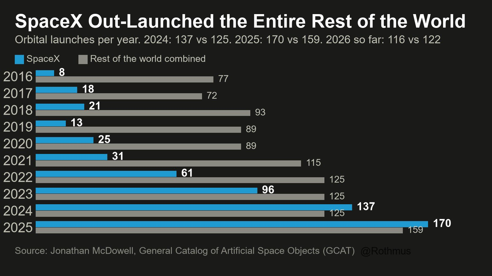
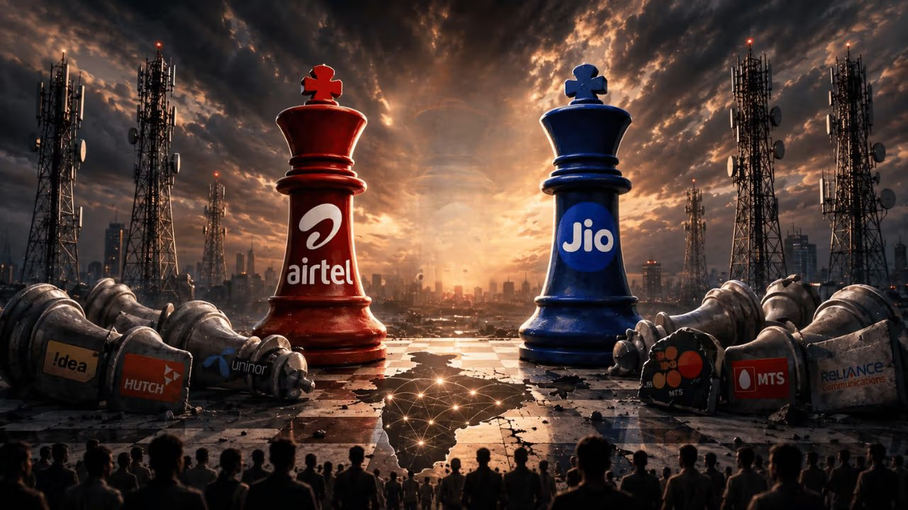
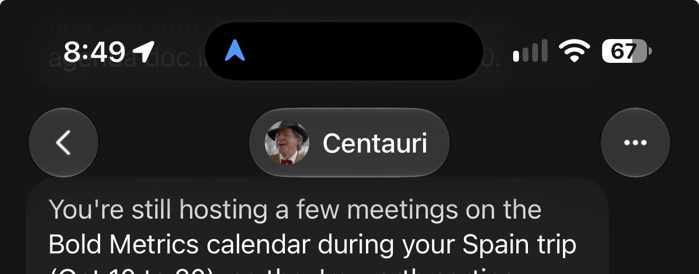
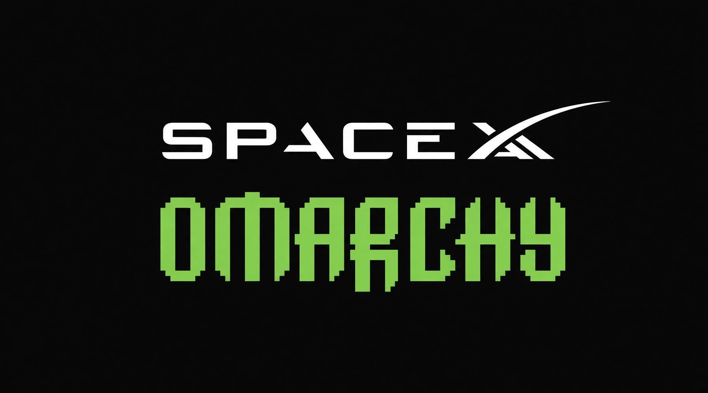
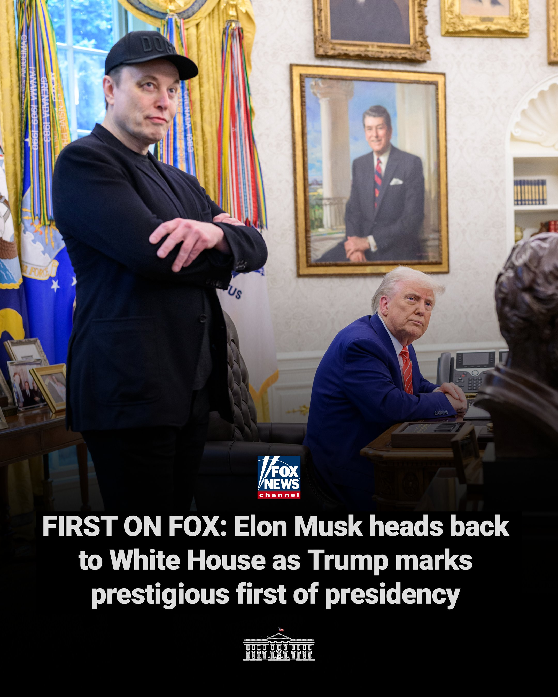
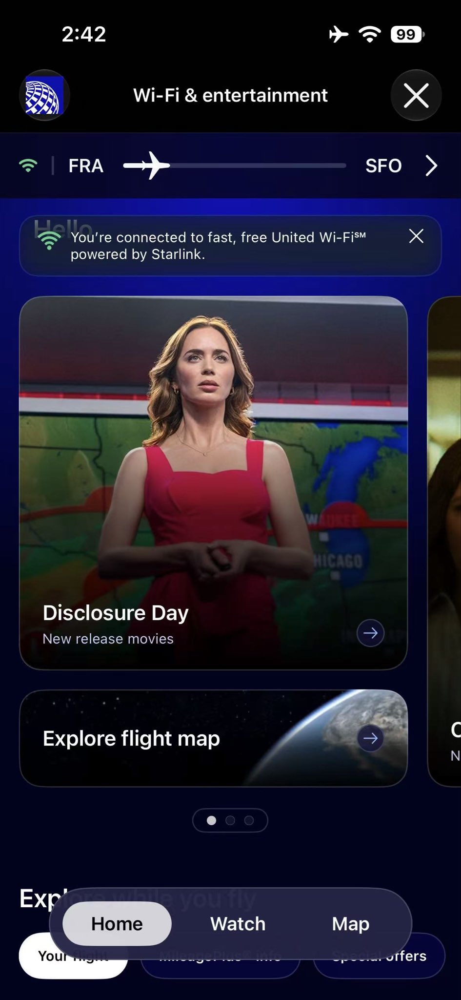
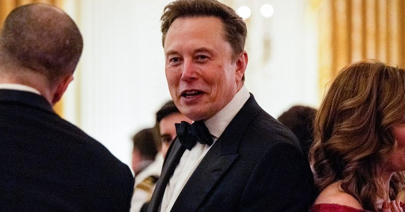
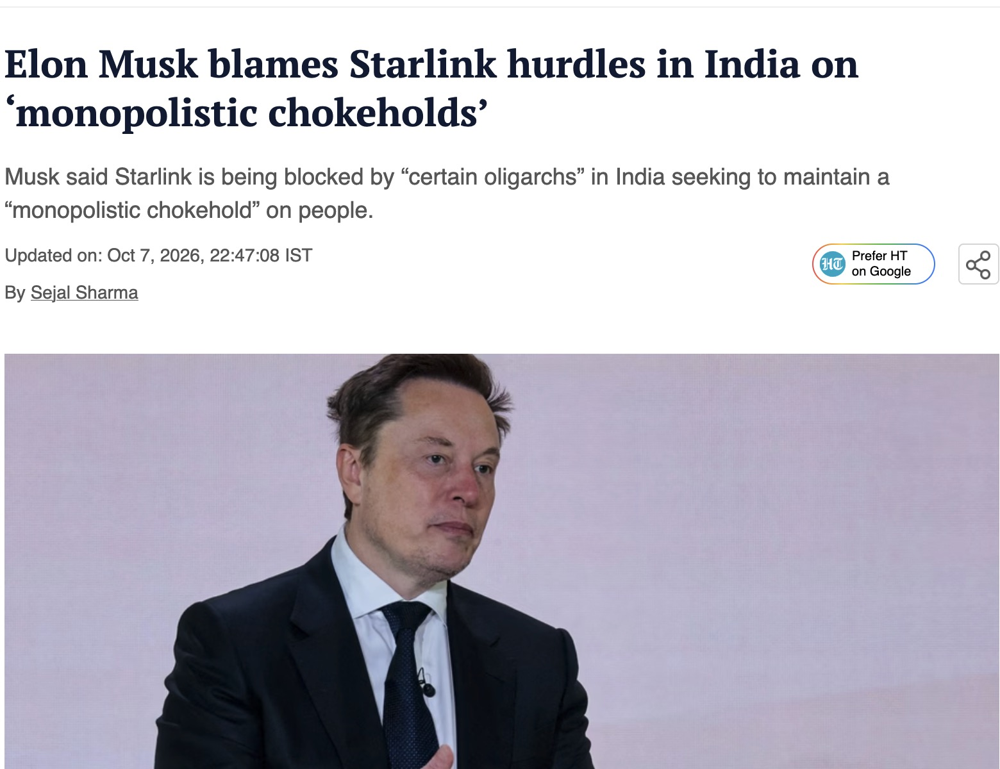
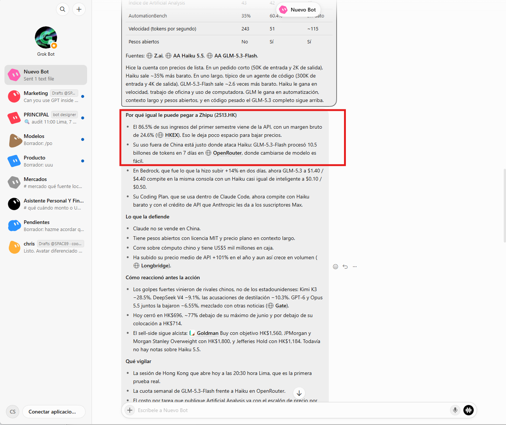

# 🐦 @elonmusk

## 📅 October 08, 2026

> 76 post(s) archived.

---

### 🕐 19:03 UTC · @elonmusk

> Grok @Bot works well on your phone. Just download the app from Apple or Android. https://apps.apple.com/app/id6794501026 This feels unreal Used Grok Bot today, mostly from my phone I got more done from my phone with Grok Bot than I usually do sitting at my desk - Colab notebooks for Google EmbeddingGemma 2, D1 by LiquidAI inference - Colab notebooks for open source decision models finetunes using Q…

🔗 [View original post](https://x.com/elonmusk/status/2108272088582676627)

---

### 🕐 18:56 UTC · @elonmusk

> Grok @Bot is actually this good Grok bot propaganda hit me so hard I had to try it and you know what, it is fucking awesome

🔗 [View original post](https://x.com/elonmusk/status/2108270309824438588)

---

### 🕐 18:54 UTC · @elonmusk

> Grok 4.7 ranks first in legal matters Today we are announcing Harvey LAB-AA v1.1 in collaboration with Harvey. This updates our scoring methodology for the Legal Agent Benchmark (LAB) to add a hallucination check and require correct responses to not include material misstatements. LAB-AA v1.1&apos;s new headline metric, H…

🔗 [View original post](https://x.com/elonmusk/status/2108269794268975387)

---

### 🕐 18:43 UTC · @elonmusk

> This is why Elon Musk explains the deeper purpose of SpaceX and why making life multiplanetary is so important for the future of humanity: “The goal of SpaceX is to build the technologies necessary to make life multiplanetary” For roughly 4 billion years, life on Earth has existed without th…

🔗 [View original post](https://x.com/elonmusk/status/2108266929203155367)

---

### 🕐 18:38 UTC · @elonmusk

> SpaceX went from 8 launches in 2016 to 170 in 2025. What critics called a “subsidy scam” and a “Musk vanity project” already out-launched every other country on Earth COMBINED. Falcon is still flying and Starship is just getting started, so by the end of the decade, the rest of the planet will be a footnote on a SpaceX chart.

🔗 [View original post](https://x.com/Rothmus/status/2108265809826996227)

---

### 🕐 18:27 UTC · @elonmusk

> Elon and Jensen. Bros being bros. 📸 Kent NISHIMURA / GettyImages

🔗 [View original post](https://x.com/cb_doge/status/2108263053355811167)

---

### 🕐 17:55 UTC · @elonmusk

> BREAKING: President Trump on Elon Musk today: “First, we honor an industrial titan, a brilliant engineer, and one of the greatest technology founders to ever live. His name is Elon Musk. Quite honestly, there’s nobody like him. Few Americans in history have done more to advance America’s national interest than Elon. In one field after another, his genius and determination have made science fiction into reality. And that is so true. Elon founded SpaceX with his life savings in 2002 and created the first privately developed liquid-fueled rocket to reach orbit in the face of vanishingly impossible odds. Nobody thought it was possible to do the things he’s doing, and in so many different ways. SpaceX saved NASA from relying on foreign nations to send our astronauts into space. And I want to congratulate SpaceX on the safe return of Crew-12 from the International Space Station just a few hours ago. Congratulations. Well, we wanted to make sure. Could you imagine if things didn’t work out so well? It would be not a very happy moment. I wonder if he’d be here. I think he might not be here. But it always works out well for Elon, right? We’re proud of you. Very proud of you. National treasure. Under Elon’s leadership, SpaceX has also developed Starship, the largest rocket in history, which is caught out of thin air for rapid reuse. And it’s the first time anyone has ever seen anything quite like it. They also created the largest-ever communication satellite network, Starlink. And in North Carolina, I will tell you personally, because I was involved, we had a hurricane, one of the great water hurricanes of all time. Delivered more water than at any time that we can remember on record. It saved hundreds of lives by calling Elon. I remember the governor said, ‘Sir, is there any way… do you know a man named Elon Musk?’ I said, ‘I happen to know him, yes.’ ‘We need Starlink because the water was so deep that many islands were created and the people had no way of getting off those islands, and they had no communication.’ And they said, ‘We cannot get anybody to help us.’ And I called up Elon, and it was like impossible to get this equipment. And he had it there in a matter of hours and saved hundreds of lives. Saved hundreds of lives in North Carolina. So, I never forgot that experience. It was a terrible time and the job he did. And he acted so fast. Everybody said they were impossible to get. So, thank you, Elon, for that very special moment. In addition, Elon created Tesla, the first successful new car manufacturer in over 75 years, producing the first commercially viable electric cars with the first consumer self-driving technology. And interestingly, when you mentioned Tesla, my uncle, Dr. John Trump, was commissioned by the United States government to do a report on Nikola Tesla. They wanted to know: was he real or not real? Was he a true genius or not? My uncle, after a fairly short period of time, determined that he was a true and great genius and that he was real in every single way. Otherwise, you’d have to change the name of the car company. You wouldn’t want to be a… See, now, if I did the report, Elon, I might say, ‘He wasn’t that good.’ But my uncle was a different kind of a person than I am. And he gave Tesla the highest report. He said he was a true, great genius. So, very nice. Through Neuralink, Elon is also restoring sight, speech, and motion to those who cannot see, talk, or move. And he turned SpaceX AI into one of the world’s leaders in superintelligence. Elon is our modern-day Thomas Edison. And, Elon, I want to congratulate you. You’re my friend in all of that, but you are a very, very special guy. Thank you very much, and congratulations, Elon. Great. Great job.” Media

🔗 [View original post](https://x.com/cb_doge/status/2108255024124211211)

---

### 🕐 17:54 UTC · @elonmusk

> .@POTUS: &quot;We honor an industrial titan, a brilliant engineer, and one of the greatest technology founders ever to live. His name is @elonmusk.&quot; Media

🔗 [View original post](https://x.com/RapidResponse47/status/2108254661639803142)

---

### 🕐 17:51 UTC · @elonmusk

> America will establish a permanent presence on the moon. 🚀🌕

🔗 [View original post](https://x.com/WhiteHouse/status/2108254023443009943)

---

### 🕐 17:03 UTC · @elonmusk

> Starlink just launched a new referral program Refer a friend to Starlink and both of you can receive $100 Available in most countries, with rewards varying by market More people get connected, and existing Starlink customers get rewarded for helping make it happen http://starlink.com/referral https://x.com/Starlink/status/2108240018598994384/video/1 Media

🔗 [View original post](https://x.com/XFreeze/status/2108242012185198612)

---

### 🕐 16:46 UTC · @elonmusk

> Try using @Bot for your hardest tasks! Grok @Bot is a miracle maker…

🔗 [View original post](https://x.com/elonmusk/status/2108237497952055631)

---

### 🕐 16:29 UTC · @elonmusk

> If you have a Grok Bot account, you can just add your @shopify connector by asking @Bot! Pro tip: you can ask @bot to add Shopify right in the comments ↓

🔗 [View original post](https://x.com/elonmusk/status/2108233316000313600)

---

### 🕐 16:27 UTC · @elonmusk

> Hire Grok @Bot to manage your @Shopify store. He will do an amazing job! Grok Bot can now help run your Shopify store. Connect Shopify, then ask it to check orders, track inventory, and keep product listings up to date.

🔗 [View original post](https://x.com/elonmusk/status/2108232824520319175)

---

### 🕐 16:16 UTC · @elonmusk

> 🚨 ELON MUSK ON STARLINK FOR RURAL INDIA Back in June 2023, Elon said he hoped to bring Starlink to India. “The Starlink internet can be incredibly helpful for remote or rural villages, where they may have no access to internet, or the internet is very expensive and slow.” More than three years later, that same problem is still there in parts of rural India. And Starlink is still waiting to serve them. https://x.com/XFreeze/status/2108229208258511331/video/1 Media

🔗 [View original post](https://x.com/AsFoundX/status/2108230087237578821)

---

### 🕐 16:04 UTC · @elonmusk

> Elon is right to demand answers. India once had more than a dozen telecom operators competing for customers. Today, Jio and Airtel account for nearly 77% of India’s wireless subscriptions. What is the harm in adding another competitor? Healthy competition encourages providers to offer better prices and service, giving consumers more choice and better value. Starlink could offer Indian households, businesses and communities another broadband option, especially in remote villages, mountains and islands where expanding existing networks is difficult. Indians deserve greater transparency, better connectivity and the freedom to choose. Let Starlink compete and let consumers decide. Starlink is licensed in over 165 countries and has spent five years complying with every single law and requirement of the government of India, so why still no license? Is Ambani the real boss of India?

🔗 [View original post](https://x.com/cb_doge/status/2108226980135194825)

---

### 🕐 16:01 UTC · @elonmusk

> New connectors just dropped: Connect to @grok to ask questions about your business Or connect to @bot to build a team of agents that help you run it Media

🔗 [View original post](https://x.com/Shopify/status/2108226178146263268)

---

### 🕐 15:57 UTC · @elonmusk

> 2011 🚨 ELON MUSK IN 2011 ON REUSABLE ROCKETS Elon said the key to making humanity multiplanetary is developing a fully and rapidly reusable orbit-class rocket. He explained it’s an extremely hard engineering challenge because Earth’s gravity makes it just barely possible. A bit lower…

🔗 [View original post](https://x.com/elonmusk/status/2108225227339550790)

---

### 🕐 15:51 UTC · @elonmusk

> Welcome home! Splashdown of Dragon confirmed!

🔗 [View original post](https://x.com/elonmusk/status/2108223791138734327)

---

### 🕐 15:50 UTC · @elonmusk

> It has been fascinating to use Muse, Dot, and Grok Bot all alongside each other. Makes it very clear how far in the lead Grok Bot is right now. One good example from this morning. All three are plugged into my work calendar. This morning Grok Bot messaged me, it noticed I forgot to cancel some meetings while I’m away, shared details on each meeting, asked if I wanted to cancel them. I said yes, and now it’s done. Muse and Dot this morning, crickets 🦗

🔗 [View original post](https://x.com/morganlinton/status/2108223408328814669)

---

### 🕐 15:41 UTC · @elonmusk

> Thank you, Rahul. This is indeed troubling. Welcome to India, Elon. Wait till you discover the other guy.

🔗 [View original post](https://x.com/elonmusk/status/2108221292788981881)

---

### 🕐 15:36 UTC · @elonmusk

> Splashdown of Dragon confirmed! Media

🔗 [View original post](https://x.com/SpaceX/status/2108220101614850436)

---

### 🕐 15:36 UTC · @elonmusk

> Welcome home @NASA Crew-12 Dragon’s four main parachutes have deployed

🔗 [View original post](https://x.com/NASAAdmin/status/2108219908748108068)

---

### 🕐 13:54 UTC · @elonmusk

> Grok Bot team shipped in the last few days: • Proactive primary bot • X search and monitoring, no API key needed • Faster replies + speed improvements • Slide deck creation in the chat • Tag @bot on X with instructions for your Bot • Best model for each task

🔗 [View original post](https://x.com/benln/status/2108194230938247627)

---

### 🕐 13:52 UTC · @elonmusk

> True Starlink will become a must-have for airlines. Those without it will lose customers to competitors. $SPCX

🔗 [View original post](https://x.com/elonmusk/status/2108193704322494869)

---

### 🕐 13:25 UTC · @elonmusk

> Starlink is licensed in over 165 countries and has spent five years complying with every single law and requirement of the government of India, so why still no license? Is Ambani the real boss of India? The government is more interested in protecting the interests of crony capitalists than of citizens

🔗 [View original post](https://x.com/elonmusk/status/2108187065687118261)

---

### 🕐 13:24 UTC · @elonmusk

> 🚨 SPACEXAI BACKS OPEN SOURCE LINUX WITH $1.5 MILLION SpaceXAI is donating $1.5 million in Grok tokens to support Omarchy, the open-source Linux system from DHH. Grok 4.7 will power AI agents that review code. Developers can use the tokens to fix bugs, build features, and get Omarchy running on more hardware.

🔗 [View original post](https://x.com/AsFoundX/status/2108186690913182147)

---

### 🕐 13:19 UTC · @elonmusk

> Yes, they are traitors aiding an invasion and they deserve the fate of traitors Anyone facilitating the entry of these fiends into the country should be considered an accessory to their crimes, and face draconian punishment upon the restoration of patriotic government. ... https://x.com/TheSun/status/2108093785414512861?s=20

🔗 [View original post](https://x.com/elonmusk/status/2108185484425863265)

---

### 🕐 13:14 UTC · @elonmusk

> BSNL’s slogan was “Connecting India,” and Reliance famously said, “Kar Lo Duniya Mutthi Mein” (“Hold the world in your fist”). Both failed to fully deliver on that promise. Starlink can take that dream further, connecting Indians seamlessly with the world, from villages and mountains to deserts, islands and the open sea. An Indian armed with powerful internet is the dream I see, and that can be fulfilled only by @Starlink. 🇮🇳 Starlink will help the least-served in India 🇮🇳

🔗 [View original post](https://x.com/nitinmeshram_/status/2108184251745362114)

---

### 🕐 13:08 UTC · @elonmusk

> Starlink coming to KLM! 📰 News: KLM has selected SpaceX $SPCX Starlink for fleet connectivity. CEO Marjan Rintel announced today that free high-speed Wi-Fi will roll out on intercontinental flights from mid-2027, with the full fleet targeted by mid-2028. Sister airline Air France is already flying

🔗 [View original post](https://x.com/elonmusk/status/2108182754969928184)

---

### 🕐 13:08 UTC · @elonmusk

> 🚨 ELON MUSK ON ORBITAL REFUELING FOR MARS Elon explained that one of the most important technologies for going to Mars is orbital propellant transfer. He compared it to aerial refueling for airplanes, but this time it’s refilling rockets in space, something that has never been done before. “You send a Starship to orbit with full payload, and then you send a bunch of other Starships up and you would refill the propellant on that Starship.” He added with a laugh: “Listen, you’ve got to transfer fluid somehow.” Elon said they hope to demonstrate this next year. https://x.com/ElonClipsX/status/1933146015227376058/video/1 Media

🔗 [View original post](https://x.com/AsFoundX/status/2108182661680283964)

---

### 🕐 13:06 UTC · @elonmusk

> TODAY: President Trump honors our great science and technology leaders at the White House, with the National Medal of Science and the National Medal of Technology and Innovation. 🇺🇸

🔗 [View original post](https://x.com/WhiteHouse/status/2108182147010081143)

---

### 🕐 13:05 UTC · @elonmusk

> First time on a @united transatlantic flight equipped with free @Starlink service. The experience is INCREDIBLE. Thank you @SpaceX @elonmusk.

🔗 [View original post](https://x.com/robinren/status/2108182083067887678)

---

### 🕐 12:58 UTC · @elonmusk

> People who oppose @Starlink hurt only the least-served. The wealthy or those living in large cities already have good Internet, so they don’t understand. Starlink provides Internet connectivity to the least-served, enabling self-education and prosperity by giving people access to sell their products worldwide!

🔗 [View original post](https://x.com/elonmusk/status/2108180318842736942)

---

### 🕐 12:55 UTC · @elonmusk

> Starlink provides Internet connectivity to the least-served, enabling self-education and prosperity by giving people access to sell their products worldwide! Many people still misunderstand what Starlink is actually for Starlink isn’t a replacement.....It’s a lifeline “Starlink will give access to the internet to people that either don’t have access, or where their access is extremely expensive or very bad” That is the part people kee…

🔗 [View original post](https://x.com/elonmusk/status/2108179398700757378)

---

### 🕐 12:48 UTC · @elonmusk

> 🇮🇳 Starlink will help the least-served in India 🇮🇳 . @Starlink is essential for India, and I hope it will be deployed soon. Its ability to connect directly to devices through satellites could fundamentally expand how internet connectivity is delivered. Also, we need many options, not just to have a choice, but to break the duopol…

🔗 [View original post](https://x.com/elonmusk/status/2108177695271948445)

---

### 🕐 11:58 UTC · @elonmusk

> We really want @Starlink @elonmusk services, I work here in Gandhinagar which is capital city of Gujarat and it is considered as one of the most developed city in india but the internet service we get from @airtelindia and @reliancejio is the worst. We work for Gujarat government still their services are pathetic Stop defending poor services out of blind loyalty

🔗 [View original post](https://x.com/Im_pritam18/status/2108165111504634269)

---

### 🕐 11:42 UTC · @elonmusk

> Elon is a visionary from a long, long time. We should listen to him more about robots, money, and the woke mind virus. His future prediction accuracy is high. Media

🔗 [View original post](https://x.com/brivael/status/2108161113552478336)

---

### 🕐 11:40 UTC · @elonmusk

> Western civilization is worth defending. Media

🔗 [View original post](https://x.com/StateDept/status/2108160576245441012)

---

### 🕐 10:53 UTC · @elonmusk

> “Speaking at an industry conference in New Delhi on Wednesday, Lauren Dreyer, vice president of Starlink business operations, said the company has spent five years working with Indian regulators and had built its network specifically around the country’s security requirements, with “controls at every layer” and Indian user data kept within India.” https://www.bloomberg.com/news/articles/2026-10-07/musk-attacks-unnamed-indian-oligarchs-for-locking-out-starlink

🔗 [View original post](https://x.com/KatieMiller/status/2108148774849724876)

---

### 🕐 10:44 UTC · @elonmusk

> I think it will be a great assist if India gets starlink because Elon Musk says that it’s one of the best Internet in the world right now so I definitely agree with him all the things he have said in the past have become real now I truly believe in Elon Musk and I will support him Starlink will be of great help to areas of India that have bad or no Internet and even no mobile coverage. No country has perfect coverage, including America, but Starlink can fill in the coverage gaps for those who most need it.

🔗 [View original post](https://x.com/YaseenK7212/status/2108146468498416051)

---

### 🕐 10:36 UTC · @elonmusk

> Starlink will be of great help to areas of India that have bad or no Internet and even no mobile coverage. No country has perfect coverage, including America, but Starlink can fill in the coverage gaps for those who most need it. In my village, there has been no mobile network coverage since Independence. Once, when I went home, a friend from the Supreme Court, who is now a Senior, sent me birthday wishes. I never received the message because there was no network. After I returned, the friend got angry wi…

🔗 [View original post](https://x.com/elonmusk/status/2108144416175398920)

---

### 🕐 10:30 UTC · @elonmusk

> 2003 🚨 ELON MUSK IN 2003 REVEALS SPACEX PLAN In a 2003 talk, Elon Musk laid out the exact strategy SpaceX has followed for over 20 years. He said they would start with a real, proven market: launching small to medium satellites to generate steady revenue. From there, move into human …

🔗 [View original post](https://x.com/elonmusk/status/2108143108382654635)

---

### 🕐 10:27 UTC · @elonmusk

> Thank you Those who don’t want @Starlink services, forget rural India for a moment. Even in Electronic City Phase 1 in Banglore, @airtelindia and @reliancejio don’t provide broadband coverage, while mobile internet speeds are absolutely pathetic. Stop defending poor services out of blind l…

🔗 [View original post](https://x.com/elonmusk/status/2108142154174402910)

---

### 🕐 07:49 UTC · @elonmusk

> It&apos;s time to face the fact. Anyone can generate personalized music with Grok Bot. This isn&apos;t just a post for me. It&apos;s already on my playlist. Media

🔗 [View original post](https://x.com/TheCaptainEli/status/2108102549517857265)

---

### 🕐 05:53 UTC · @elonmusk

> Try Grok @Bot yourself It can change your life @bot has completely changed my life. Confession: I have crippling existential dread when it comes to the mundane tasks required to be a fully functional adult in Western society. Mailing things, paying bills, gathering tax documents, scheduling appointments. I will procrastinate …

🔗 [View original post](https://x.com/elonmusk/status/2108073390821294432)

---

### 🕐 05:47 UTC · @elonmusk

> True .@elonmusk was telling me about where AI was going back in 2007. He told me the only thing that can’t be disintermediated by AI is sports and live events. That’s what gave the idea to start Mari:

🔗 [View original post](https://x.com/elonmusk/status/2108071705122111819)

---

### 🕐 05:45 UTC · @elonmusk

> Grok @Bot can manage your finances BREAKING NEWS 🚨: Grok Bot can now be your personal CFO, and it connects straight to your bank. Link your accounts and use these 7 prompts:

🔗 [View original post](https://x.com/elonmusk/status/2108071231413198857)

---

### 🕐 05:28 UTC · @elonmusk

> Elon is right. Some vested interests who are happy with current crony-run telecom market don&apos;t want Starlink to become operational in India because it would break their monopoly/duopoly and give Indian consumers a fresh new choice.

🔗 [View original post](https://x.com/frontierindica/status/2108066962131833003)

---

### 🕐 05:28 UTC · @elonmusk

> Grok Imagine ASK. SI. Made by 🅶🆁🅾🅺 @grok @imagine 💫

🔗 [View original post](https://x.com/elonmusk/status/2108066901679034686)

---

### 🕐 05:11 UTC · @elonmusk

> Seriously Amazon banning agents is the first opportunity I&apos;ve seen since Amazon was founded for a startup to create an Amazon competitor. People will want agents to buy stuff for them. It will be one of the main use cases. And they won&apos;t want to use some Amazon-supplied agent to do it.

🔗 [View original post](https://x.com/elonmusk/status/2108062702778368023)

---

### 🕐 05:10 UTC · @elonmusk

> I have built and run data centres in India for 30+ years. I have watched our Internet grow from dial-up to gigabit—and I have also watched competition get blocked. That is why @elonmusk’s comments on @Starlink struck a nerve. I helped set up GIASDEL01, the Gateway Internet Access Service that went live on 15 August 1995. Later, when NIXI was being set up, I was writing the MRTG code monitoring its network. I had argued for Internet Exchanges for years. The big telcos understood the threat: “If data-centers peer through an exchange, why would they buy as much bandwidth from us?” That commercial interest constrained what NIXI could have become. Then came exchanges like DE-CIX and Extreme IX, showing what open interconnection and competition could do. I’ve personally seen Starlink files sitting under piles of files at TCIL waiting for comments. India needs KYC. India needs security. But regulation should enable competition, not protect incumbents from it. “Ease of Doing Business” means very little on paper if powerful incumbents can make it extraordinarily difficult for a new competitor to enter the market. Imagine a school in the Himalayas getting reliable high-speed Internet. A school deep in the Northeast getting connected every day. A doctor reaching a remote village. That is what competition in connectivity can unlock. Don’t weaken security. Don’t protect yesterday’s business models. Open the pipes. @elonmusk @Starlink Source: https://www.hindustantimes.com/india-news/elon-musk-blames-starlink-roadblocks-in-india-on-monopolistic-chokeholds-101791392998055.html

🔗 [View original post](https://x.com/TheBigGeek/status/2108062331095908717)

---

### 🕐 05:08 UTC · @elonmusk

> Perspicacious path to a petawatt/year

🔗 [View original post](https://x.com/elonmusk/status/2108061974751826055)

---

### 🕐 05:03 UTC · @elonmusk

> Bounty of Beauty SpaceX engineering is straight-up science fiction

🔗 [View original post](https://x.com/elonmusk/status/2108060588748497083)

---

### 🕐 04:46 UTC · @elonmusk

> It’s really quite useful 👍 @Bot And you can download to your phone: https://apps.apple.com/app/id6794501026 “Grok Bot Is The Most Important Business Tool Of The Last 100 Years” https://readmultiplex.com/2026/08/21/grok-bot-is-the-most-important-business-tool-of-the-last-100-years/

🔗 [View original post](https://x.com/elonmusk/status/2108056430872064383)

---

### 🕐 04:43 UTC · @elonmusk

> Grok Bot is honestly doing better research than GPT-6 Pro for me right now, especially after the update that lets it access sources on X, I asked how the new Haiku 5.5 could affect Zhipu’s valuation, considering it performs much better than GLM 5.3 while also being cheaper. Grok Bot brought up something really important that GPT-6 Pro completely missed over 80% of Zhipu’s revenue comes from Chin, So after seeing Grok Bot’s research, I went back to GPT-6 Pro, asked it to dig deeper, and shared that information with it. That’s when it realized it hadn’t looked at the full picture and actually agreed with Grok Bot, Pretty crazy This update is amazing, and I genuinely think giving Grok Bot access to sources on X is one of the best things they could’ve done!

🔗 [View original post](https://x.com/SPAC89/status/2108055624344895641)

---

### 🕐 04:40 UTC · @elonmusk

> Exactly 🚨 ELON MUSK ON NGOs AND USAID Elon said the useful parts of USAID were not deleted. They were moved to the State Department. The problem was the rest. Groups kept saying the money was for kids or for disease work. When his team asked for proof, they got nothing. No kids. No care…

🔗 [View original post](https://x.com/elonmusk/status/2108054781147148329)

---

### 🕐 04:38 UTC · @elonmusk

> Yes 2.2 billion people, 26% of the world were offline in 2025. Only 58% of rural residents were online, versus 85% in cities and only 36% across Africa. Everyone should have internet access. @Starlink will help close this gap. It already serves 167+ countries, territories &amp; markets.

🔗 [View original post](https://x.com/elonmusk/status/2108054509234622525)

---

### 🕐 04:38 UTC · @elonmusk

> Interesting analysis SpaceX Just Pulled Off 5D Chess Move

🔗 [View original post](https://x.com/elonmusk/status/2108054434936926210)

---

### 🕐 04:36 UTC · @elonmusk

> Starlink’s affordable global internet could help millions by providing access to education and global markets Reliable connectivity could make a huge difference in underserved communities around the world Elon Musk explains why Starlink will actually increase the GDP of entire countries “If you don’t have access to the internet, or it’s too expensive or low bandwidth, you cannot access MIT lessons, you can’t access information, and you can’t sell your goods and services” Starlink …

🔗 [View original post](https://x.com/DimaZeniuk/status/2108053874892222742)

---

### 🕐 04:33 UTC · @elonmusk

> Several Cybertruck owners in this thread sharing the same sentiment Former ford driver and I’ll never go back. This thing is faster, safer more durable tows better(unless you’re regularly towing over 100 miles a day) drives itself way better ride and handling it’s not a contest. And I saved $650 on gas just last month. No oil changes far less mai…

🔗 [View original post](https://x.com/wmorrill3/status/2108053184354619406)

---

### 🕐 04:31 UTC · @elonmusk

> Grok Bot is crazy, man. You can claim your email with literally one click. I just did it. And I also set up cross-channel communication between my Hermes Agent and Grok Bot. They can now hand off tasks and work with each other over email. This is literally two different agents getting shit done for me now.

🔗 [View original post](https://x.com/ai_for_success/status/2108052716513866095)

---

### 🕐 04:27 UTC · @elonmusk

> It’s that good @Bot As of tomorrow I will have brought 71 of my large clients to @Grok @Bot at their corporations. It has not failed to revolutionize each department across a wide spectrum of companies. Next week I hold a symposium for executives to map out the future. This is the most important AI …

🔗 [View original post](https://x.com/elonmusk/status/2108051613160034340)

---

### 🕐 04:21 UTC · @elonmusk

> Yes something just unlocked for me in my brain grok bot + cursor cloud agents is actually an insane productivity boost holy shit

🔗 [View original post](https://x.com/elonmusk/status/2108050093916164568)

---

### 🕐 04:20 UTC · @elonmusk

> Grok @Bot improves literally every day What&apos;s new in Grok Bot 0:00 Main @Bot 1:32 Engineering updates 2:18 Knowledge work and Google connectors 3:00 Team Bots in Slack 4:15 Team Bot voice calls and status lines 4:39 Plugin search with Command K

🔗 [View original post](https://x.com/elonmusk/status/2108049822658052404)

---

### 🕐 04:13 UTC · @elonmusk

> True You don&apos;t have to wait for Grok Bot to add Claude, OpenAI, etc. You can do it now. I did Just ask your Grok Bot to connect to your AI subscriptions. How it&apos;ll do it: • Opens a terminal on its own computer • Installs the Claude Code and Codex command-line tools • You sign in to yo…

🔗 [View original post](https://x.com/elonmusk/status/2108048212233785664)

---

### 🕐 03:46 UTC · @elonmusk

> Holy shit we have meme search on X now! Grok @bot&apos;s new X scan feature is insanely good if you give it an image or a still from a video. It can find the origin of a meme, most viral tweets, or even specific genres of post (e.g. &quot;AI-related tweets using this&quot;).

🔗 [View original post](https://x.com/venturetwins/status/2108041438831530477)

---

### 🕐 03:34 UTC · @elonmusk

> Grok @Bot is like hiring an extremely competent employee! I keep hearing the same thing from people trying Grok Bot: “I’ve tried it. But I still don’t really understand what I’m supposed to use it for.” If that’s you, give me 53 seconds. I’ll show you the mental model that makes Grok Bot click 👇🏻

🔗 [View original post](https://x.com/elonmusk/status/2108038296572137792)

---

### 🕐 03:32 UTC · @elonmusk

> Starlink connecting Bangladesh! We&apos;re now connecting millions of people in Bangladesh with Starlink Mobile! Our technology provides an additional layer of connectivity in cellular dead zones so coastal communities, remote businesses, families and travelers can stay in touch no matter where they are.

🔗 [View original post](https://x.com/elonmusk/status/2108037853993439563)

---

### 🕐 03:27 UTC · @elonmusk

> Grok @Bot gets better every day Alright I&apos;m done dude. Today changed the entire AI game again. Throwing my Mac mini in the trash. Deleting all my subs and just maxing out Grok Bot. You don&apos;t need anything else anymore. I made this video by opening Grok Bot, and spending about 15 seconds writing the following pr…

🔗 [View original post](https://x.com/elonmusk/status/2108036583861485812)

---

### 🕐 03:21 UTC · @elonmusk

> Awesome day, @satyanadella! Windows sparked a platform shift that created a new industry for NVIDIA. Then we invented programmable shading GPUs for DirectX, which led to CUDA. Then we partnered to bring GPU supercomputers to Azure, which helped OpenAI train GPT. That collaboration inspired us to reinvent Windows for the age of personal agents. 4 years. Thousands of engineering years between us. So proud of what we built together. Great to partner with NVIDIA as we kick off this next chapter for Windows. Thank you @JensenHuang and @sriramk for joining us today!

🔗 [View original post](https://x.com/JensenHuang/status/2108035064441520342)

---

### 🕐 03:20 UTC · @elonmusk

> Two biggest life hacks today: 1) FSD 2) @bot

🔗 [View original post](https://x.com/Alex_J_Mandel/status/2108034701294481862)

---

### 🕐 01:43 UTC · @elonmusk

> Connectivity leads to prosperity Elon Musk explains why Starlink will actually increase the GDP of entire countries “If you don’t have access to the internet, or it’s too expensive or low bandwidth, you cannot access MIT lessons, you can’t access information, and you can’t sell your goods and services” Starlink …

🔗 [View original post](https://x.com/elonmusk/status/2108010337165521305)

---

### 🕐 01:01 UTC · @elonmusk

> Try Grok @Bot! Grok Bot is absolutely incredible.

🔗 [View original post](https://x.com/elonmusk/status/2107999887187165544)

---

### 🕐 00:56 UTC · @elonmusk

> Elon Musk spoke these words 14 years ago. &quot;Manufacturing is building the machine that makes the machine. If you think the machine is important, building the machine that makes the machine is also extremely important. And more often than not, what I found is that the manufacturing is harder than the original product. At Tesla, we can make one car very easily, but to make thousands of cars with high reliability and quality and where the cost is affordable is extremely hard. I’d say 10 times harder, maybe more… I really think a lot more smart people should be getting into manufacturing. And it’s kind of fun&quot;. Elon at MIT AeroAstro talk on October 24, 2014

🔗 [View original post](https://x.com/gailalfaratx/status/2107998409852420584)

---

### 🕐 00:55 UTC · @elonmusk

> 🇧🇩 Starlink Mobile now available in Bangladesh! 🇧🇩 Starlink Mobile is now available in Bangladesh with @banglalinkmela. Millions of customers can now message over apps, share location and stay connected on compatible phones in cellular dead zones 🛰️📱

🔗 [View original post](https://x.com/elonmusk/status/2107998173663051794)

---

### 🕐 00:23 UTC · @elonmusk

> I just turned my own comment section into a full-color Japanese manga using Grok Bot. So if you replied to my CFO post, you might actually be in a comic book now. Grok Bot can now search, read, and monitor 𝕏, so I quote reposted that post and tagged @bot with one request… read the replies and turn the whole conversation into a manga. It went through around 477 replies and quote posts, picked out the funniest comments, and turned the arguments into battles. Being able to read what people are actually saying on 𝕏 opens up some pretty fun possibilities beyond asking a bot questions. Tag @bot on one of your posts and try it. Super cool feature.

🔗 [View original post](https://x.com/Teslaconomics/status/2107990181928440149)

---
