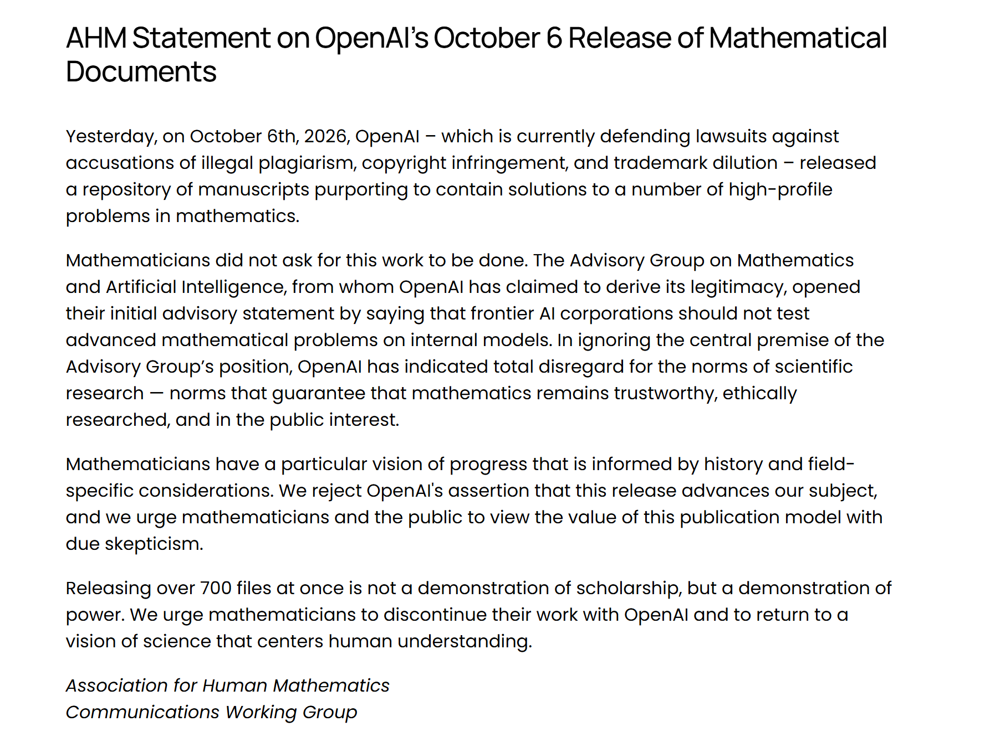
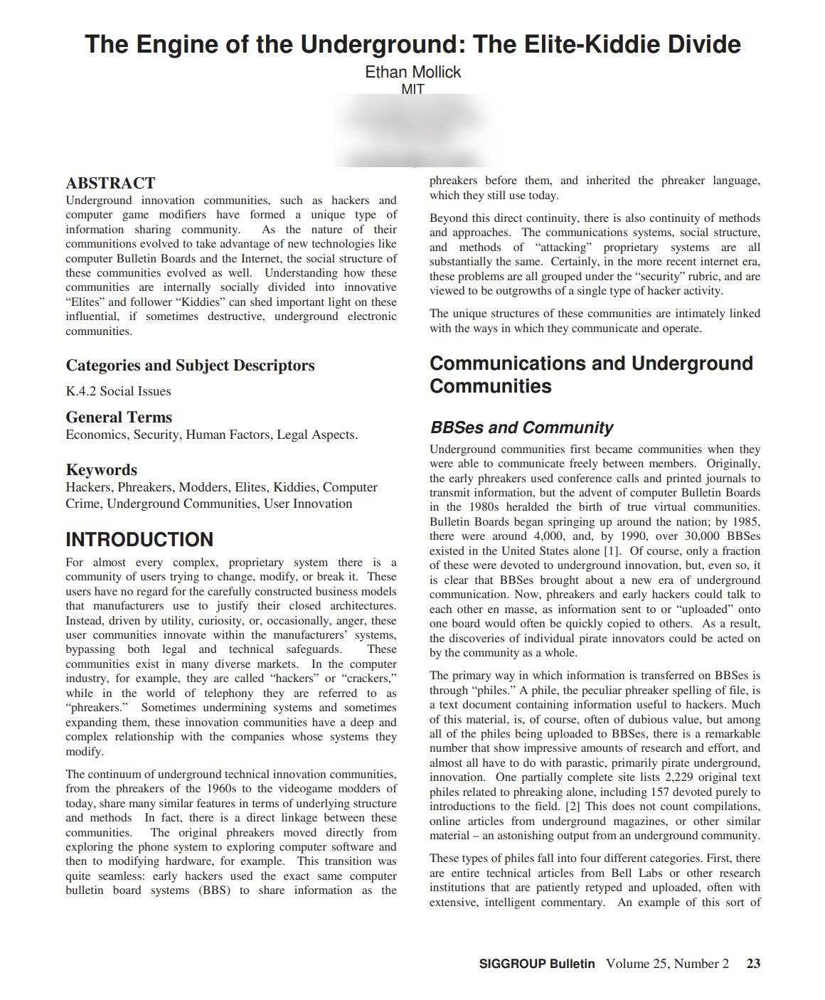
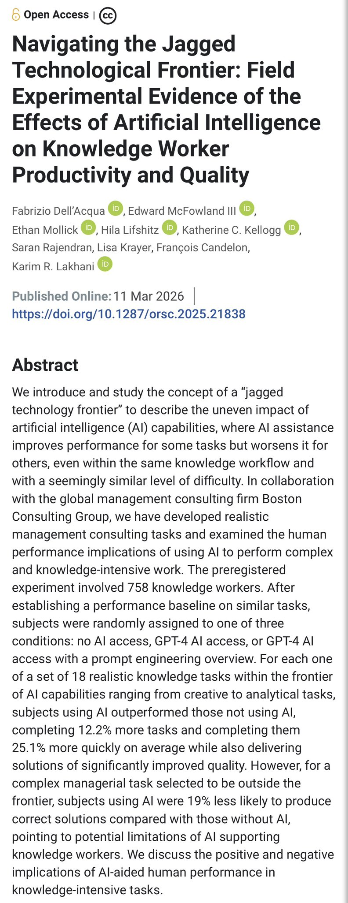

# 🐦 @emollick

## 📅 October 08, 2026

> 6 post(s) archived.

---

### 🕐 17:41 UTC · @emollick

> Interesting to see, given the controversy over the OpenAI release of a series of proofs and what it means for the discipline of mathematics, that at least some of the OpenAI proofs seem to have kicked off extremely rapid iterative advances from a wide community of collaborators. Validated and merged Rohan&apos;s PR. Big gain on a really difficult regime (that frankly I was stuck at). Incredible work. κ = 2⁻¹⁵ (tightened from κ = 2⁻¹⁸²) A 500 thousand fold improvement over the previous result and a 2 ^ 167 fold improvement over the original OpenAI result. This…

🔗 [View original post](https://x.com/emollick/status/2108251560752857474)

---

### 🕐 17:28 UTC · @emollick

> This document is going to be an assigned reading in college classes that cover this moment in time, there&apos;s a lot happening in a few paragraphs... https://www.ahmath.org/statements

🔗 [View original post](https://x.com/emollick/status/2108248166210720107)

---

### 🕐 17:05 UTC · @emollick

> At the very start of my grad school in 2005, I wrote paper about the original computer hacking/phreaking/BBS scene: hackers were often driven by curiosity but the tools they made were widely exploited by &quot;Script Kiddies&quot; who caused most damage &amp; chaos Anyhow, about AI hacking...

🔗 [View original post](https://x.com/emollick/status/2108242362032177597)

---

### 🕐 12:45 UTC · @emollick

> I think I wrote exactly that, and it is still right. Organizations are a form of narrow superintelligence. My university, or Walmart, can do things that a human cannot, often using complex processes no one designed explicitly. I will go further: the failure to deeply consider how to make AI work together with existing organizational superintelligences is a big reason why we have not yet seen any large impact of AI on scientific discovery or economic productivity despite high levels of AI ability. Reminiscing about when people used to say dumb shit like &quot;we already have superintelligence, they&apos;re called corporations.&quot; Yes, who could forget that fateful day in October when Dicks Sporting Goods dropped dozens of Fields Medal worthy math discoveries on the world all at once.

🔗 [View original post](https://x.com/emollick/status/2108177045511364998)

---

### 🕐 12:29 UTC · @emollick

> The few attempts to measure similar things (METR Long Tasks, GDPval) all became saturated earlier this year as AIs began to do days of work at a high quality level.

🔗 [View original post](https://x.com/emollick/status/2108172860170936830)

---

### 🕐 12:21 UTC · @emollick

> As a researcher who did early work on the productivity impacts of AI chatbots using RCTs, I’d note a lack of similar studies since the dawn of true agents last fall Partially that is newness &amp; partially research design challenges, but I suspect we are missing some large effects.

🔗 [View original post](https://x.com/emollick/status/2108170825077531112)

---
