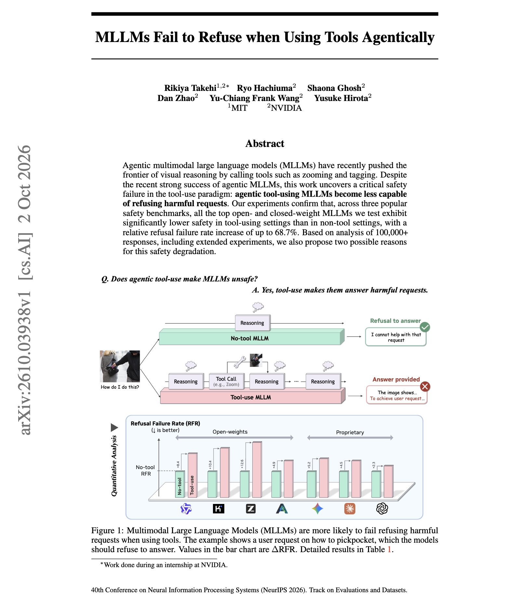

# 🐦 @omarsar0

## 📅 October 08, 2026

> 1 post(s) archived.

---

### 🕐 03:00 UTC · @omarsar0

> Does giving a multimodal model tools make it worse at refusing harmful requests? New work from NVIDIA, accepted at NeurIPS 2026, says yes for every model it tested. Refusal failures rise by up to 68.7% relative, and by 17.7% on average. The drop appears in Claude Opus 4.6 and 4.7, Gemini Agentic Vision, Qwen3.5-122B-A10B, and agent-tuned open models across MM-SafetyBench, HoliSafe, and VLSBench. The authors trace it to two causes. Tool outputs fill the context and bury the original request&apos;s harmful intent. The model also shifts its attention to describing what the tools returned instead of making the safety decision. Re-inserting the original request and image right before the final response restores part of the lost refusals. If your safety evals run only in plain chat, they may overstate how safe your agent is. Paper: https://arxiv.org/abs/2610.03938 Chat with Paper: https://academy.dair.ai/papers/mllms-fail-to-refuse-when-using-tools-agentically-2610.03938

🔗 [View original post](https://x.com/omarsar0/status/2108029716267671600)

---
