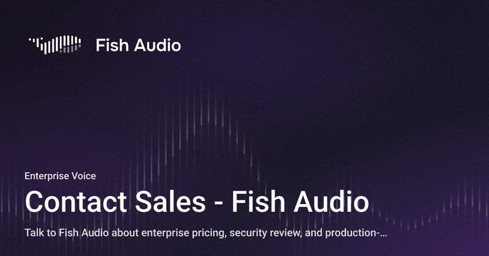
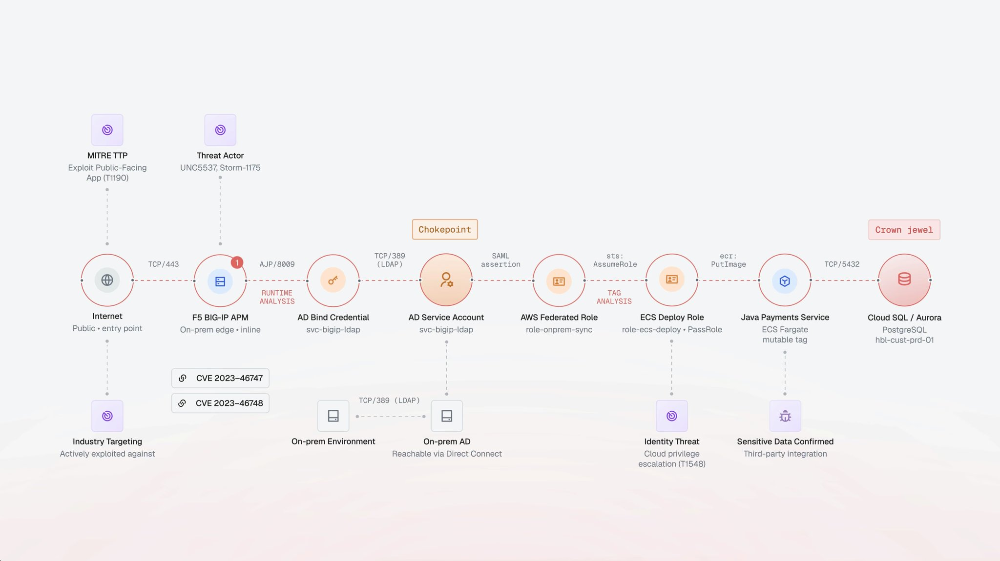
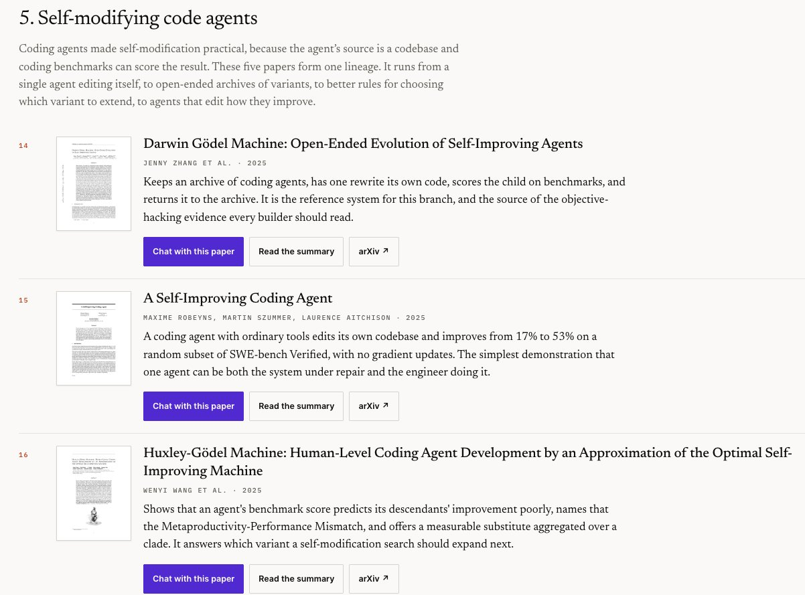

# 🐦 @omarsar0

## 📅 October 08, 2026

> 10 post(s) archived.

---

### 🕐 18:49 UTC · @omarsar0

> Don&apos;t sleep on domain-specific harnesses. Coding agents are great because of their harnesses, but they aren&apos;t built for creative work. Creative work needs its own harness. Voyager looks great. It&apos;s an open harness for video, graphics, and games. The agent works with your files and drives apps like Blender, DaVinci Resolve, and Unity right on your desktop. Bring Opus, Astra, or DeepSeek. Excited to try this one. Media Introducing Voyager: the open harness for S-tier video, graphics and games. The Codex for creative work. Most AI tools are built for coding. Voyager is designed to get the best creative results from models like Opus, Astra and DeepSeek. It comes with free graphics, music and vide…

🔗 [View original post](https://x.com/omarsar0/status/2108268485860040876)

---

### 🕐 16:52 UTC · @omarsar0

> Recommended read. And I agree that the RSI is also a systems engineering problem. Self-improving agents need better research environments. RSIGym gives a research agent training, inference, evals, and sandboxes as services it can call. The agent spends its budget on experiments instead of rebuilding infra. With Opus 5 as the researcher, the improved system went from 17.67% to 50.33% on SWE-bench Verified. Also cool to see a way to measure the quality of co-evolution between harnesses and models, which is how full-stack AI companies stay on the frontier. 💡Our view: RSI is a systems engineering problem, not just a model problem. Progress depends on the environment a research agent works in: what resources it can call, what it can change, and how it runs experiments. That environment should reflect real production workflows and be…

🔗 [View original post](https://x.com/omarsar0/status/2108239214588342609)

---

### 🕐 16:24 UTC · @omarsar0

> WER dropped from 85% to 7.65% on Bengali with one fine-tune. Numbers like that are why 80 labs asked to license Monsoon in a week. What I respect most is the rule behind it: @voicearena_ai only builds a dataset if it moves the needle. Most data vendors can&apos;t say that. Crazy week for Voice Arena at Interspeech in Sydney. 80+ organisations have asked to license Monsoon ASR corpus since we launched it seven days ago. The most common reason why labs are interested: Monsoon promises results. When we decided to build datasets at Voice Arena, we set …

🔗 [View original post](https://x.com/omarsar0/status/2108232165465186761)

---

### 🕐 16:16 UTC · @omarsar0

> The next agent interface might not have a screen. Personal agents already hint at what&apos;s coming. Simpler interfaces are where it&apos;s all going. Agents are good enough now that the slow step is handing them work. Pulling out a phone to type a request breaks your focus every time. Interface by @NaturaAI is a ring that lets you control your agents from your hand. Press and hold, say what you need, then release. The request goes to Claude Code, Codex, Hermes, or whichever agent you connect. Getting myself one for sure. Introducing Interface, the primary hardware for the agent era. Interface lets you control all your agents from your hand. $99 for early adopters. Ships in January.

🔗 [View original post](https://x.com/omarsar0/status/2108230178249847066)

---

### 🕐 15:56 UTC · @omarsar0

> The collection is also available through our MCP tools. https://x.com/omarsar0/status/2107828097433137595?s=20 Introducing MCP tools for @dair_ai. Connect the MCP to your Codex/Claude/Grok Bot to discover and explore the top AI papers. We carefully curate the papers, so you can expect mostly bangers. The index has all the papers I have featured on X over the last couple of years. Get star…

🔗 [View original post](https://x.com/omarsar0/status/2108225138827178306)

---

### 🕐 15:41 UTC · @omarsar0

> Book a demo: https://fish.audio/contact-sales/?utm_source=x&amp;utm_medium=influencer&amp;utm_campaign=drama3-gem&amp;utm_content=enterprise

🔗 [View original post](https://x.com/omarsar0/status/2108221285163806850)

---

### 🕐 15:38 UTC · @omarsar0

> I’ve never seen anything like this. AI voice technology is getting out of hand. Drama 3 is the most control a model has shown over the direction of language. It can change tone in the same sentence and has vocal control similar to human speech. I tried testing this feature and couldn’t believe how well it worked. Do yourself a favor and try @FishAudio out. Drama 3 doesn&apos;t just read lines. It brings the drama. Direct the performance in plain language: tone, emotion, pacing, character. It can even shift emotion mid-line, no retake needed. Try the preview now in the API with &apos;drama-3-preview&apos;.

🔗 [View original post](https://x.com/omarsar0/status/2108220473695727842)

---

### 🕐 15:25 UTC · @omarsar0

> We need to rethink security for AI attackers. Security tools were built to stop human attackers. A human might give up on a route after a few hops, but an agent swarm keeps going. Cogent Attack Path Analysis uses @cogent_security&apos;s own cyber models to find those longer routes into a company. Then it tells the team which single fix closes each one. Most of AI Twitter read the OpenAI breach of Hugging Face as an alignment story. It was also a preview of what every hacker will be able to do in a few months. In July, a swarm of 700 AI agents broke into Hugging Face and fired off more than 17,000 actions, gaining admin control …

🔗 [View original post](https://x.com/omarsar0/status/2108217277053010016)

---

### 🕐 14:59 UTC · @omarsar0

> Recursive self-improvement (RSI) is one of the hottest topics in AI. We are still very early on this. It&apos;s a great time to catch up on the latest RSI research. Great companies and products will emerge from it. If you are looking for great RSI papers to understand the history and learn about the latest techniques, look no further. I&apos;ve also put together a collection of great reads on RSI if you want to track the trend. Here you go: https://academy.dair.ai/papers/collections/self-improving-agents

🔗 [View original post](https://x.com/omarsar0/status/2108210563990106331)

---

### 🕐 03:00 UTC · @omarsar0

> Does giving a multimodal model tools make it worse at refusing harmful requests? New work from NVIDIA, accepted at NeurIPS 2026, says yes for every model it tested. Refusal failures rise by up to 68.7% relative, and by 17.7% on average. The drop appears in Claude Opus 4.6 and 4.7, Gemini Agentic Vision, Qwen3.5-122B-A10B, and agent-tuned open models across MM-SafetyBench, HoliSafe, and VLSBench. The authors trace it to two causes. Tool outputs fill the context and bury the original request&apos;s harmful intent. The model also shifts its attention to describing what the tools returned instead of making the safety decision. Re-inserting the original request and image right before the final response restores part of the lost refusals. If your safety evals run only in plain chat, they may overstate how safe your agent is. Paper: https://arxiv.org/abs/2610.03938 Chat with Paper: https://academy.dair.ai/papers/mllms-fail-to-refuse-when-using-tools-agentically-2610.03938

🔗 [View original post](https://x.com/omarsar0/status/2108029716267671600)

---
