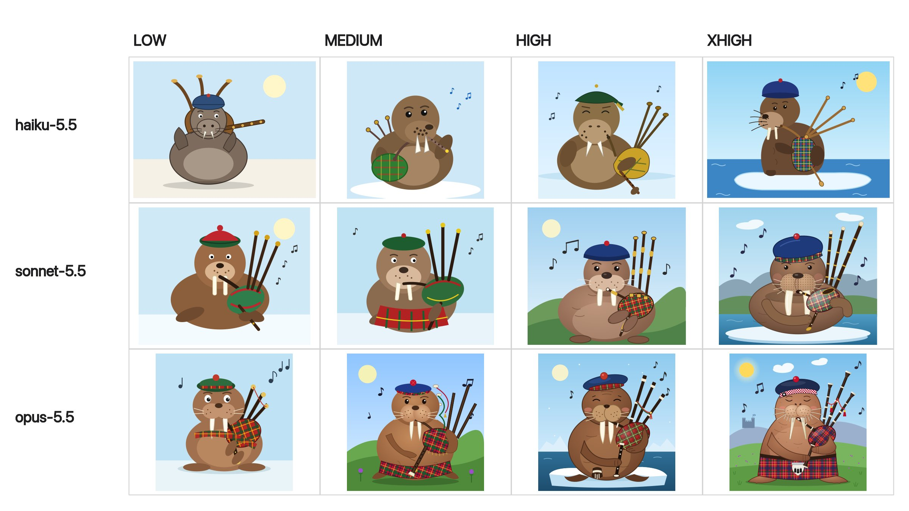

# 🐦 @simonw

## 📅 October 08, 2026

> 4 post(s) archived.

---

### 🕐 21:17 UTC · @simonw

> @simonw 🤣 I couldn&apos;t help myself. &quot;Generate an SVG of a walrus playing the bagpipes&quot;

🔗 [View original post](https://x.com/funcOfJoe/status/2108305684567830568)

---

### 🕐 15:56 UTC · @simonw

> AWS have a new open source sandbox too, must be something in the air Today we&apos;re announcing Strands Box, our open source sandbox for developers building AI agents. New blog post from me, on the Strands blog: https://strandsagents.com/blog/strands-box-the-big-picture/

🔗 [View original post](https://x.com/simonw/status/2108225028299034638)

---

### 🕐 15:29 UTC · @simonw

> Related new project from Microsoft is Quicksand, a Python library that bundles QEMU and uses it to run eg an Alpine Linux container - this one is really neat, I&apos;ve tried it on macOS and Windows and Linux: https://github.com/microsoft/quicksand

🔗 [View original post](https://x.com/simonw/status/2108218301654749218)

---

### 🕐 15:23 UTC · @simonw

> New open source cross-platform (Windows, macOS, Linux) sandboxing library from Microsoft - looks very promising, uses processcontainer/bubblewrap/seatbelt under the hood https://github.com/microsoft/mxc If you’ve been struggling with a multitude of sandboxes for agents, MxC is a sandbox solution that works across Windows, Linux, and macOS. A real platform opportunity for developers across the ecosystem. Process, session, micro VM, and deep integration into agent ID on Windows.

🔗 [View original post](https://x.com/simonw/status/2108216753604248000)

---
