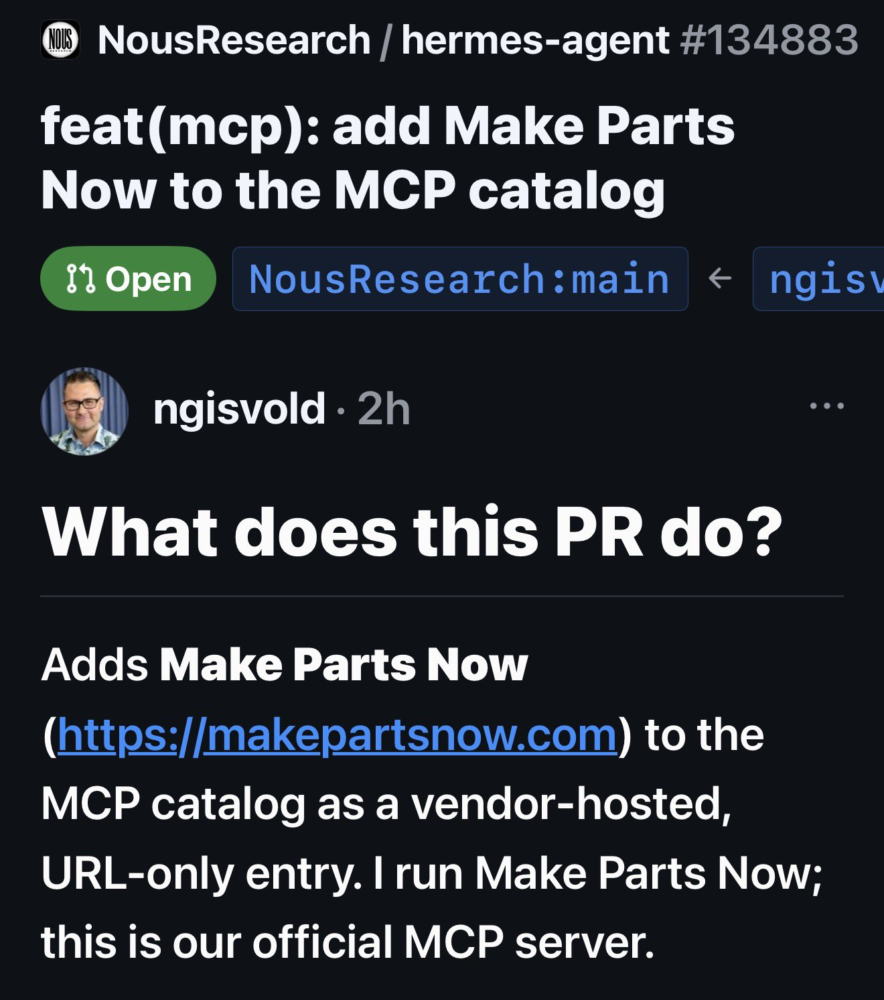
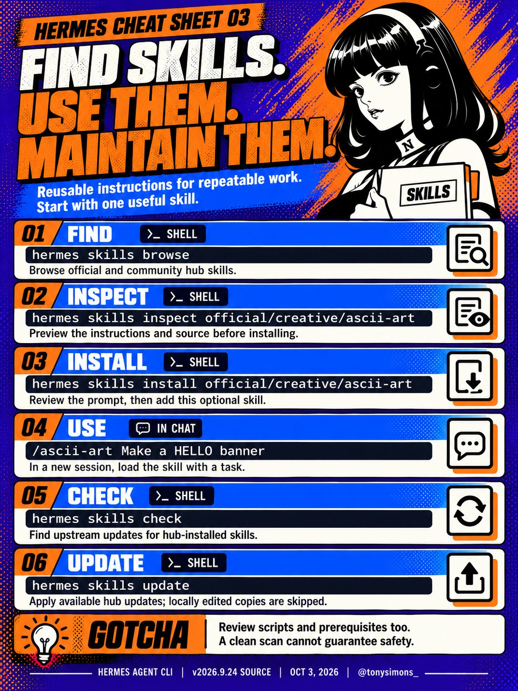

# 🐦 @tonysimons_

## 📅 October 08, 2026

> 6 post(s) archived.

---

### 🕐 06:44 UTC · @tonysimons_

> Drop the wildest Hermes bot or persona you’ve built. I want to see what y&apos;all are cooking. 🔥

🔗 [View original post](https://x.com/tonysimons_/status/2108086050811949119)

---

### 🕐 05:12 UTC · @tonysimons_

> 🚨 Hermes Agent is getting a connection to REAL manufacturing. 🪽 Give it a CAD file. Ask for 25 custom brackets. It can get actual 3D-printing or CNC quotes, compare production speeds, adjust quantities and hand you a checkout link. AI is leaving the chat window. 🚀

🔗 [View original post](https://x.com/tonysimons_/status/2108062883393233329)

---

### 🕐 03:02 UTC · @tonysimons_

> You get 60 seconds to show a skeptic why Hermes Agent is different. What workflow are you demoing?

🔗 [View original post](https://x.com/tonysimons_/status/2108030209891209292)

---

### 🕐 01:39 UTC · @tonysimons_

> A good Hermes skill saves you from explaining the same workflow every session. Cheat Sheet 03: find it, inspect it, install it, use it, keep it current. Read the instructions and scripts before you hand them the keys.

🔗 [View original post](https://x.com/tonysimons_/status/2108009365831909595)

---

### 🕐 00:44 UTC · @tonysimons_

> 🎶 Sorry, I&apos;m not home right now I&apos;m walkin&apos; into spiderwebs So leave a message and I&apos;ll call you back @thsottiaux - it&apos;s all your fault dot screens his phone calls A likely story, but leave a reset and I&apos;ll call you back 💃🏼 Media My OpenAI dot is straight-up screening my calls tonight. 💀 Anybody else&apos;s dot ghosting them, or did mine just decide we&apos;re on a break? @thsottiaux... I know that smell. Another reset cooking? 👀

🔗 [View original post](https://x.com/tonysimons_/status/2107995612507677007)

---

### 🕐 00:14 UTC · @tonysimons_

> My OpenAI dot is straight-up screening my calls tonight. 💀 Anybody else&apos;s dot ghosting them, or did mine just decide we&apos;re on a break? @thsottiaux... I know that smell. Another reset cooking? 👀

🔗 [View original post](https://x.com/tonysimons_/status/2107988059950334057)

---
