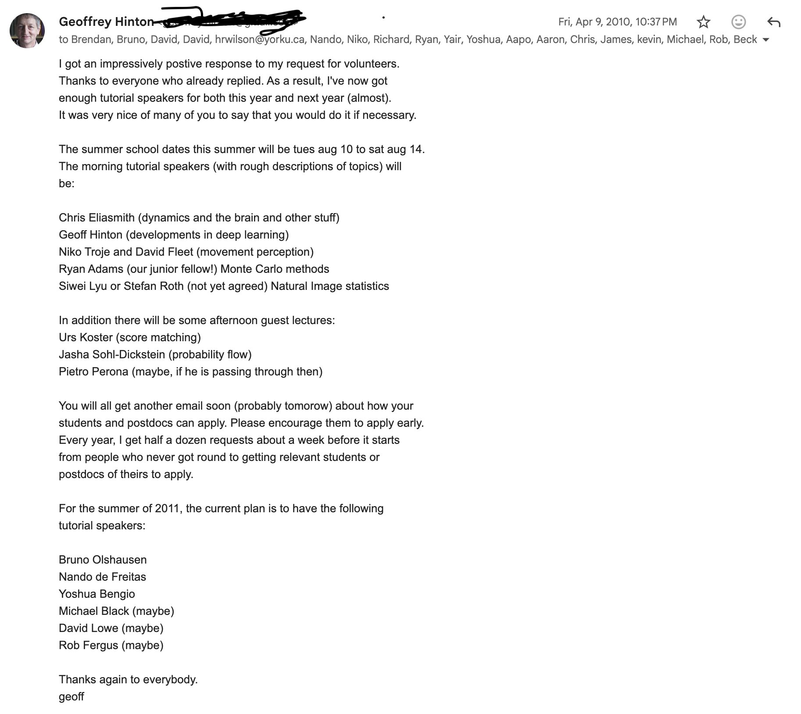

# 🐦 @ylecun

## 📅 October 08, 2026

> 5 post(s) archived.

---

### 🕐 11:43 UTC · @ylecun

> It is morally wrong for some of the billion and trillion dollar AI companies that we enabled and helped build over the last two decades to (1) enforce 6 and 12 month garden leaves on the scientists we trained for them, and (2) choose not to fund education efforts like @DeepIndaba and @Khipu_AI There was a time when @nvidia and @Google weren&apos;t into AI. There was a time when the big cloud providers didn&apos;t have GPUs. There was a time before GPUs and deep learning, and AI, ... During that time professors and students created the foundation of the AI we have today.

🔗 [View original post](https://x.com/NandoDF/status/2108161420223283487)

---

### 🕐 11:09 UTC · @ylecun

> There was a time when @nvidia and @Google weren&apos;t into AI. There was a time when the big cloud providers didn&apos;t have GPUs. There was a time before GPUs and deep learning, and AI, ... During that time professors and students created the foundation of the AI we have today.

🔗 [View original post](https://x.com/NandoDF/status/2108152797954740435)

---

### 🕐 10:43 UTC · @ylecun

> Toutes les formes d&apos;IA sont de &quot;belles saloperies&quot; ? Vraiment ? Même celles qui dépistent les tumeurs dans les mammographies ? Même celles qui détectent et évitent les obstacles sur la route et sauvent des vies en réduisant les collisions de 40% ? Même celles qui aident à filtrer les spams et les tentatives d&apos;escroquerie par email, messages, ou réseaux sociaux ? Même celles qui détectent et bloquent les tentatives d&apos;influence étrangères sur le processus démocratique ? Même celles qui permettent aux non-voyant d&apos;entendre une description de leur environnement visuel ? Même celles qui connectent les cultures par la traduction automatique des langues ? Même celles qui assistent dans leurs métiers les médecins, les chercheurs, les journalistes ? Il faut toujours éviter de jeter le bébé avec l&apos;eau du bain.

🔗 [View original post](https://x.com/ylecun/status/2108146163006287884)

---

### 🕐 08:56 UTC · @ylecun

> 1/ Why does predicting in latent space (JEPA, CPC, SimCLR...) work so well on messy data, with changing lighting, camera angles, and busy backgrounds? The usual answer: it can ignore nuisance. But that answer holds a conundrum. Media

🔗 [View original post](https://x.com/hisspikeness/status/2108119221255164165)

---

### 🕐 03:56 UTC · @ylecun

> Big new paper nobody is talking about ‼️ 🌎 Robot world models now have scaling laws. Meta trained an 8B-parameter JEPA on 15,000 hours of robot video to prove it. RoboJEPA (FAIR at Meta + Mila) imagines the future in V-JEPA 2.1&apos;s feature space, then plans toward a single goal image. The authors call it the largest JEPA predictor trained to date. - Trained on 23 public datasets: 12 robot embodiments, 15,022 hours of video, 6,692 of them with actions. - Fit the scaling law on 22M–2B models and it accurately predicts the 4B and 8B results. - Skills unlock in order as compute grows: moving the arm, holding an object, avoiding obstacles, and only past ~10^22 FLOPs, pushing objects. - On a real Franka with no task fine-tuning, the 8B model grasps 67% of the time vs 5% for π0.5. Not apples-to-apples (goal image vs text), and π0.5 still wins pick-and-place, 53% vs 27%. Why it matters: SCALING LAWS. You can forecast what more compute buys before you spend it.

🔗 [View original post](https://x.com/vai_viswanathan/status/2108043761045348781)

---
