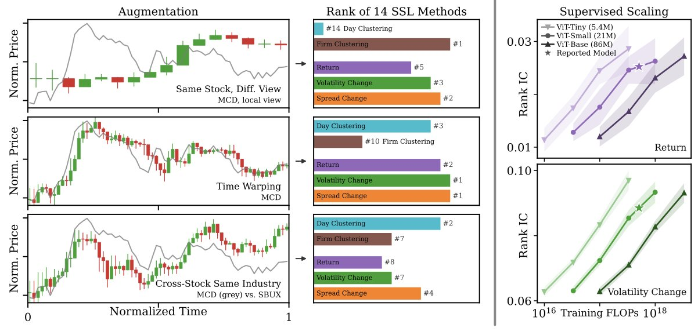
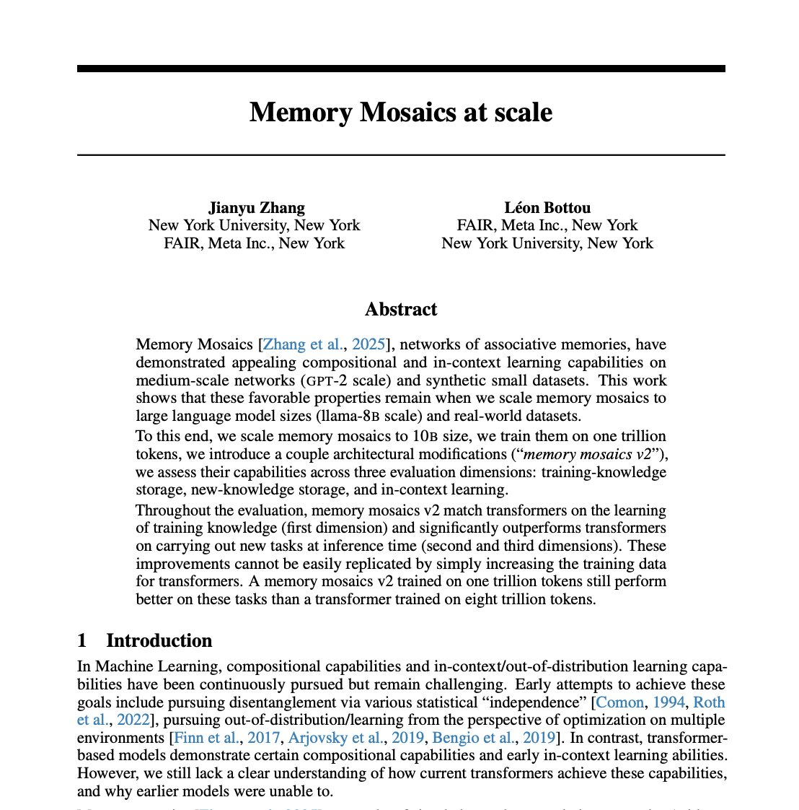

# 🐦 @ylecun

## 📅 October 08, 2026

> 14 post(s) archived.

---

### 🕐 19:04 UTC · @ylecun

> Financial data is RIPE for JEPAs... noise, non-stationarity, unknown ground truth states... yet data and evaluation is not readily available! We resolve that in our latest NeurIPS paper `Towards Financial World Modeling&apos; TLDR: invest with LeJEPA ;) 📄https://arxiv.org/abs/2610.09048 🧵⬇️

🔗 [View original post](https://x.com/randall_balestr/status/2108272405236097449)

---

### 🕐 18:29 UTC · @ylecun

> Is it possible to provably recover individual latent variables of the true world, even without reconstruction (e.g., JEPA)? Yes, with DSReg, a simple regularization that can be applied post hoc to your pretrained model! https://dsreg.github.io/ Media

🔗 [View original post](https://x.com/YujiaZheng9/status/2108263563097719146)

---

### 🕐 15:25 UTC · @ylecun

> @BrianRoemmele @elonmusk The Medal of Science is for scientists. Scientists publish their works in peer-reviewed venues so they can be scrutinized, verified, and reproduced.

🔗 [View original post](https://x.com/ylecun/status/2108217333504180551)

---

### 🕐 14:11 UTC · @ylecun

> The one and only Michael Jordan was interviewed last week by the French newspaper Libération. Here is an English translation. Enjoy! https://www.di.ens.fr/~fbach/MJordan_ITW_Liberation_English.html

🔗 [View original post](https://x.com/BachFrancis/status/2108198535388631222)

---

### 🕐 11:43 UTC · @ylecun

> It is morally wrong for some of the billion and trillion dollar AI companies that we enabled and helped build over the last two decades to (1) enforce 6 and 12 month garden leaves on the scientists we trained for them, and (2) choose not to fund education efforts like @DeepIndaba and @Khipu_AI There was a time when @nvidia and @Google weren&apos;t into AI. There was a time when the big cloud providers didn&apos;t have GPUs. There was a time before GPUs and deep learning, and AI, ... During that time professors and students created the foundation of the AI we have today.

🔗 [View original post](https://x.com/NandoDF/status/2108161420223283487)

---

### 🕐 11:09 UTC · @ylecun

> There was a time when @nvidia and @Google weren&apos;t into AI. There was a time when the big cloud providers didn&apos;t have GPUs. There was a time before GPUs and deep learning, and AI, ... During that time professors and students created the foundation of the AI we have today.

🔗 [View original post](https://x.com/NandoDF/status/2108152797954740435)

---

### 🕐 11:06 UTC · @ylecun

> I find it odd watching armchair critics rush to nitpick @MistralAI’s plans or obsess over whether they’re #1 on every leaderboard. Having a team with this level of conviction building frontier models and AI infrastructure in France—and punching so far above their weight relative to hyperscaler resources—is incredible. Building in the arena is hard. Anybody who actually tries knows. We should be rooting for them, and I have huge respect for what they’re building in France 🇫🇷🇫🇷🇫🇷—keep it up!

🔗 [View original post](https://x.com/clmt/status/2108151971932729658)

---

### 🕐 10:43 UTC · @ylecun

> Toutes les formes d&apos;IA sont de &quot;belles saloperies&quot; ? Vraiment ? Même celles qui dépistent les tumeurs dans les mammographies ? Même celles qui détectent et évitent les obstacles sur la route et sauvent des vies en réduisant les collisions de 40% ? Même celles qui aident à filtrer les spams et les tentatives d&apos;escroquerie par email, messages, ou réseaux sociaux ? Même celles qui détectent et bloquent les tentatives d&apos;influence étrangères sur le processus démocratique ? Même celles qui permettent aux non-voyant d&apos;entendre une description de leur environnement visuel ? Même celles qui connectent les cultures par la traduction automatique des langues ? Même celles qui assistent dans leurs métiers les médecins, les chercheurs, les journalistes ? Il faut toujours éviter de jeter le bébé avec l&apos;eau du bain.

🔗 [View original post](https://x.com/ylecun/status/2108146163006287884)

---

### 🕐 09:33 UTC · @ylecun

> Meta published a paper that might end the transformer era. For the last seven years, every major AI, ChatGPT, Claude, Gemini, has been built on the exact same architecture. Transformer. But Transformers have a massive, expensive flaw. To get smarter, they rely on an endless, brute-force supply of training data. And to remember long contexts, their compute cost explodes. We thought the only way forward was bigger GPUs and endless data centers. But, Meta proved us wrong. They published &quot;Memory Mosaics at scale,&quot; and it completely rewrites how AI processes information. Instead of the standard attention mechanism, Meta built a network of associative memories. It works less like a calculator running endless sequence equations, and more like a device storing and selectively retrieving specific key-value pairs. The results are staggering. A Memory Mosaics model trained on just 1 trillion tokens completely outperformed a traditional Transformer trained on 8 trillion tokens. Let that sink in. It beat a model trained on 8x more data. It also demonstrated superior in-context learning and the ability to solve completely new tasks with a fraction of the examples. It naturally disentangles complex problems into smaller, independent sub-tasks automatically.

🔗 [View original post](https://x.com/CrazyShyyt/status/2108128585760596237)

---

### 🕐 08:56 UTC · @ylecun

> 1/ Why does predicting in latent space (JEPA, CPC, SimCLR...) work so well on messy data, with changing lighting, camera angles, and busy backgrounds? The usual answer: it can ignore nuisance. But that answer holds a conundrum. Media

🔗 [View original post](https://x.com/hisspikeness/status/2108119221255164165)

---

### 🕐 08:53 UTC · @ylecun

> Au contraire. C&apos;est une nouvelle ère qui s&apos;ouvre pour les mathématiques. Une ère où la démonstration formelle est largement automatisée et où l&apos;accent sera reporté sur le développement de nouveaux concepts, nouvelles abstractions, nouvelles définitions, et nouvelles conjectures. L&apos;invention du bateau a réduit l&apos;importance de la nage, mais a permis la découverte de nouvelles terres.

🔗 [View original post](https://x.com/ylecun/status/2108118582856925198)

---

### 🕐 08:25 UTC · @ylecun

> 🔥 #LeAVJEPA: A simple recipe for self-supervised learning from sound and vision 🔥 One shared encoder, trained without class labels. Dropping a modality makes audio &amp; video learn a common representation. 🧵 Media

🔗 [View original post](https://x.com/arnosolin/status/2108111611768480128)

---

### 🕐 03:56 UTC · @ylecun

> Big new paper nobody is talking about ‼️ 🌎 Robot world models now have scaling laws. Meta trained an 8B-parameter JEPA on 15,000 hours of robot video to prove it. RoboJEPA (FAIR at Meta + Mila) imagines the future in V-JEPA 2.1&apos;s feature space, then plans toward a single goal image. The authors call it the largest JEPA predictor trained to date. - Trained on 23 public datasets: 12 robot embodiments, 15,022 hours of video, 6,692 of them with actions. - Fit the scaling law on 22M–2B models and it accurately predicts the 4B and 8B results. - Skills unlock in order as compute grows: moving the arm, holding an object, avoiding obstacles, and only past ~10^22 FLOPs, pushing objects. - On a real Franka with no task fine-tuning, the 8B model grasps 67% of the time vs 5% for π0.5. Not apples-to-apples (goal image vs text), and π0.5 still wins pick-and-place, 53% vs 27%. Why it matters: SCALING LAWS. You can forecast what more compute buys before you spend it.

🔗 [View original post](https://x.com/vai_viswanathan/status/2108043761045348781)

---

### 🕐 00:24 UTC · @ylecun

> If I told you what Republicans were actually doing right now, you wouldn&apos;t believe me — you would think I was lying, that it&apos;s actually too cruel and corrupt to be true But it&apos;s true 10 things Republicans have done in the last 10 days 🧵 Media

🔗 [View original post](https://x.com/ramit/status/2107990465484353651)

---
