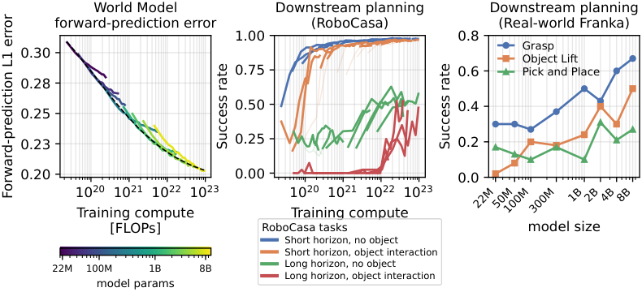

# 🐦 @ylecun

## 📅 October 08, 2026

> 1 post(s) archived.

---

### 🕐 03:56 UTC · @ylecun

> Big new paper nobody is talking about ‼️ 🌎 Robot world models now have scaling laws. Meta trained an 8B-parameter JEPA on 15,000 hours of robot video to prove it. RoboJEPA (FAIR at Meta + Mila) imagines the future in V-JEPA 2.1&apos;s feature space, then plans toward a single goal image. The authors call it the largest JEPA predictor trained to date. - Trained on 23 public datasets: 12 robot embodiments, 15,022 hours of video, 6,692 of them with actions. - Fit the scaling law on 22M–2B models and it accurately predicts the 4B and 8B results. - Skills unlock in order as compute grows: moving the arm, holding an object, avoiding obstacles, and only past ~10^22 FLOPs, pushing objects. - On a real Franka with no task fine-tuning, the 8B model grasps 67% of the time vs 5% for π0.5. Not apples-to-apples (goal image vs text), and π0.5 still wins pick-and-place, 53% vs 27%. Why it matters: SCALING LAWS. You can forecast what more compute buys before you spend it.

🔗 [View original post](https://x.com/vai_viswanathan/status/2108043761045348781)

---
