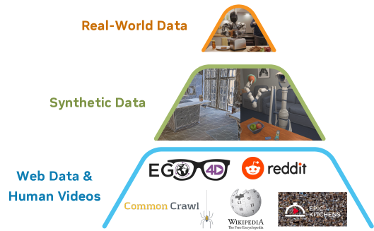

# 🐦 @_akhaliq

## 📅 October 09, 2026

> 2 post(s) archived.

---

### 🕐 16:02 UTC · @_akhaliq

> AI is already smart enough. Real-world tasks are still slow, expensive and unreliable, because we hand AI a computer built for humans, then wrap it in a heavy harness. AI doesn’t need to get smarter. It needs a computer built for it. Today we’re releasing Pine Computer Media

🔗 [View original post](https://x.com/StanleyWei4748/status/2108588887790784897)

---

### 🕐 12:09 UTC · @_akhaliq

> NVIDIA just released a GR00T-based robotics model on Hugging Face Agile One S SSD Pick is a deployment model for SSD picking, with ONNX graphs and TensorRT engines included.

🔗 [View original post](https://x.com/HuggingPapers/status/2108530168016798028)

---
