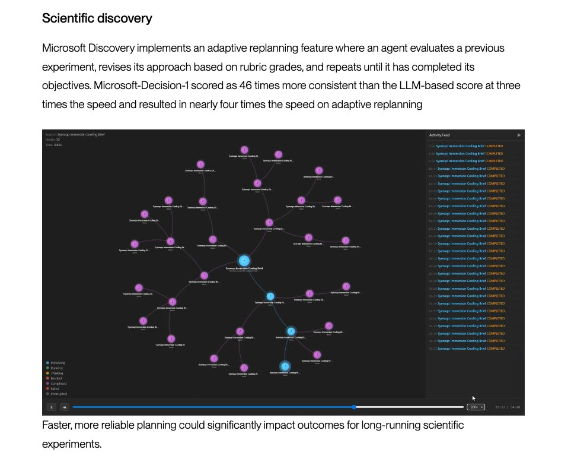
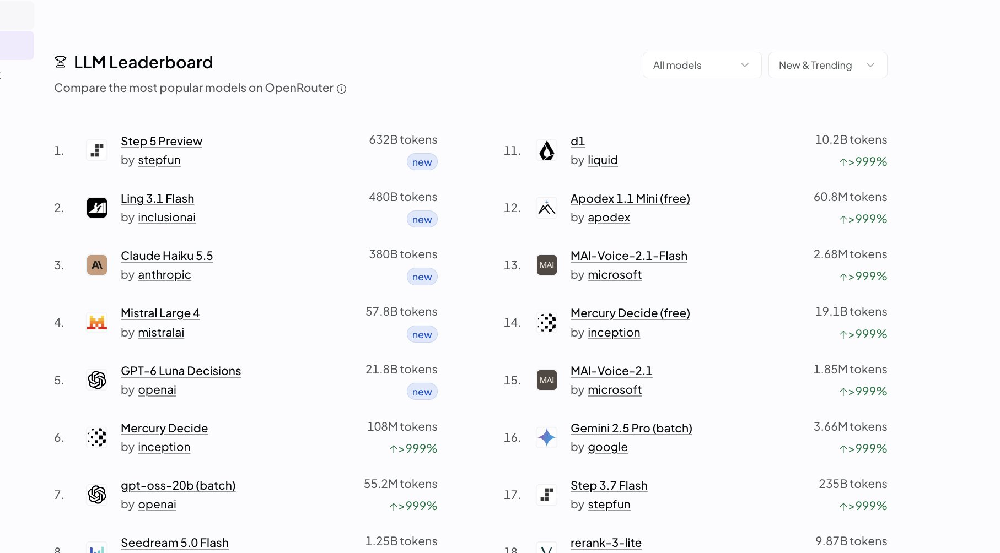
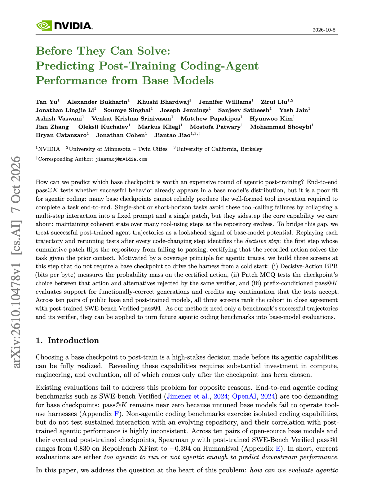
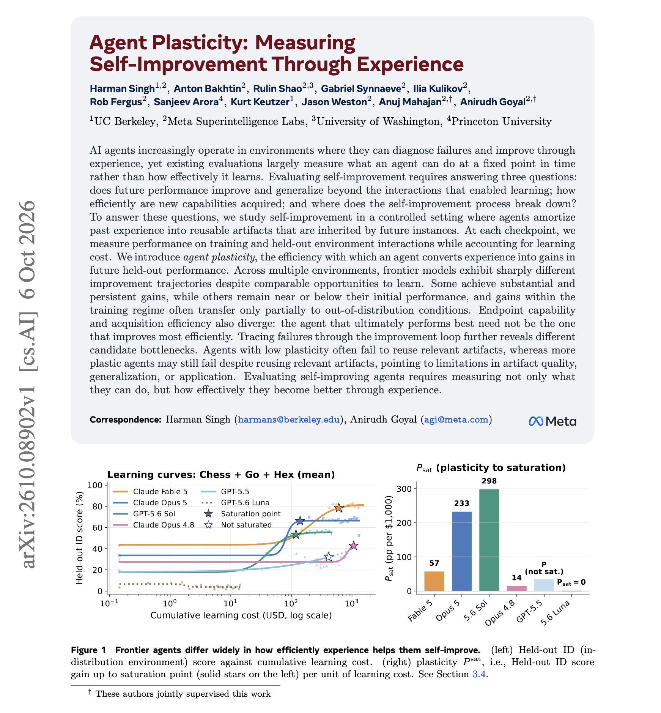
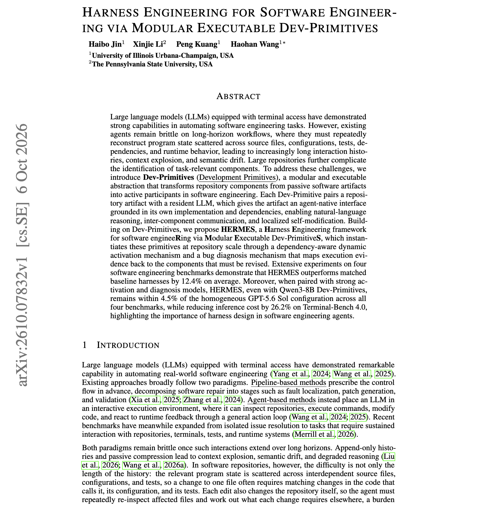
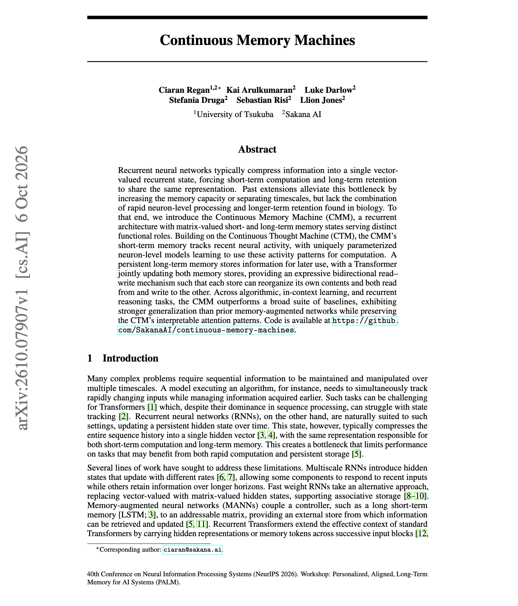

# 🐦 @dair_ai

## 📅 October 09, 2026

> 7 post(s) archived.

---

### 🕐 23:31 UTC · @dair_ai

> Bullish on this trend of making post-training more accessible. A new post-training era is upon us. If you work on agentic RL, long-context tasks (a big focus today) are expensive, inefficient, and don&apos;t scale well. I&apos;ve been diving into RL envs and evals for long-context tasks, and I can see this being useful. In agent RL, rollouts use most of the tokens. Every turn re-reads the whole growing context, including tool outputs, files, and earlier turns. Tinker just cut the price of those tokens. Long-context prefill and sampling now cost the same as short context. This means that evaluating your trained models on long inputs also gets cheaper. Huge win here. I believe RL will keep unlocking specialized models that slash the cost of critical agent operations. Cheaper long rollouts make them more practical to build. Own your intelligence stack! Tinkerers have been busy scaling up long-context RL! We’ve made significant improvements to Tinker’s efficiency to support those, and are passing these on with price cuts up to 70%. GLM-5.3-Flash and DeepSeek-v4.1-Flash are also live for cost-efficient long-context work.

🔗 [View original post](https://x.com/omarsar0/status/2108702010933424464)

---

### 🕐 19:44 UTC · @dair_ai

> NEW: Microsoft also releases its System One model, Microsoft-Decision-1. What a crazy effect Jev has had in the space. Also, a very cool application of decision-making models to power LLM judges and improve scientific discovery pipelines (e.g., screening candidate hypotheses). I&apos;ll add this model to my ever-growing list of eval runs. In my ongoing evals, consistency and more complex decision-making are two areas where I see these decision models struggle. I&apos;m also exploring a bunch of science applications at @dair_ai and will share when ready. Introducing Microsoft-Decision-1, our new model for fast decision-making. It delivers top performance on structured decision tasks, outperforming both LLMs and other decision models in latency and quality. We’re already testing it across Microsoft for everything from incident res…

🔗 [View original post](https://x.com/omarsar0/status/2108644675166888033)

---

### 🕐 17:24 UTC · @dair_ai

> Step 5 Preview from @StepFun_ai hit #1 on OpenRouter Trending, a day after launch. It&apos;s available in Kilo Code, Cline, Hermes Agent, and OpenCode. Keep your workflow and just switch models. I&apos;ve tested the model. It’s a great model and has some nice properties. I&apos;ve been using it as a coding agent since early access. It checks its own work and stops when the task is done. I would use it for long agent runs that I don&apos;t watch closely. StepFun built it for real engineering work. That covers fixing bugs in unfamiliar codebases, implementing features across files, and refactoring, with changes that run and pass checks. Frontend is the other big focus. You can give it a screenshot, a mockup, or a PRD, and it can return a working web page. It can also build a playable browser game from a set of assets. Beyond code, it reads annual reports and operating data and turns them into financial reports, editable spreadsheets, and slide decks. The context window is 1M tokens, with up to 1M output tokens. That is enough for large codebases and long multi-step tasks. Under the hood, Step 5 Preview is a sparse MoE with 600B total parameters and 27B active per token. Open weights are coming on Oct 15. Very much looking forward to its release.

🔗 [View original post](https://x.com/omarsar0/status/2108609487338631207)

---

### 🕐 15:46 UTC · @dair_ai

> Super interesting NVIDIA paper on choosing base models for coding agents. It&apos;s actually a clever way to rank base checkpoints by how well each one is likely to do as a coding agent after post-training. They document that base models are really hard to evaluate on agentic coding tasks. They ran six base models on SWE-bench Verified, and five of them solved zero tasks. So instead, they look at the one step in a coding run that actually fixes the task. In other words, they take tasks that a strong post-trained agent already solved, replay its code edits one by one, and run the tests after each edit. The first edit that makes the tests pass is the decisive edit. Then they give the base model everything that happened before that edit and check whether it can come up with that fix. They score this in three ways. They check how likely the base model is to write the fix, whether it can pick the fix out of a set of rejected patches, and whether any fix it writes on its own passes the tests. All three rankings closely match post-trained SWE-bench Verified scores across ten base and post-trained model pairs. Why is this useful? If you pick checkpoints for agentic post-training, this method can give you a signal before you spend the training budget. Paper: https://academy.dair.ai/papers/before-they-can-solve-predicting-post-training-coding-agent-performance-from-bas-2610.10478

🔗 [View original post](https://x.com/dair_ai/status/2108584781877522655)

---

### 🕐 15:28 UTC · @dair_ai

> Banger paper from Meta Superintelligence Labs on self-improving agents. (bookmark it) It&apos;s hard to know exactly what drives self-improvement, since so many variables are at play (notes, skills, tool calls between runs, etc.). Meta researchers explore and discuss a way to measure whether self-improvement pays off. They call it agent plasticity. It is the gain on held-out tasks per dollar spent on learning, with model weights frozen and every run starting from a fresh context. They find that the model that performs the best is often a different model from the one that learns most efficiently. In chess, Go, and Hex, Claude Fable 5 reaches the highest final score, while GPT-5.6 Sol gains the most per dollar. In NetHack, only Claude Opus 5.5 improves significantly, by 66 normalized points for about $1,073 of learning. Another interesting finding is that slow learners often ignore artifacts they already wrote. Faster learners reuse their artifacts and still fail when an artifact is low quality. Paper: https://arxiv.org/abs/2610.08902 Chat with Paper: https://academy.dair.ai/papers/agent-plasticity-measuring-self-improvement-through-experience-2610.08902

🔗 [View original post](https://x.com/omarsar0/status/2108580251127439710)

---

### 🕐 00:53 UTC · @dair_ai

> Build your own harness, folks. Reading papers like this makes me realize how underexplored harness engineering really is. The authors find that on whole-repository migration, GPT-5.6 Sol goes from 6.5% to 31.0% when Codex is replaced with the HERMES harness, with the same model and effort setting. The gain comes from the harness. HERMES pairs each repository component with a resident LLM that knows its own code and dependencies. A dependency-aware step decides which components to activate, and a diagnosis step maps test failures back to the components that need changes. Across four software engineering benchmarks, it beats matched baseline harnesses by 12.4 points on average. With strong activation and diagnosis models, Qwen3-8B components come within 4.5 points of an all-GPT-5.6 Sol setup and cut Terminal-Bench 4.0 inference cost by 26.2%. Paper: https://arxiv.org/abs/2610.07832 Chat with Paper: https://academy.dair.ai/papers/harness-engineering-for-software-engineering-via-modular-executable-dev-primitiv-2610.07832

🔗 [View original post](https://x.com/omarsar0/status/2108360049848717588)

---

### 🕐 00:50 UTC · @dair_ai

> Interesting paper from Sakana AI on memory for recurrent models. Recurrent models are good at state tracking, but they usually keep everything in one hidden vector, so short-term computation and long-term storage compete for the same space. The Continuous Memory Machine gives the model two memory matrices. One short-term memory tracks recent neuron activity, and the other long-term memory stores information for later steps. A Transformer reads and writes both at every step. It builds on Sakana&apos;s Continuous Thought Machine and beats LSTM, DNC, RMC, and CTM baselines on copy, associative recall, sorting, few-shot regression, and maze solving. It also generalizes to longer inputs than earlier memory-augmented networks. The attention maps show the model uses long-term memory for algorithmic and in-context tasks and skips it when the task does not need it. Paper: https://academy.dair.ai/papers/continuous-memory-machines-2610.07907

🔗 [View original post](https://x.com/dair_ai/status/2108359294609768715)

---
