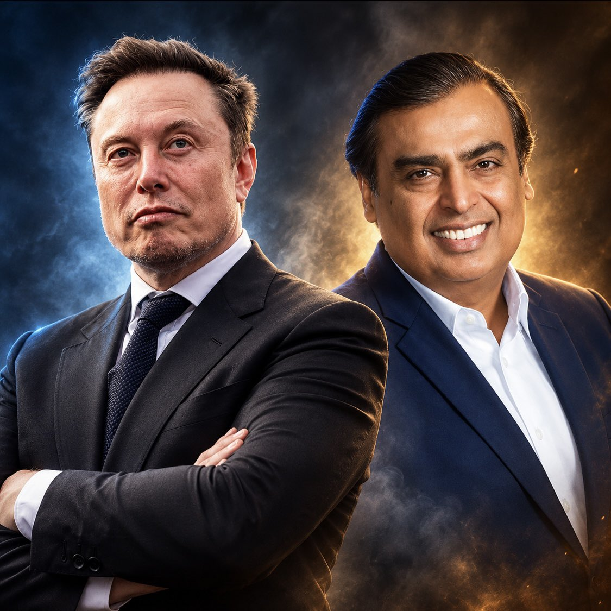
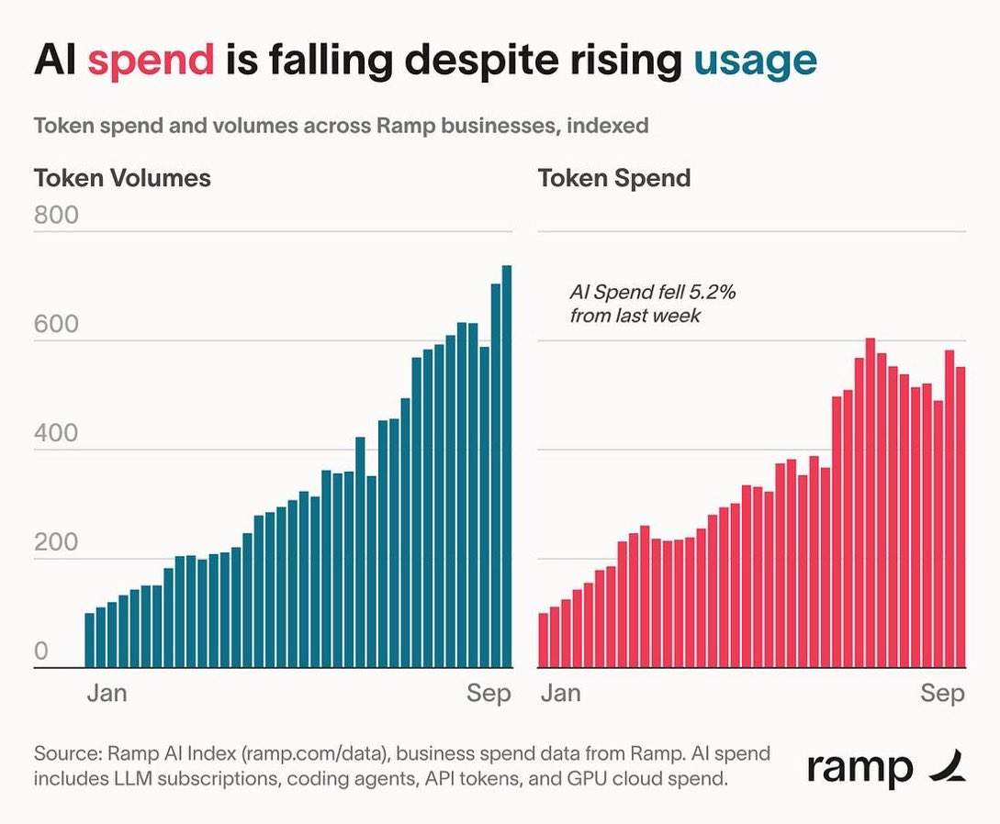
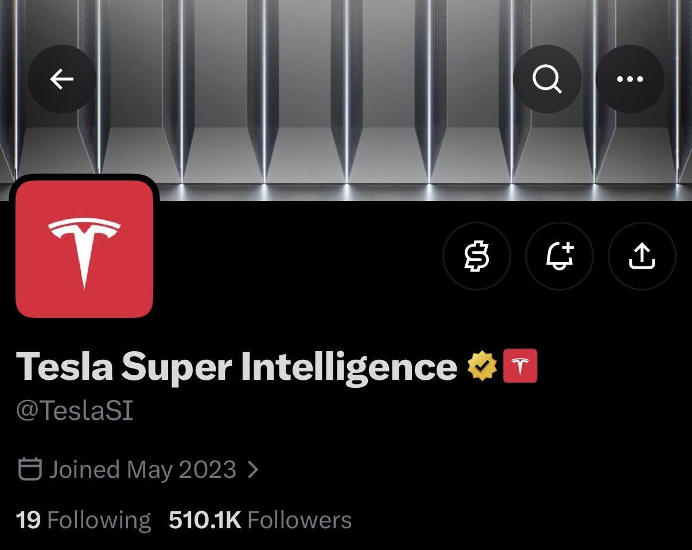

# 🐦 @elonmusk

## 📅 October 09, 2026

> 16 post(s) archived.

---

### 🕐 17:43 UTC · @elonmusk

> True Starlink is a life-saving technology that has helped save many lives during severe natural disasters SpaceX and Elon has repeatedly provided FREE Starlink connectivity to people affected by natural disasters and major infrastructure outages ❤️ As Elon Musk said: “Whenever there’s…

🔗 [View original post](https://x.com/elonmusk/status/2108614272112525781)

---

### 🕐 17:37 UTC · @elonmusk

> Grok @Bot can now set up its own email Please set up your email, @bot

🔗 [View original post](https://x.com/elonmusk/status/2108612939842511217)

---

### 🕐 17:25 UTC · @elonmusk

> Grok Bot now has its own email. Bot can use it to sign up for services, contact businesses for you, or schedule time with someone.

🔗 [View original post](https://x.com/bot/status/2108609764766908772)

---

### 🕐 17:21 UTC · @elonmusk

> Yes The biggest gains from Starlink going from 1 million users to 12 million in 3.5 years went to villages, islands, farms, ships, and disaster zones that towers don’t reach. Ukraine kept links up under bombardment. Clinics, schools, and crews stayed online with a dish and a clear sk…

🔗 [View original post](https://x.com/elonmusk/status/2108608762856800302)

---

### 🕐 17:17 UTC · @elonmusk

> BREAKING: Elon Musk takes aim at Mukesh Ambani, calling him “Prime Minister Ambani” and asking him to let Starlink compete in India. Starlink could help children access education, connect small businesses to global markets and save lives when disasters knock out other networks. Elon is right to speak up. He has helped build technology that could change lives in communities still waiting for reliable internet. His argument deserves support: more opportunity for children, more customers for businesses and a lifeline for families during emergencies. India should welcome that ambition. Let Starlink compete, give Indians more choice and let consumers decide. Dear Prime Minister Ambani, Please accept my humble apologies for not realizing that you are the real boss of India. Naturally, you would prefer to maintain your monopolistic exploitation of the great people of India, but would you nonetheless consider allowing Starlink to compet…

🔗 [View original post](https://x.com/cb_doge/status/2108607817150304536)

---

### 🕐 17:06 UTC · @elonmusk

> Also, Starlink has proven to be essential for saving lives during natural disasters throughout the world, when all other communications systems have failed, so you would also be helping save men, women and children throughout India. 🇮🇳

🔗 [View original post](https://x.com/elonmusk/status/2108605079746167163)

---

### 🕐 17:03 UTC · @elonmusk

> Dear Prime Minister Ambani, Please accept my humble apologies for not realizing that you are the real boss of India. Naturally, you would prefer to maintain your monopolistic exploitation of the great people of India, but would you nonetheless consider allowing Starlink to compete? There are many areas of India, as there are in all countries, with no Internet access, which denies children the opportunity for education and for small businesses the opportunity to sell their goods to a global market. Starlink would change their lives for the better. Thank you 🙏

🔗 [View original post](https://x.com/elonmusk/status/2108604227643719745)

---

### 🕐 16:36 UTC · @elonmusk

> Internet connectivity enables education &amp; prosperity 🚨 ELON MUSK ON INTERNET AND POVERTY Elon said the single biggest thing you can do to lift people out of poverty is give them an internet connection. Once people have internet, they can learn almost anything for free and sell their goods and services to the world. SpaceX is in a …

🔗 [View original post](https://x.com/elonmusk/status/2108597418065613301)

---

### 🕐 15:01 UTC · @elonmusk

> BREAKING: SpaceX donated nearly $500,000 to Anderson-Shiro CISD in Texas for 3 new school buses with three-point seatbelts, cameras and radios. The donation will help upgrade the district’s fleet and give students safer rides. ❤️ Media

🔗 [View original post](https://x.com/cb_doge/status/2108573683942109187)

---

### 🕐 11:55 UTC · @elonmusk

> Why open-weight models that compress margins at the model layer are net positive for AI infra demand, exhibit 1001. An open-weight token consumes *roughly* the same amount of compute as a frontier token for a similar size model.

🔗 [View original post](https://x.com/GavinSBaker/status/2108526656902091103)

---

### 🕐 08:15 UTC · @elonmusk

> テスラ家庭用蓄電池 Powerwall 3 は、水深0.6mまで浸水対応🐟 Media

🔗 [View original post](https://x.com/teslajapan/status/2108471489175658589)

---

### 🕐 07:41 UTC · @elonmusk

> 😑 James Talarico says the violent hierarchies of the heteropatriarchy have colonized white minds https://notthebee.com/article/james-talarico-says-the-violent-hierarchies-of-the-heteropatriarchy-have-colonized-white-minds

🔗 [View original post](https://x.com/elonmusk/status/2108462793112371679)

---

### 🕐 03:19 UTC · @elonmusk

> We’re just going to have @Grok Bots manage Grokipedia You can now watch Grokipedia evolve in real time Live edits are happening constantly across the platform as Grok reviews, updates and improves articles You can literally follow the knowledge base changing as it happens Pretty wild to watch an SI-maintained encyclopedia update its…

🔗 [View original post](https://x.com/elonmusk/status/2108396888160387541)

---

### 🕐 03:18 UTC · @elonmusk

> Using Grok @Bot is like hiring a super smart, hard-working person for peanuts First month I paid $200 Cursor Ultra just to try Grok Bot. I said to myself.. it&apos;s okay even I don&apos;t find it worth it, I will still learn something. I learned so much since I started Grok Bot + Cursor. I never imagined myself building an app. Not only I can&apos;t do coding but I also…

🔗 [View original post](https://x.com/elonmusk/status/2108396588544745887)

---

### 🕐 02:02 UTC · @elonmusk

> Tesla Super Intelligence is the only one dedicated to solving real-world intelligence, from large-scale bits to atoms.

🔗 [View original post](https://x.com/yunta_tsai/status/2108377550116503695)

---

### 🕐 00:06 UTC · @elonmusk

> One of my favorite and totally underrated @bot features is canvas. Just ask your Chief of Staff to present you an updates on the canvas, relax, and enjoy the results 😉

🔗 [View original post](https://x.com/stepango/status/2108348368447778862)

---
