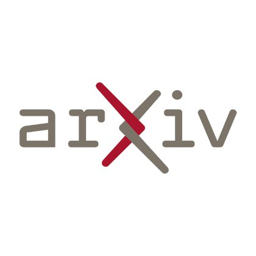
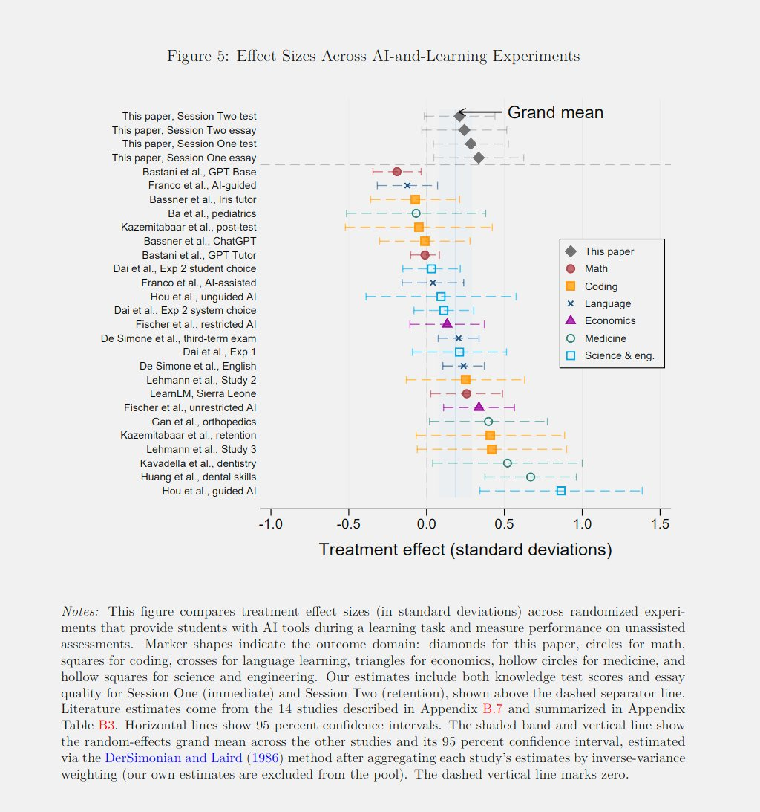
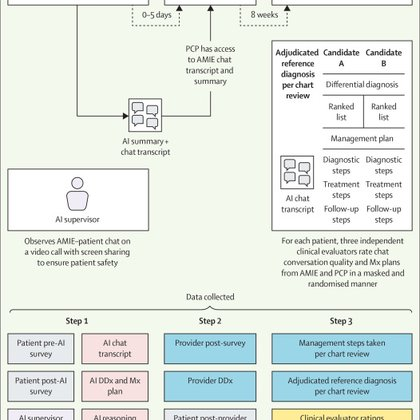
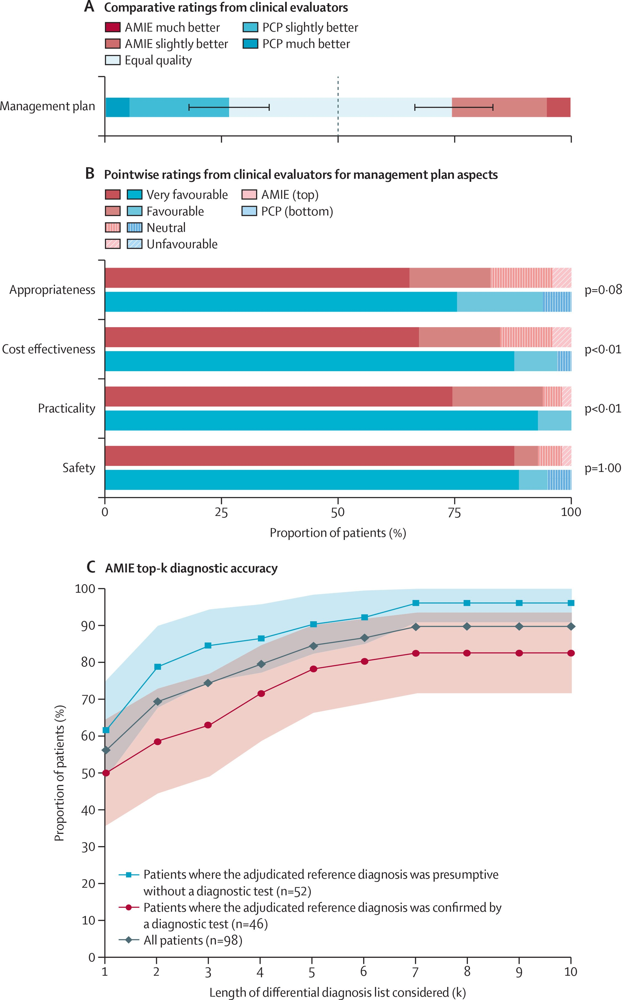

# 🐦 @emollick

## 📅 October 09, 2026

> 8 post(s) archived.

---

### 🕐 20:16 UTC · @emollick

> Its reasonable for mathematicians to point out that proofs are not always the same thing as advancing mathematics. But it suggests a need for new goals for what math is trying to do Same thing will happen everywhere. 100x more PowerPoint or code is not always progress - what is?

🔗 [View original post](https://x.com/emollick/status/2108652762904793360)

---

### 🕐 20:11 UTC · @emollick

> The distillation cycle continues.

🔗 [View original post](https://x.com/emollick/status/2108651646872068561)

---

### 🕐 16:29 UTC · @emollick

> Paper: https://arxiv.org/abs/2607.08849

🔗 [View original post](https://x.com/emollick/status/2108595784362938400)

---

### 🕐 16:25 UTC · @emollick

> Randomized trials with old GPT-4o: &quot;AI access raises test scores, and a smaller gain persists a week later. Gains remain for students who use AI as a tutor (“augmentation”) and fade for students who have AI write for them (“automation”)&quot; Across all experiments, positive effects.

🔗 [View original post](https://x.com/emollick/status/2108594749305135613)

---

### 🕐 15:47 UTC · @emollick

> Google has the advantage, if they use it, of being able to observe where OpenAI and Anthropic are going with Codex/Code and get there now. Otherwise they are going to have to go through that whole learning process themselves, which will make Gemini 4 less impactful along the way.

🔗 [View original post](https://x.com/emollick/status/2108585135998120061)

---

### 🕐 15:43 UTC · @emollick

> The challenge for Google post-Gemini 4 will be what they do with a good model. Anthropic &amp; OpenAI show we are moving towards a single interface for many tasks with orchestrator agents. The Gemini 3 era was full of fragmented products for many markets. Won&apos;t work for what&apos;s next.

🔗 [View original post](https://x.com/emollick/status/2108584037451550741)

---

### 🕐 06:21 UTC · @emollick

> Paywalled copy here: https://www.thelancet.com/journals/lancet/article/PIIS0140-6736(26)01535-7/fulltext

🔗 [View original post](https://x.com/emollick/status/2108442740778320264)

---

### 🕐 04:28 UTC · @emollick

> In an urgent care setting, the advice of the obsolete Gemini 2.5 Pro &amp; Gemini 2.5 Flash (without access to patient medical records) were rated of similar quality to doctors by other physicians. There was no safety issues spotted. Models have gotten significantly better since.

🔗 [View original post](https://x.com/emollick/status/2108414247558316508)

---
