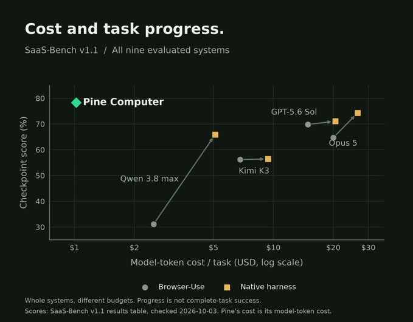

# 🐦 @omarsar0

## 📅 October 09, 2026

> 4 post(s) archived.

---

### 🕐 19:09 UTC · @omarsar0

> ICYMI, I set up a Jev-powered automation to track and index all the great use cases of Jev shared on X. Great list of inspirations there. https://academy.dair.ai/resources/jev-field-notes @martin_casado @CompleteSkeptic Yup. I love it. Back to building proper software with fewer reliability problems. Jev is now core to how we build at @dair_ai. We even have a dedicated automation pulling the best Jev use cases on X, all done by Jev itself. https://academy.dair.ai/…

🔗 [View original post](https://x.com/omarsar0/status/2108635937731227726)

---

### 🕐 16:23 UTC · @omarsar0

> Build for agents, folks! Have said for a while now that models are already very &quot;smart&quot;, but need better harnesses and environments. And you don&apos;t want to do this because it&apos;s cool. The cost implications are massive here. I highly recommend reading the report and comparing how Pine Computer can help your team. I&apos;ll do some testing myself and share more soon. AI is already smart enough. Real-world tasks are still slow, expensive and unreliable, because we hand AI a computer built for humans, then wrap it in a heavy harness. AI doesn’t need to get smarter. It needs a computer built for it. Today we’re releasing Pine Computer

🔗 [View original post](https://x.com/omarsar0/status/2108594085921518022)

---

### 🕐 14:54 UTC · @omarsar0

> Crazy to see how fast agentic video creation is improving. Syren learns your style from your library, including preferred graphics, motion, and editing rhythm. Then you build new ones from a prompt and refine them in a chat. These will only get better as models and harness improve. MCP tools included. We&apos;re exploring this for education, so we&apos;re excited to try it out. Syren Video is now live and FREE to try! ChatGPT moment for agentic video. Prompt → agency-quality AI video → chat to edit. Powered by Opus 5.5 + Syren renderer w/ 3D support. Browser or Claude MCP. Insane examples in thread 🤯🤯🤯 Try it free here: https://shorturl.at/r57qy

🔗 [View original post](https://x.com/omarsar0/status/2108571905963831638)

---

### 🕐 14:30 UTC · @omarsar0

> This is a big deal. Sabi just raised $50M to build a brain-AI interface you wear as a cap, outfitted with 100,000 sensors, that will enable people to talk to their AI agents just by thinking. I did some BCI research during my PhD, but the tech wasn&apos;t that great. It&apos;s great to see investment in improving the hardware, since current AI can unlock interesting research and personal agentic applications. we&apos;ve raised $50M from Khosla Ventures, Accel, Initialized, Kevin Weil, DST Global to build the world&apos;s most wearable BCI cap at Sabi read more here: https://www.forbes.com/sites/rashishrivastava/2026/10/09/vinod-khosla-backs-an-ai-startup-building-a-mind-reading-baseball-cap/

🔗 [View original post](https://x.com/omarsar0/status/2108565653682536887)

---
