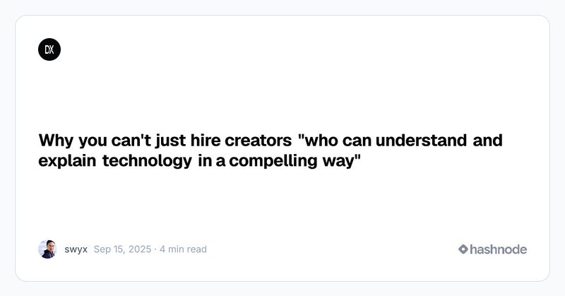

# 🐦 @swyx

## 📅 October 09, 2026

> 5 post(s) archived.

---

### 🕐 02:58 UTC · @swyx

> to paraphrase modern family, there are 5 things wrong in this tweet. the talented {role} will already have posts covering most of them https://x.com/lulumeservey/status/2108273380298461240 The evolution of going direct: Distribution was scarce, so the alpha was in building an audience Then every company started posting all the time, and attention became scarce Then attention became exploited with bait and slop, so now credibility is scarce And there are no shortcut…

🔗 [View original post](https://x.com/swyx/status/2108391703488958475)

---

### 🕐 02:58 UTC · @swyx

> to paraphrase modern family, there are 5 things wrong in this tweet. the talented {role} will already have posts covering most of them https://x.com/lulumeservey/status/2108273380298461240 The evolution of going direct: Distribution was scarce, so the alpha was in building an audience Then every company started posting all the time, and attention became scarce Then attention became exploited with bait and slop, so now credibility is scarce And there are no shortcut…

🔗 [View original post](https://x.com/swyx/status/2108391663827849390)

---

### 🕐 02:44 UTC · @swyx

> if you cant hire for it, my team will do oneoff consult for you, get in touch business@latent.space https://x.com/eriktorenberg/status/2107888314254815483?s=20 Many founders wish they had true peers &amp; thought partners in comms &amp; people leadership roles. If you’re gifted with words &amp; people, these roles are opportunities to have meaningful impact at top companies and they’re less competitive than being a top founder/investor/creator.

🔗 [View original post](https://x.com/swyx/status/2108388128390086675)

---

### 🕐 02:43 UTC · @swyx

> recap of last time this discourse happened for those who are insufficiently online https://dx.tips/cant-hire

🔗 [View original post](https://x.com/swyx/status/2108387824034873808)

---

### 🕐 02:11 UTC · @swyx

> going rate for this role is between 5-50m comp package btw at the frontier agent labs literal hardest role to hire for rn and every ai startup wants someone &gt; chronically online (knows trends) &gt; has taste &amp; can create (new media) &gt; understands ai &amp; technical &gt; can execute with quality (operator) such a small niche of folks who can do this

🔗 [View original post](https://x.com/swyx/status/2108379841859072028)

---
